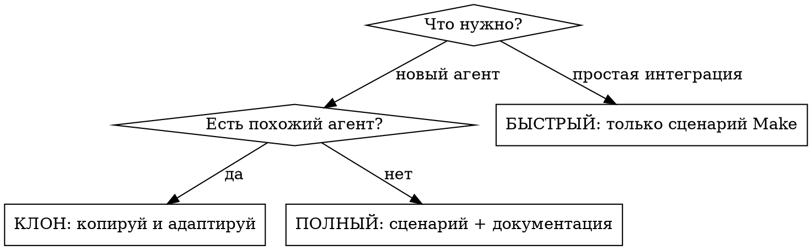
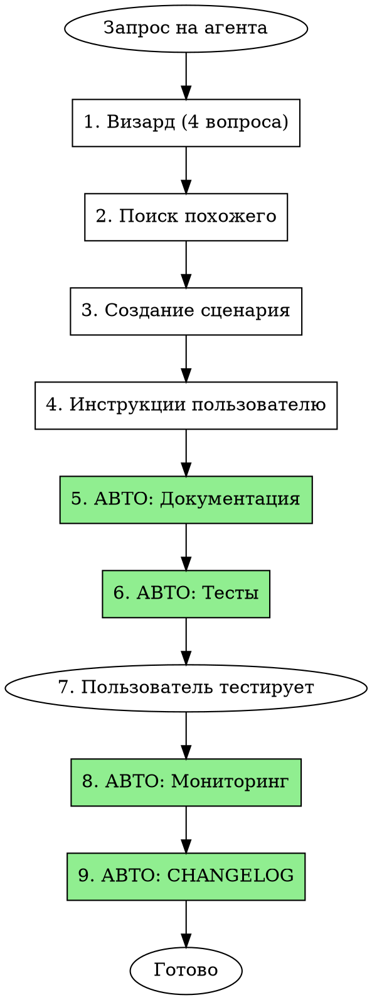

# AI Agents: Создание автоматизаций

## Режимы работы



## Визард создания (задай эти вопросы)

**Перед началом работы спроси:**

1. **Что автоматизируем?** (обновление данных / обработка входящих / рассылка)
2. **Источник?** (API url / Notion база / Webhook)
3. **Куда пишем?** (Notion / Telegram / WhatsApp / Google Sheets)
4. **Триггер?** (по расписанию / по событию / вручную)

## База знаний

Проект: `D:/Downloads/AI_AGENTS_PROJECT/`

| Папка | Содержимое | Когда смотреть |
|-------|------------|----------------|
| `03_АГЕНТЫ/` | **10+ готовых агентов** | ПЕРВЫМ ДЕЛОМ — ищи похожего |
| `03_АГЕНТЫ/INDEX.md` | Каталог всех агентов | Выбор агента для клонирования |
| `03_АГЕНТЫ/_ШАБЛОН_НОВОГО_АГЕНТА/` | Шаблон структуры | Создание с нуля |
| `04_КОМПОНЕНТЫ/` | **Библиотека компонентов** | Переиспользуемые модули |
| `02_ДОКУМЕНТАЦИЯ/MAKE_COM_СПРАВОЧНИК/` | 71 файл справочника | Настройка модулей |
| `04_БАЗА_ОШИБОК/` | Типичные ошибки | При ошибках |
| `05_ЧЕКЛИСТЫ/` | Чеклисты и KPI | Перед запуском |
| `scripts/` | Скрипты автоматизации | Быстрое создание |

## Быстрое создание агента (скрипт)

```bash
./scripts/create-agent.sh "AGENT_NAME"
```

Скрипт автоматически:
- Копирует шаблон
- Заменяет плейсхолдеры
- Добавляет в INDEX.md
- Создаёт TESTS.md и MONITORING.md

## Каталог существующих агентов

**ВСЕГДА проверяй перед созданием нового!**

| Агент | Задача | Переиспользуй для |
|-------|--------|-------------------|
| `NOTION_AI_AGENT_BOOKINGS` | Бронирования | Обработка заявок, статусы |
| `NOTION_AI_AGENT_BANK` | Банковские операции | Финансы, платежи |
| `NOTION_AI_AGENT_CALCULATOR` | Расчёты | Калькуляции, формулы |
| `NOTION_AI_AGENT_FORMATTING` | Форматирование | Преобразование текста |
| `NOTION_AI_AGENT_REQUESTS` | Обработка запросов | Воронка, классификация |
| `NOTION_AI_AGENT_ROUTES` | Маршруты | Геоданные, логистика |
| `ДУХОВНЫЙ_ТРЕКЕР` | Время намаза | Расписание, API данные |

**Структура агента (9 файлов):**
```
АГЕНТ/
├── README.md           # Обзор
├── INSTRUCTIONS.md     # Алгоритм работы
├── CHEATSHEET.md       # Шпаргалка
├── REFERENCE_TABLES.md # База знаний
├── TEMPLATES.md        # Шаблоны вывода
├── TESTS.md            # Тестовые сценарии
├── MONITORING.md       # Мониторинг и KPI
├── CHANGELOG.md        # История
└── CLAUDE.md           # Инструкции для Claude
```

## Режим КЛОН: копируй и адаптируй

1. Найди похожего в `03_АГЕНТЫ/INDEX.md`
2. Скопируй папку целиком
3. Переименуй под новую задачу
4. Адаптируй файлы по порядку:
   - `README.md` → новое описание
   - `INSTRUCTIONS.md` → новая логика
   - `REFERENCE_TABLES.md` → новые данные
   - `TEMPLATES.md` → новые форматы
5. Обнови `03_АГЕНТЫ/INDEX.md`

## Каталог API (готовые конфигурации)

### AlAdhan (время намаза)
```
URL: https://api.aladhan.com/v1/timingsByCity?city=Dubai&country=UAE&method=8
Auth: No Auth
Response: {{data.timings.Fajr}}, {{data.timings.Dhuhr}}, {{data.timings.Asr}}
```

### ExchangeRate (курсы валют)
```
URL: https://api.exchangerate-api.com/v4/latest/USD
Auth: No Auth
Response: {{rates.RUB}}, {{rates.AED}}, {{rates.EUR}}
```

### OpenWeather (погода)
```
URL: https://api.openweathermap.org/data/2.5/weather?q=Dubai&appid=YOUR_KEY&units=metric
Auth: API Key в URL (appid=)
Response: {{main.temp}}, {{weather[0].description}}, {{main.humidity}}
```

### Универсальный шаблон для нового API
```
1. Найди документацию API
2. Определи: Auth (No Auth / API Key / Bearer)
3. Собери URL с параметрами
4. Протестируй в браузере
5. Запиши путь к данным: {{data.field.subfield}}
```

## Паттерны сценариев Make.com

| Паттерн | Структура | Когда использовать |
|---------|-----------|-------------------|
| Обновление | `[Scheduler] → [HTTP] → [Notion Update]` | Периодическое обновление данных |
| Обработка | `[Webhook] → [Router] → [Notion Create]` | Входящие заявки |
| Уведомления | `[Notion Watch] → [Telegram/WhatsApp]` | Реакция на изменения |
| Массовый | `[Schedule] → [Iterator] → [HTTP] → [Notion]` | Обработка списков |

## АВТОМАТИЧЕСКИЙ WORKFLOW (ОБЯЗАТЕЛЬНО!)

**⚠️ КРИТИЧЕСКИ ВАЖНО:** Пользователь НЕ будет напоминать. Claude ОБЯЗАН выполнять ВСЕ шаги сам.

**Красные флаги — СТОП, ты забыл что-то сделать:**
- ❌ Выдал инструкции, но не создал папку агента
- ❌ Создал папку, но не заполнил TESTS.md
- ❌ Пользователь сказал "работает", но ты не обновил MONITORING.md
- ❌ Закончил работу, но не обновил INDEX.md и CHANGELOG.md
- ❌ Использовал плейсхолдеры вместо реальных данных



### Что Claude делает АВТОМАТИЧЕСКИ:

| Этап | Триггер | Claude делает сам |
|------|---------|-------------------|
| **После создания сценария** | Инструкции выданы | Создать папку агента, заполнить README.md |
| **Сразу после** | README готов | Заполнить TESTS.md с конкретными тестами |
| **После теста пользователя** | "работает" / "запустил" | Заполнить MONITORING.md с реальными KPI |
| **В конце** | Всё готово | Обновить INDEX.md и CHANGELOG.md |

### Что Claude НЕ спрашивает:

- ❌ "Хочешь ли создать документацию?" → Создаёт сам
- ❌ "Нужны ли тесты?" → Заполняет сам
- ❌ "Обновить CHANGELOG?" → Обновляет сам
- ❌ "Добавить в INDEX?" → Добавляет сам

## Алгоритм создания (полный режим)

### 1. Анализ (визард выше)
### 2. Поиск похожего
- Проверь `03_АГЕНТЫ/INDEX.md`
- Если есть похожий → режим КЛОН

### 3. Создание сценария
- Выбери паттерн из таблицы выше
- Используй чеклист из `05_ЧЕКЛИСТЫ/`
- **ВАЖНО:** Все инструкции на русском с переводом полей!

### 4. АВТО: Документирование (делай сразу после инструкций!)
- Создай папку в `03_АГЕНТЫ/[ИМЯ_АГЕНТА]/`
- Заполни README.md с конкретными данными (не плейсхолдерами!)
- Заполни TESTS.md с реальными тестовыми сценариями
- Добавь в `03_АГЕНТЫ/INDEX.md`

### 5. АВТО: После теста пользователя
Когда пользователь говорит "работает", "запустил", "протестировал":
- Заполни MONITORING.md с начальными KPI
- Обнови CHANGELOG.md с записью о создании

## Шаблон инструкций для пользователя

```markdown
## Модуль N: [Название]

### Шаг N.1: [Действие]
[Подробное описание на русском]

### Шаг N.2: Заполни поля

| Поле | Значение |
|------|----------|
| **Field Name** (название поля) | `точное значение` |
| **Another Field** | Из модуля **[N]** → поле **[Name]** |
```

## Критические правила

| Правило | ✅ Правильно | ❌ Неправильно |
|---------|-------------|----------------|
| Database ID | `451e17f1-d1c5-4a77-9397-...` (с дефисами) | Без дефисов |
| Page ID | Из Search Objects | Parent: Page ID |
| Value Type текста | Rich Text | Text |
| Источник данных | "из модуля **1** → поле **data**" | Без указания источника |

## Чеклист перед запуском

- [ ] Выбран правильный паттерн сценария
- [ ] Authentication соответствует API
- [ ] Database ID с дефисами
- [ ] Интеграция подключена в Notion (Connections)
- [ ] Value Type = Rich Text для текста
- [ ] Все пути к данным проверены

## База ошибок (быстрая)

| Ошибка | Причина | Решение |
|--------|---------|---------|
| Invalid request URL (400) | ID без дефисов | Добавь дефисы |
| Body failed validation | Value Type = Text | Измени на Rich Text |
| Missing parameter 'page' | Parent: Page ID | Выбери просто Page ID |
| Нет данных в списке | Модуль не запускался | Run this module only |
| Rate limit exceeded | Слишком часто | Добавь модуль Sleep |

**Полная база:** `04_БАЗА_ОШИБОК/` и `MAKE_COM_СПРАВОЧНИК/05_ОБРАБОТКА_ОШИБОК/`

## Навигация по справочнику Make.com

Путь: `02_ДОКУМЕНТАЦИЯ/MAKE_COM_СПРАВОЧНИК/`

| Нужно | Смотри |
|-------|--------|
| Подключить API | `06_WEBHOOKS_API/HTTP_МОДУЛЬ.md` |
| Функции Make | `04_ФУНКЦИИ/` |
| Модуль Notion | `07_МОДУЛИ_ТОП_100/NOTION/` |
| Обработка ошибок | `05_ОБРАБОТКА_ОШИБОК/` |
| Готовые сценарии | `10_ПРИМЕРЫ_СЦЕНАРИЕВ/` |

## Библиотека компонентов

Путь: `04_КОМПОНЕНТЫ/`

| Компонент | Файл | Что содержит |
|-----------|------|--------------|
| Notion Auth | `AUTH/NOTION_AUTH.md` | Интеграция, токены, headers |
| Error Handler | `HANDLERS/ERROR_HANDLER.md` | Retry, логирование, алерты |
| Telegram | `NOTIFIERS/TELEGRAM_NOTIFY.md` | Бот, сообщения, форматирование |
| JSON Parser | `PARSERS/JSON_PARSER.md` | Парсинг, массивы, вложенность |

**Используй компоненты вместо создания с нуля!**

## АВТО: Тестирование агента

**Claude заполняет TESTS.md сразу после создания инструкций:**

```markdown
## Тест 1: Базовый запуск
Вход: [конкретные данные для этого агента]
Ожидаемый результат: [конкретный результат]

## Тест 2: Обработка ошибок
Вход: [невалидные данные]
Ожидаемое поведение: [graceful error]
```

**НЕ использовать плейсхолдеры типа [ЗАПОЛНИТЬ]!**

## АВТО: Мониторинг и KPI

**Claude заполняет MONITORING.md когда пользователь говорит "работает":**

| KPI | Начальное значение | Цель |
|-----|-------------------|------|
| Reliability | 100% (1/1 успешно) | > 99% |
| Latency | [реальное время из теста] | < 30 сек |
| Error Rate | 0% | < 1% |
| Operations | [реальное кол-во] | Минимум |

**Claude автоматически добавляет:**
- Дату первого запуска
- Контакт владельца (пользователь)
- Алерты в Telegram (если настроены)

**Справочник метрик:** `05_ЧЕКЛИСТЫ/KPI_METRICS.md`

---

## ⚠️ ОБЯЗАТЕЛЬНЫЙ ЧЕКЛИСТ (проверь перед завершением!)

**Claude ОБЯЗАН проверить каждый пункт. Нельзя считать работу завершённой, пока не выполнены ВСЕ пункты.**

### После выдачи инструкций:
- [ ] Создана папка `03_АГЕНТЫ/[ИМЯ_АГЕНТА]/`
- [ ] README.md заполнен конкретными данными (не плейсхолдерами!)
- [ ] TESTS.md заполнен реальными тестовыми сценариями
- [ ] Агент добавлен в `03_АГЕНТЫ/INDEX.md`

### После слов пользователя "работает" / "запустил" / "протестировал":
- [ ] MONITORING.md заполнен начальными KPI
- [ ] CHANGELOG.md обновлён записью о создании
- [ ] Сообщить пользователю: "Документация обновлена"

### Триггеры для автоматических действий:

| Пользователь говорит | Claude ДЕЛАЕТ (не спрашивает!) |
|---------------------|-------------------------------|
| "создай агента..." | Визард → Инструкции → Документация → Тесты |
| "работает" / "запустил" | Заполняет MONITORING.md + CHANGELOG.md |
| "ошибка" / "не работает" | Добавляет в `04_БАЗА_ОШИБОК/` + решение |
| "обнови агента" | Обновляет документацию + CHANGELOG.md |
| "сломалось" / "перестало" | Диагностика + добавить в базу ошибок |
| "медленно" / "долго" | Оптимизация + обновить KPI в MONITORING.md |
| "не понимаю" / "объясни" | Переписать инструкции проще |
| "удали" / "отключи" агента | Архивировать в `03_АГЕНТЫ/_АРХИВ/` + обновить INDEX |
| "покажи агентов" / "список" | Вывести таблицу из INDEX.md |
| "статус" / "как работает" | Показать данные из MONITORING.md |
| "сколько операций" | Показать статистику из MONITORING.md |

**Claude никогда не спрашивает:**
- "Создать документацию?" → Создаёт сам
- "Обновить CHANGELOG?" → Обновляет сам
- "Добавить в INDEX?" → Добавляет сам
- "Добавить в базу ошибок?" → Добавляет сам
- "Архивировать агента?" → Архивирует сам

---

## ПРОАКТИВНЫЕ ПОДСКАЗКИ (Claude предлагает сам)

| Ситуация | Claude говорит |
|----------|----------------|
| Создаётся похожий агент | "У тебя есть [X], может клонировать?" |
| Используется новый API | "Добавить в api-catalog.md?" → и добавляет |
| Новая ошибка | "Добавляю в базу ошибок для будущего" |
| Успешный тест | "Добавляю как пример в документацию" |
| 3+ похожие ошибки | "Создаю общее решение в базе ошибок" |

---

## АВТОВЕРСИОНИРОВАНИЕ

**Claude автоматически обновляет версию в README.md:**

| Изменение | Действие |
|-----------|----------|
| Мелкое (фикс, тюнинг) | 1.0 → 1.0.1 |
| Среднее (новая функция) | 1.0 → 1.1.0 |
| Крупное (переделка логики) | 1.x → 2.0.0 |

**Перед любым изменением:**
1. Прочитать текущую версию из README.md
2. Создать запись в CHANGELOG.md с датой
3. Увеличить версию
4. Обновить "Последнее обновление" в README.md

---

## АВТОСИНХРОНИЗАЦИЯ

**Claude автоматически синхронизирует:**

| Что изменилось | Куда обновить |
|----------------|---------------|
| Скилл в `~/.claude/skills/` | → `07_СКИЛЛ/SKILL.md` |
| Новый агент | → `03_АГЕНТЫ/INDEX.md` + CHANGELOG.md |
| Новая ошибка | → `04_БАЗА_ОШИБОК/` |
| Новый API | → `references/api-catalog.md` |
| Изменение агента | → CHANGELOG.md агента + версия |

---

## ЧЕКЛИСТ ЗДОРОВЬЯ ПРОЕКТА

**Claude проверяет при упоминании агентов:**

- [ ] Все агенты в INDEX.md существуют как папки
- [ ] У всех агентов есть заполненный MONITORING.md
- [ ] Нет агентов без TESTS.md
- [ ] База ошибок актуальна
- [ ] API каталог содержит все используемые API
- [ ] Нет "мёртвых" агентов (без активности > 30 дней)

**Если найдена проблема — Claude сообщает:**
```
⚠️ Обнаружил проблему: Агент [X] не имеет MONITORING.md
Исправляю...
```

---

## УМНЫЕ НАПОМИНАНИЯ

**Claude напоминает когда уместно (не спамит!):**

| Контекст | Напоминание |
|----------|-------------|
| Упомянут агент без MONITORING | "Кстати, [агент] не имеет метрик. Добавить?" → и добавляет |
| Ошибка уже была в базе | "Эта ошибка уже решена — см. [ссылка]" |
| Создаётся агент без тестов | Автоматически создаёт TESTS.md |
| Много изменений без коммита в CHANGELOG | "Обновляю CHANGELOG с последними изменениями" |

---

## КРАСНЫЕ ФЛАГИ (расширенные)

**СТОП — Claude забыл что-то сделать:**

- ❌ Выдал инструкции без создания папки агента
- ❌ Создал агента без TESTS.md
- ❌ Пользователь сказал "работает", а MONITORING.md пустой
- ❌ Изменил агента без обновления версии и CHANGELOG
- ❌ Использовал плейсхолдеры вместо реальных данных
- ❌ Новый API не добавлен в api-catalog.md
- ❌ Новая ошибка не добавлена в базу ошибок
- ❌ Агент удалён, но остался в INDEX.md
- ❌ Скилл изменён, но не синхронизирован в 07_СКИЛЛ/

**Если Claude замечает красный флаг — немедленно исправляет!**
