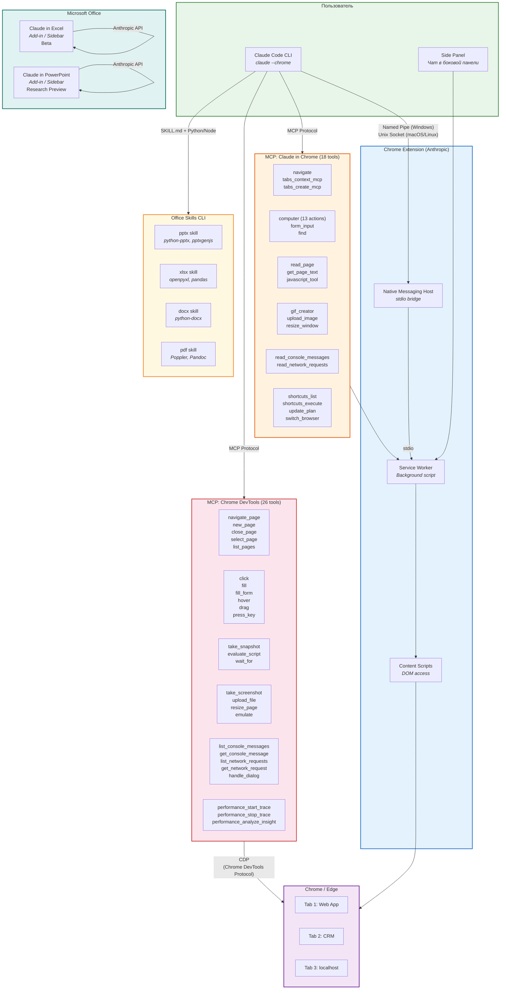

# Архитектура экосистемы Claude + Browser/Office

## Описание
Показывает взаимосвязь всех 5 продуктов экосистемы: Claude in Chrome (side panel), Claude Code + Chrome (CLI), Chrome DevTools MCP, Claude in Excel, Claude in PowerPoint и Office Skills CLI. Полезна для понимания общей картины: как компоненты связаны, какие протоколы используют и где находятся границы каждого продукта.

## Диаграмма

## Ключевые связи

| Связь | Протокол | Описание |
|-------|----------|----------|
| Claude Code -> Extension | Named Pipe / Unix Socket | Native Messaging Host bridge |
| Extension -> Browser | Content Scripts | DOM-доступ через Chrome API |
| Claude Code -> Claude in Chrome MCP | MCP Protocol | 18 инструментов через расширение |
| Claude Code -> Chrome DevTools MCP | CDP (Chrome DevTools Protocol) | 26 инструментов напрямую |
| Claude Code -> Office Skills | SKILL.md + Python/Node | Программная генерация файлов |
| Excel/PPT Add-in -> Anthropic | Anthropic API | Прямое обращение к моделям |

## Конфликт: Desktop Cowork vs Claude Code

Оба используют один Extension ID. Одновременно работает только одно приложение. При конфликте -- отключить Native Messaging Host неиспользуемого.
