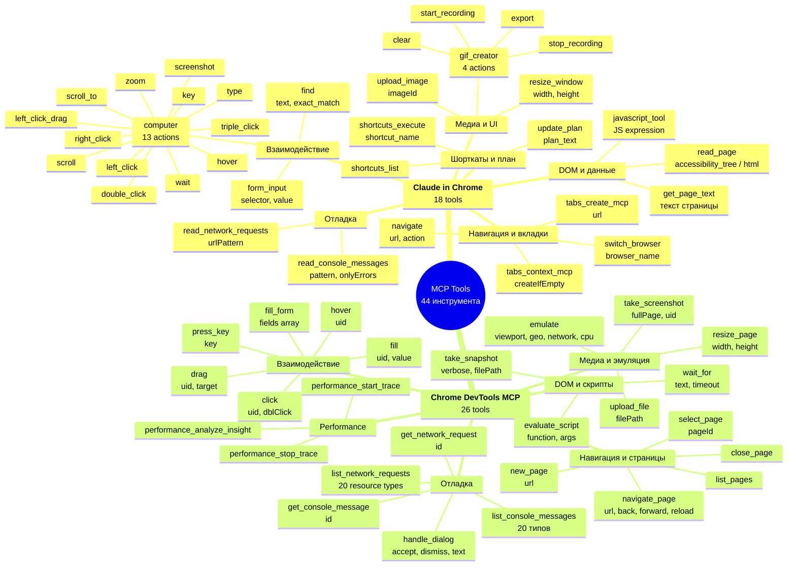

# Mind Map: Все MCP-инструменты по категориям

## Описание
Полная карта всех 18 инструментов Claude in Chrome и 26 инструментов Chrome DevTools MCP, сгруппированных по функциональным категориям. Позволяет быстро найти нужный инструмент по задаче и увидеть параллели между двумя MCP-серверами.

## Диаграмма

## Таблица соответствий: Claude in Chrome vs Chrome DevTools MCP

| Категория | Claude in Chrome | Chrome DevTools MCP | Уникальное |
|-----------|-----------------|---------------------|------------|
| Навигация | `navigate` | `navigate_page` | DevTools: `list_pages`, `close_page` |
| Клик | `computer(left_click)` | `click(uid)` | Chrome: `right/double/triple_click`, drag |
| Формы | `form_input` | `fill`, `fill_form` | DevTools: batch `fill_form` |
| JS | `javascript_tool` | `evaluate_script` | DevTools: uid args |
| Скриншот | `computer(screenshot)` | `take_screenshot` | DevTools: fullPage, element screenshot |
| DOM | `read_page` | `take_snapshot` | Chrome: `get_page_text`, `find` |
| Консоль | `read_console_messages` | `list_console_messages` | DevTools: `get_console_message` |
| Сеть | `read_network_requests` | `list_network_requests` | DevTools: `get_network_request` |
| GIF | `gif_creator` | -- | Только Chrome! |
| Upload | `upload_image` (screenshot) | `upload_file` (disk) | Разная функциональность |
| Диалоги | -- | `handle_dialog` | Только DevTools! |
| Performance | -- | 3 инструмента | Только DevTools! |
| Эмуляция | -- | `emulate` | Только DevTools! |
| Шорткаты | `shortcuts_list/execute` | -- | Только Chrome! |
| План | `update_plan` | -- | Только Chrome! |

## Когда что использовать

- **Claude in Chrome** -- авторизованные сайты (cookies), GIF-запись, шорткаты, side panel
- **Chrome DevTools MCP** -- performance, headless, full-page screenshots, диалоги, эмуляция
- **Оба вместе** -- максимальный контроль: Chrome для UI, DevTools для отладки
