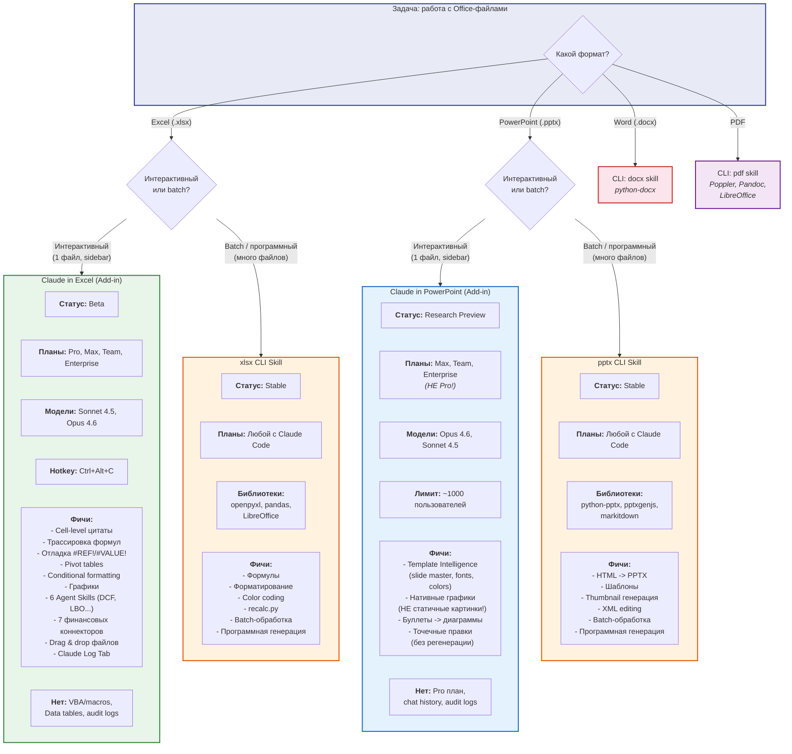

# Сравнение: Office Add-ins vs CLI Skills

## Описание
Сравнительная диаграмма двух подходов к работе с Office-файлами: интерактивные Add-in (Claude in Excel, Claude in PowerPoint) и программные CLI Skills (xlsx, pptx, docx, pdf). Помогает выбрать правильный подход в зависимости от задачи, плана подписки и требований к автоматизации.

## Диаграмма



## Сравнительная таблица

| Критерий | Add-in (Excel/PPT) | CLI Skill (xlsx/pptx/docx/pdf) |
|----------|--------------------|---------------------------------|
| **Подход** | Интерактивный (sidebar) | Программный (скрипт) |
| **Файлы за раз** | 1 открытый файл | Любое количество (batch) |
| **Нужен Office?** | Да (Excel/PowerPoint) | Нет (Python-библиотеки) |
| **Подписка (Excel)** | Pro, Max, Team, Enterprise | Любой с Claude Code |
| **Подписка (PPT)** | Max, Team, Enterprise (НЕ Pro!) | Любой с Claude Code |
| **Интеллект** | Высокий (cell-level, template intelligence) | Средний (программная логика) |
| **Batch** | Нет | Да |
| **Audit** | Claude Log Tab (только Excel) | Логи Claude Code |
| **VBA/Macros** | Нет | Нет |
| **Форматы** | .xlsx, .xlsm / .pptx | .xlsx, .pptx, .docx, .pdf |

## Pipeline: Excel -> PowerPoint

```
Claude in Excel                 Claude in PowerPoint
(анализ данных)       -->       (визуализация)
- Формулы                       - Template Intelligence
- Pivot tables                  - Нативные графики
- Conditional formatting        - Корпоративный брендинг
```

Или через CLI:
```
xlsx skill              -->       pptx skill
(openpyxl/pandas)                 (python-pptx/pptxgenjs)
- Batch обработка                 - HTML -> PPTX
- recalc.py                       - Batch генерация
```
