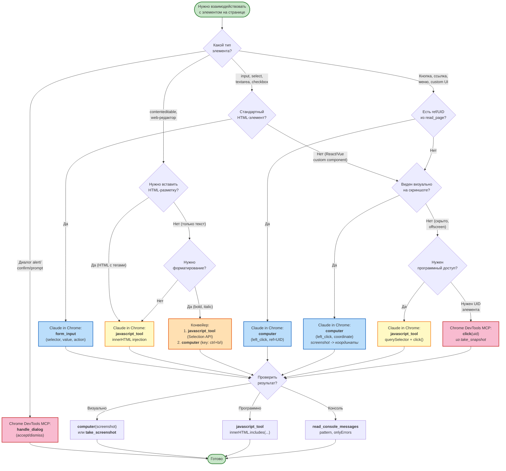

# Decision Tree: Выбор инструмента взаимодействия

## Описание
Дерево решений для выбора правильного инструмента при взаимодействии с элементами веб-страницы. Помогает быстро определить: использовать form_input, computer, javascript_tool или Chrome DevTools MCP в зависимости от типа элемента и задачи.

## Диаграмма

## Быстрая таблица

| Сценарий | Инструмент | Почему |
|----------|-----------|--------|
| Стандартная HTML-форма | `form_input` | Быстрее, надежнее, не нужны координаты |
| Custom UI (React/Vue) | `computer` (клик) | Визуальный клик обходит виртуальный DOM |
| Web-редактор (contenteditable) | `javascript_tool` (innerHTML) | Прямая вставка HTML-разметки |
| Форматирование текста | Selection API + `computer(key)` | Программное выделение + горячая клавиша |
| Dropdown с поиском | `computer` (click + type) | Имитация пользовательского ввода |
| Скрытый элемент | `javascript_tool` (querySelector) | Программный доступ к невидимым элементам |
| Диалоговое окно (alert) | DevTools `handle_dialog` | Claude in Chrome НЕ поддерживает диалоги |
