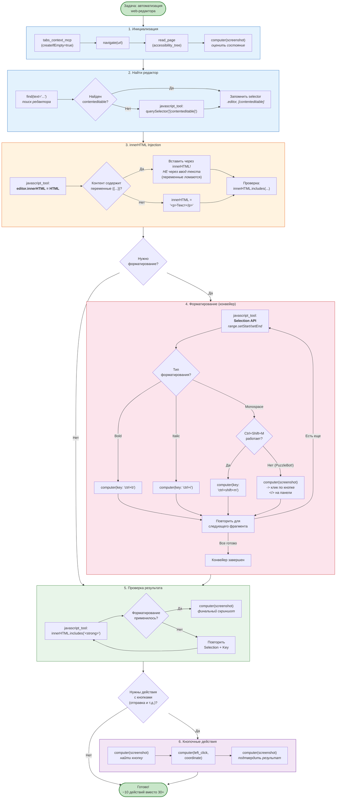

# Flowchart: Оптимальный паттерн автоматизации Web-редактора

## Описание
Пошаговая схема оптимального паттерна автоматизации web-редакторов (PuzzleBot и аналоги). Показывает конвейер: innerHTML injection -> Selection API -> горячие клавиши -> проверка -> скриншот. Основан на проверенном опыте (2x тестирование). Сокращает количество действий с 30+ до ~10, экономия 60-70%.

## Диаграмма

## Критические предупреждения (из опыта)

| Проблема | Решение |
|----------|---------|
| `{{переменные}}` ломаются при обычном вводе | ТОЛЬКО innerHTML injection |
| `Ctrl+Shift+M` вводит "m" в PuzzleBot | Кликать кнопку `</>` на панели |
| `alert()` блокирует все | НИКОГДА не вызывать alert/confirm/prompt |
| Selection не сработал | Проверить: textNode vs elementNode |
| Форматирование не видно | JS-проверка innerHTML перед скриншотом |

## Сравнение подходов

| Подход | Действий | Надежность | Скорость |
|--------|----------|-----------|----------|
| Наивный (клик-клик-клик) | 30+ | Низкая | Медленно |
| innerHTML + Selection API | ~10 | Высокая | Быстро |
| Экономия | **60-70%** | -- | -- |
