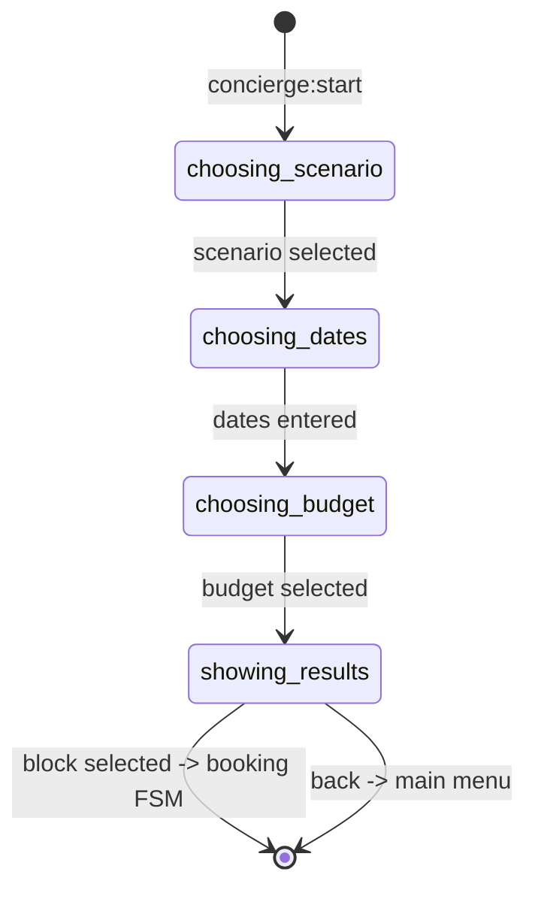
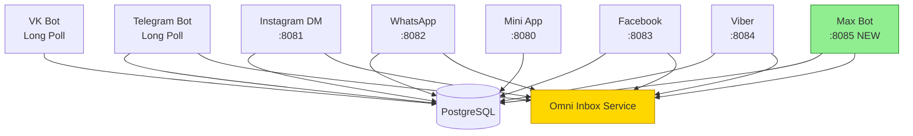

# Delivery Docs — Post-Ship Documentation Workflow

## Overview

Этот скилл автоматизирует всю документацию, которая нужна **после** того, как фича готова.
Один вызов — и у тебя: CHANGELOG.md обновлён, CLAUDE.md таблица актуальна, OpenAPI spec
отражает новые endpoints, все функции задокументированы, архитектурная диаграмма показывает
что изменилось.

**Принцип работы:** сначала читаем git history и код, затем генерируем документацию в нужном
формате. Никакого угадывания — только то, что реально поменялось.

**Основан на трёх скиллах:**
- `changelog-generator` — Keep a Changelog format, CLAUDE.md таблица
- `api-doc-generator` — OpenAPI 3.x из FastAPI кода, drift detection
- `code-documenter` — Google-style docstrings, onboarding guides

---

## When to Use

| Триггер | Режим | Пример |
|---------|-------|--------|
| Завершили фазу/фичу | `full` | "Phase 22 готова, задокументируй всё" |
| Только changelog | `release` | "Сгенерируй changelog для v10.9.0" |
| Новые API endpoints | `api-spec` | "Задокументируй /webhook/max endpoint" |
| Новые DB методы/функции | `docstrings` | "Задокументируй get_or_create_max_user()" |
| Нужно показать что изменилось в архитектуре | `visual-delta` | "Покажи что изменилось после Phase 22" |
| Онбординг нового разработчика | `docstrings` | "Сделай документацию для нового dev" |
| Перед деплоем | `release` | "Обнови все доки перед пушем" |

---

## Режимы

### Mode: `release` — Полные Release Notes

Генерирует всё для выпуска версии:
1. CHANGELOG.md entry в формате Keep a Changelog
2. Новую строку в таблице "9. Changelog (последние 6)" в CLAUDE.md
3. User-facing summary на русском для менеджеров/клиентов
4. Mermaid architecture diagram (что изменилось)

**Пример запроса:**
```
release: Phase 22 Max Bot — добавлен новый бот для мессенджера Max
```

**Что делать:**

**Шаг 1.** Получить git history с момента последнего тега:
```bash
git tag --sort=-creatordate | head -5
LAST_TAG=$(git describe --tags --abbrev=0 2>/dev/null || echo "HEAD~20")
git log "$LAST_TAG"..HEAD --format="%h %s (%ad)" --date=short --no-merges
git diff "$LAST_TAG"..HEAD --stat
```

**Шаг 2.** Определить версию по SemVer:
- Новый бот/платформа = MINOR bump (v10.8.0 → v10.9.0)
- Новая таблица БД = MINOR bump
- Bug fix без новых фич = PATCH bump (v10.8.0 → v10.8.1)
- Breaking change = MAJOR bump (v10.x.x → v11.0.0)

**Шаг 3.** Сгенерировать CHANGELOG.md entry:
```markdown
## [10.9.0] - 2026-MM-DD

### Added
- Add Max Bot with FastAPI webhook (port 8085)
- Add `max_users` DB table with synthetic user_id -4000..
- Add `get_or_create_max_user(max_id, max_name)` DB method
- Add migration v22_max
- Add 180 tests for Max Bot

### Changed
- Register MaxConnector in Omni Inbox startup sequence
```

**Шаг 4.** Обновить CLAUDE.md таблицу (строку 1 — новая, строку 7 — удалить):
```markdown
| 2026-MM-DD | Phase 22: Max Bot | FastAPI webhook, каталог + 8-step FSM, max_users table, synthetic -4000.., 180 тестов. |
```

**Шаг 5.** Написать user-facing summary (русский, для менеджеров):
```markdown
## Что нового в v10.9.0

Добавлена поддержка мессенджера **Max** — теперь клиенты могут бронировать
экскурсии прямо в Max с карточками и пошаговой формой.

**Новое:**
- Max бот с полным каталогом экскурсий
- Бронирование за 8 шагов прямо в мессенджере
- Автоматическое уведомление менеджера в Telegram

**Исправлено:**
- [если есть фиксы]
```

---

### Mode: `api-spec` — OpenAPI из FastAPI кода

Генерирует или обновляет OpenAPI 3.x спецификацию для webhook-серверов.
Включает **drift detection** — сравнение существующего spec с реальным кодом.

**Пример запроса:**
```
api-spec: задокументируй /webhook/max endpoint в max_bot/app.py
```

**Шаг 1.** Прочитать файл приложения:
```python
# Ищем route definitions в app.py
# FastAPI: @app.get("/path"), @app.post("/path"), @router.post("/path")
# Pydantic models: class SomeName(BaseModel)
```

**Шаг 2.** Drift detection — проверить существующий spec:
```bash
# Есть ли уже spec для этого бота?
ls docs/openapi/
cat docs/openapi/max_bot.yaml 2>/dev/null || echo "spec не найден — создаём новый"
```

Если spec есть — сравнить пути: какие endpoints в коде, но не в spec (added), и наоборот (removed).

**Шаг 3.** Сгенерировать/обновить YAML по шаблону `assets/templates/openapi-base.yaml`.

**Шаг 4.** Сохранить как `docs/openapi/{platform}_bot.yaml`.

**Формат сообщения о drift:**
```
DRIFT REPORT:
  + Added endpoints (in code, not in spec):
    POST /webhook/max
  - Removed endpoints (in spec, not in code):
    none
  ~ Changed schemas:
    IncomingMessage.platform: added field "max_id"
```

**Patterns для VIP-DXB-CatalogBot FastAPI endpoints:**
- Webhook verify: `GET /webhook` (query: hub.challenge, hub.verify_token)
- Webhook receive: `POST /webhook` (body: platform-specific payload)
- Health check: `GET /health` (returns {"status": "ok"})
- Mini App API: `GET /api/catalog`, `POST /api/bookings`, `GET /api/map`

---

### Mode: `docstrings` — Документирование кода

Генерирует Google-style docstrings для Python функций/методов + README update.

**Пример запроса:**
```
docstrings: задокументируй get_or_create_max_user() и MaxConnector class
```

**Шаг 1.** Прочитать функцию/класс:
```python
async def get_or_create_max_user(
    self, max_id: str, max_name: str
) -> tuple[int, bool]:
    ...
```

**Шаг 2.** Сгенерировать Google-style docstring:
```python
async def get_or_create_max_user(
    self, max_id: str, max_name: str
) -> tuple[int, bool]:
    """Get existing or create new Max messenger user mapping.

    Looks up the synthetic user_id for a given Max user_id. If not found,
    creates a new mapping in the max_users table with synthetic_user_id
    in the range -4000..-4999.

    Args:
        max_id: Max messenger user identifier (platform-native string ID).
        max_name: Display name from Max user profile.

    Returns:
        Tuple of (synthetic_user_id, created) where:
        - synthetic_user_id: integer in range -4000..-4999
        - created: True if a new row was inserted, False if existing

    Raises:
        asyncpg.PostgresError: On database connectivity or constraint errors.

    Example:
        user_id, is_new = await db.get_or_create_max_user("123456", "Ivan")
        # user_id = -4000, is_new = True (first Max user)
    """
```

**Правила для asyncpg методов CatalogDB:**
- Всегда документировать `$1/$2` параметры как `Args:`
- Указывать диапазон synthetic_user_id если метод его создаёт
- Показывать конкретный `Example:` с реальными значениями
- В `Raises:` указывать `asyncpg.PostgresError` как минимум

**Шаг 3.** Если нужен onboarding guide — создать `docs/onboarding/{platform}_bot.md`:
```markdown
# Max Bot — Onboarding Guide

## Что делает этот бот
[1-2 предложения простым языком]

## Ключевые файлы
- `max_bot/app.py` — точка входа
- `max_bot/fsm.py` — состояния формы бронирования
- `max_bot/handlers/` — обработчики сообщений

## Как добавить новый handler
[step-by-step]

## Переменные окружения
[таблица с описанием]
```

---

### Telegram Handler Documentation

Telegram handler, FSM flow и AI service — три типа документации, которые `docstrings` mode не покрывает стандартным Google-style docstring. Ниже — специализированные паттерны.

#### 1. Handler documentation pattern

Для каждого нового или изменённого handler — документировать в таком формате:

```markdown
### Handler: concierge_start
**Router:** bot/handlers/concierge.py
**Trigger:** callback_data="concierge:start"
**FSM:** Sets ConciergeForm.choosing_scenario
**Keyboard:** 5 scenario buttons (family, adventure, culture, luxury, browse)
**Side effects:** Tracks analytics event "concierge_start"
**Back button:** Returns to main client menu
```

#### 2. FSM flow documentation pattern

Для каждого нового или изменённого FSM — документировать Mermaid-диаграмму:

````markdown
### FSM: Concierge Flow

````

#### 3. CLAUDE.md update checklist — какие секции обновлять

| Тип изменения | Секции CLAUDE.md для обновления |
|---------------|-------------------------------|
| Новый handler | 3 Architecture, 8 Roadmap table |
| Новая DB таблица | 4 DB Tables, 3 Architecture |
| Новый env var | 6 Environment Variables |
| Новая платформа | 2 Platform Navigation, 5 Patterns |
| Новый сервис | 3 Architecture tree |
| Изменение FSM | Платформенный CLAUDE.md |
| Новый тест-файл | 1 Overview (счётчик тестов) |

#### 4. AI service documentation pattern

Для каждого AI-сервиса — документировать провайдера, бюджет, latency, fallback:

```markdown
### AI Service: Copilot
**Provider:** Gemini 2.5 Flash (primary) -> OpenAI gpt-4o-mini (fallback)
**Trigger:** Manager presses "AI Reply" in Omni Inbox
**Token budget:** ~2000 tokens input (conversation context), ~500 tokens output
**Latency target:** p50 < 2s, p95 < 5s
**Cost:** ~$0.001 per suggestion (Gemini), ~$0.003 per suggestion (OpenAI)
**Fallback:** If both providers fail -> show "AI unavailable" toast, log error
**Logging:** model, tokens, latency_ms, cost_usd per request
```

---

### Mode: `visual-delta` — Архитектурная диаграмма

Генерирует Mermaid диаграмму "до/после" — что изменилось в архитектуре.

**Пример запроса:**
```
visual-delta: Phase 22 добавила Max Bot — покажи что изменилось
```

**Формат вывода:**
```markdown
### Архитектура после Phase 22



**Изменения Phase 22:**
- Добавлен: Max Bot (порт 8085, synthetic ID -4000..)
- Добавлен: MaxConnector в Omni Inbox
- Новая таблица: max_users
```

**Правила для диаграммы VIP-DXB-CatalogBot:**
- Новые компоненты выделять зелёным `fill:#90EE90`
- Изменённые — жёлтым `fill:#FFD700`
- Удалённые — красным (с пометкой REMOVED)
- Всегда показывать связь с PostgreSQL и Omni Inbox

---

### Mode: `full` — Всё за один прогон

Запускает все четыре режима последовательно.

**Порядок выполнения:**
1. `release` → CHANGELOG.md + CLAUDE.md таблица + user summary
2. `api-spec` → OpenAPI YAML для новых endpoints
3. `docstrings` → docstrings для новых функций/классов
4. `visual-delta` → Mermaid диаграмма (вставляется в CHANGELOG.md entry)

**Пример запроса:**
```
full: Phase 22 Max Bot завершена — задокументируй всё
```

**Что генерирует `full`:**

| Артефакт | Файл | Формат |
|----------|------|--------|
| CHANGELOG entry | `CHANGELOG.md` | Keep a Changelog |
| CLAUDE.md row | `CLAUDE.md` секция 9 | Markdown таблица |
| User summary | (в ответе) | Русский, для менеджеров |
| OpenAPI spec | `docs/openapi/max_bot.yaml` | OpenAPI 3.x YAML |
| Docstrings | (inline в коде) | Google-style Python |
| Architecture diagram | (в ответе / в CHANGELOG) | Mermaid |

---

## Synergy Rules

Режимы не изолированы — они автоматически дополняют друг друга:

**Правило 1:** `release` всегда включает Mermaid diagram если добавлен новый бот/сервис.
Если в git history есть новые файлы типа `{platform}_bot/app.py` — автоматически
рисуем updated architecture diagram.

**Правило 2:** `api-spec` всегда запускает drift detection.
Если в `docs/openapi/` уже есть файл для этой платформы — сравниваем.
Если нет — создаём новый и сообщаем об этом явно.

**Правило 3:** `docstrings` обновляет README платформы.
Если документируем методы в `data/database.py` — добавляем их в таблицу
"DB Methods" соответствующего `{platform}/CLAUDE.md`.

**Правило 4:** `full` генерирует артефакты в правильном порядке.
CHANGELOG.md пишется последним — чтобы включить ссылки на созданные spec файлы.

**Правило 5:** Все режимы проверяют CLAUDE.md перед записью.
Никогда не дублируем существующую строку в таблице changelog.
Читаем текущее состояние файла перед любой записью.

---

## Output Examples

### Пример: Phase 22 Max Bot — полный `release` output

**CHANGELOG.md entry:**
```markdown
## [10.9.0] - 2026-04-01

### Added
- Add Max Bot with FastAPI webhook on port 8085
- Add `max_users` DB table — synthetic user_id range -4000..-4999
- Add `get_or_create_max_user(max_id, max_name)` DB method
- Add migration `_migrate_v22_max()` (idempotent, checks column existence)
- Add MaxConnector registration in Omni Inbox startup
- Add 180 pytest tests covering webhook verify, catalog, booking FSM, search
- Add HMAC-SHA256 webhook signature verification

### Changed
- Omni Inbox now supports 6 connectors (was 5: TG/IG/VK/WA/FB/VB)
- `core/user_ids.py` — added MAX_ID_OFFSET, `is_max_user()`, updated `get_platform()`

### Fixed
- Fix Max webhook response format for non-text event types
```

**CLAUDE.md таблица (новая строка):**
```
| 2026-04-01 | Phase 22: Max Bot | FastAPI webhook :8085, каталог + 8-step FSM, max_users table, synthetic -4000.., MaxConnector в Omni Inbox, 180 тестов. |
```

**User-facing summary:**
```markdown
## Что нового в v10.9.0 — April 2026

Бот теперь работает в мессенджере **Max** (VK Mini Apps).
Клиенты из России могут бронировать экскурсии прямо там, где привыкли общаться.

**Новое:**
- Каталог экскурсий в Max
- Бронирование за 8 шагов
- Уведомления менеджеру в Telegram

**Это уже работает — никаких действий не нужно.**
```

---

## Quick Reference

| Команда | Что делает | Время |
|---------|-----------|-------|
| `release: <описание>` | CHANGELOG + CLAUDE.md + user summary + Mermaid | ~5 мин |
| `api-spec: <файл/endpoint>` | OpenAPI YAML + drift report | ~3 мин |
| `docstrings: <функция/класс>` | Google-style docstrings + README update | ~2 мин |
| `visual-delta: <что изменилось>` | Mermaid до/после диаграмма | ~2 мин |
| `full: <описание фазы>` | Всё вышеперечисленное | ~10 мин |

**Trigger phrases (что говорить Claude):**
- "delivery-docs release: ..." → режим `release`
- "delivery-docs full: ..." → режим `full`
- "задокументируй Phase X" → режим `full`
- "сгенерируй changelog" → режим `release`
- "задокументируй новые DB методы" → режим `docstrings`
- "обнови OpenAPI spec" → режим `api-spec`
- "покажи что изменилось в архитектуре" → режим `visual-delta`

---

## File Structure

```
delivery-docs/
├── SKILL.md                              — этот файл
├── README.md                             — навигация и quick start
├── references/
│   ├── changelog-advanced.md             — Keep a Changelog + SemVer reference
│   └── openapi-patterns.md               — FastAPI OpenAPI patterns + drift detection
└── assets/
    └── templates/
        ├── release-notes-ru.md           — шаблон release notes на русском
        └── openapi-base.yaml             — базовый OpenAPI 3.x template
```

---

## Common Mistakes

| Ошибка | Правильный подход |
|--------|-----------------|
| Писать changelog от лица разработчика | Писать от лица пользователя: "Add Max Bot" не "Refactor FSM handler" |
| Добавить 7-ю строку в CLAUDE.md таблицу | Максимум 6 строк — удаляем самую старую |
| Генерировать OpenAPI без чтения кода | Всегда читать реальный `app.py` перед генерацией spec |
| Дублировать строку в CLAUDE.md changelog | Проверять текущую таблицу перед добавлением |
| Забыть drift detection | Перед созданием нового spec — проверить `docs/openapi/` на существующий файл |
| Docstring на русском для Python кода | Python docstrings — на английском (код интернациональный); user summaries — на русском |
| Использовать `?` placeholders в примерах SQL | Только asyncpg-style `$1/$2` для VIP-DXB-CatalogBot |
| Писать CLAUDE.md changelog row на английском | Русский язык для changelog таблицы в этом проекте |
| Запустить `full` без git log | Сначала `git log` — потом документация. Иначе будет угадывание. |
| Не включать количество тестов в CLAUDE.md row | Всегда указывать: "X тестов" если добавлялись тесты |

---

## Integration with CLAUDE.md Maintenance Rule

Этот скилл реализует правило из `CLAUDE.md`:
> "At the end of every completed task, review CLAUDE.md. If the task changed project behavior, architecture, deploy flow... update CLAUDE.md in the same change set."

Режим `full` закрывает это требование автоматически:
- Обновляет таблицу `## 9. Changelog`
- Добавляет секцию фазы (если Phase)
- Обновляет архитектурный раздел (если новый бот/сервис)

---

## Sources

- `changelog-generator/SKILL.md` — Keep a Changelog format, git commands, CLAUDE.md table rules
- `api-doc-generator` (terminal-skills) — Framework detection, drift detection, OpenAPI generation
- `code-documenter` (terminal-skills) — Docstring standards, onboarding guides, architecture docs
- Keep a Changelog: https://keepachangelog.com/en/1.1.0/
- Semantic Versioning: https://semver.org/
- OpenAPI 3.x: https://swagger.io/specification/

**Skill size:** ~10 KB | **Version:** 1.0.0 | **Created:** 2026-03-12
