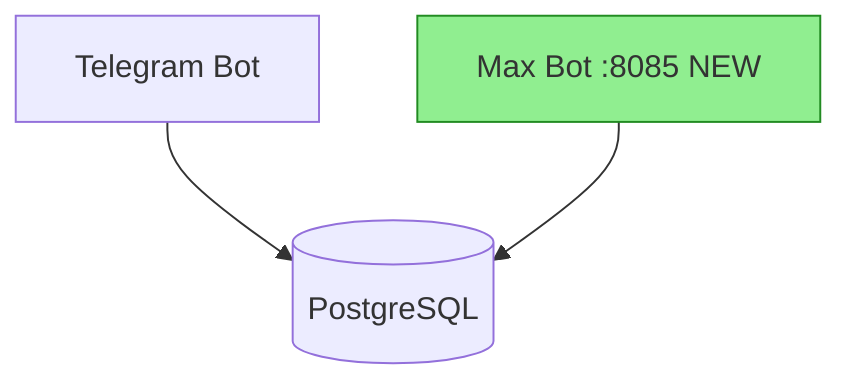

# doc-ops — Documentation Operations

## Философия

**Один скилл для всей документации.** После шипа — генерация. Периодически — аудит и чистка.

Принципы:
1. **Факты из кода, не из головы.** `git log`, `grep`, `glob` — потом документация. Никакого угадывания.
2. **CLAUDE.md = навигационный хаб, не энциклопедия.** Ссылки вместо содержимого. SSOT для каждого факта.
3. **Свежесть > Полнота.** 50 актуальных строк лучше 500 устаревших.
4. **Archive != Delete.** Перемещать в `docs/archive/`, не удалять. Журналы (CHANGELOG, WHY-LOG, ISSUES) растут всегда.
5. **Dormant code/docs:** спросить перед удалением, пометить `// DORMANT`.
6. **Никаких изменений без OK владельца.**
7. **Cache-optimized:** статическое вверху CLAUDE.md, динамическое внизу.

---

## Триггеры

| Ситуация | Режим | Пример фразы |
|----------|-------|--------------|
| Завершили фазу/фичу, нужны release notes | `ship` | "Phase 22 готова, задокументируй" |
| Только changelog | `ship` | "Сгенерируй changelog для v10.9.0" |
| Перед деплоем | `ship` | "Обнови все доки перед пушем" |
| Новые API endpoints | `api` | "Задокументируй /webhook/max endpoint" |
| Обнови OpenAPI spec | `api` | "Обнови OpenAPI spec для max_bot" |
| CLAUDE.md > 300 строк или > 2.5K токенов | `audit` | "Доки раздулись" |
| Подозрение на дублирование | `audit` | "Проверь доки на дубли" |
| Суммарно docs > 10K строк | `audit` | "Проверь документацию" |
| Оптимизируй / почисти доки | `clean` | "Оптимизируй доки", "Почисти CLAUDE.md" |
| Быстрая проверка здоровья | `score` | "Скор документации", "doc-ops score" |
| Нет уточнения | `score` | (по умолчанию — быстрая проверка) |

**НЕ АКТИВИРОВАТЬ:** написание нового контента с нуля, рефакторинг кода, создание docs/ для нового проекта.

---

## Определение режима

Парсить запрос пользователя по ключевым словам:

| Ключевые слова | Режим |
|----------------|-------|
| `ship`, `release`, `changelog`, `задокументируй фазу`, `обнови доки после`, `перед деплоем` | `ship` |
| `api`, `openapi`, `swagger`, `endpoint`, `spec`, `drift` | `api` |
| `audit`, `аудит`, `проверь доки`, `дубли`, `дублирование`, `anti-pattern` | `audit` |
| `clean`, `optimize`, `оптимизируй`, `почисти`, `примени`, `apply` | `clean` |
| `score`, `скор`, `здоровье`, `health`, `быстрая проверка` | `score` |

Если запрос содержит слова из нескольких режимов — спросить пользователя.
Если ничего не совпало — запустить `score` (быстрая проверка).

---

## Режим: ship

**Цель:** После завершения фичи/фазы — обновить всю документацию за один прогон.

**Генерирует:**

| Артефакт | Файл | Формат |
|----------|------|--------|
| CHANGELOG entry | `CHANGELOG.md` | Keep a Changelog |
| CLAUDE.md row | `CLAUDE.md` секция Changelog | Markdown таблица |
| User summary | (в ответе) | Русский, для менеджеров |
| Docstrings | (inline в коде) | Google-style Python |
| Architecture diagram | (в ответе / CHANGELOG) | Mermaid |
| Health score | (в ответе) | N/5 |

### Шаг 1. Git history

```bash
git tag --sort=-creatordate | head -5
LAST_TAG=$(git describe --tags --abbrev=0 2>/dev/null || echo "HEAD~20")
git log "$LAST_TAG"..HEAD --format="%h %s (%ad)" --date=short --no-merges
git diff "$LAST_TAG"..HEAD --stat
```

### Шаг 2. SemVer

- Новый бот/платформа/таблица БД = **MINOR** bump (v10.8.0 -> v10.9.0)
- Bug fix без новых фич = **PATCH** bump (v10.8.0 -> v10.8.1)
- Breaking change = **MAJOR** bump (v10.x.x -> v11.0.0)

### Шаг 3. CHANGELOG.md entry

Формат Keep a Changelog. Секции: `### Added`, `### Changed`, `### Fixed`, `### Removed`, `### Breaking`.

```markdown
## [10.9.0] - 2026-MM-DD

### Added
- Add Max Bot with FastAPI webhook (port 8085)
- Add `max_users` DB table with synthetic user_id -4000..
- Add 180 tests for Max Bot

### Changed
- Register MaxConnector in Omni Inbox startup sequence
```

**Правила:**
- Писать от лица пользователя: "Add Max Bot", не "Refactor FSM handler"
- Английский язык для CHANGELOG entries
- Каждая строка начинается с глагола: Add, Fix, Change, Remove, Update

### Шаг 4. CLAUDE.md таблица

Добавить новую строку (строка 1 — новая, строку 7 — удалить, максимум 6 строк):

```markdown
| 2026-MM-DD | Phase 22: Max Bot | FastAPI webhook :8085, каталог + 8-step FSM, max_users table, 180 тестов. |
```

**Правила:**
- Русский язык для CLAUDE.md changelog таблицы
- Всегда указывать количество тестов если добавлялись
- Проверять текущую таблицу перед добавлением — не дублировать

### Шаг 5. User-facing summary (русский)

```markdown
## Что нового в v10.9.0

Добавлена поддержка мессенджера **Max** — теперь клиенты могут бронировать
экскурсии прямо в Max.

**Новое:**
- Каталог экскурсий в Max
- Бронирование за 8 шагов
- Уведомления менеджеру в Telegram
```

### Шаг 6. Docstrings (если есть новые функции/классы)

Google-style docstrings на английском. Обязательные секции: `Args:`, `Returns:`, `Raises:`, `Example:`.

**Правила:**
- Python docstrings — на английском; user summaries — на русском
- Для asyncpg: указывать `$1/$2` параметры, диапазон synthetic_user_id
- Для Telegram handlers — формат: Router, Trigger, FSM, Keyboard, Side effects, Back button
- Для FSM — Mermaid `stateDiagram-v2` с переходами между состояниями
- Для AI services — формат: Provider, Token budget, Latency target, Fallback

### Шаг 7. Visual delta (Mermaid диаграмма)

Если добавлен новый бот/сервис/модуль — автоматически включить архитектурную диаграмму.



**Цветовые правила:**
- Новые компоненты: зелёный `fill:#90EE90`
- Изменённые: жёлтый `fill:#FFD700`
- Удалённые: красный с пометкой REMOVED

### Шаг 8. Health score

После всех артефактов — запустить быструю проверку (как в режиме `score`) и вывести результат.
Если score < 3/5 — предложить: "Рекомендую запустить `doc-ops clean`".

### CLAUDE.md update checklist

| Тип изменения | Секции CLAUDE.md для обновления |
|---------------|-------------------------------|
| Новый handler | Architecture, Roadmap table |
| Новая DB таблица | DB Tables, Architecture |
| Новый env var | Environment Variables |
| Новая платформа | Platform Navigation, Patterns |
| Новый сервис | Architecture tree |
| Изменение FSM | Платформенный CLAUDE.md |
| Новый тест-файл | Overview (счётчик тестов) |

---

## Режим: api

**Цель:** Генерация или обновление OpenAPI 3.x спецификации для webhook-серверов. Включает drift detection.

### Шаг 1. Прочитать исходный код

```python
# Искать route definitions в app.py / router файлах
# FastAPI: @app.get("/path"), @app.post("/path"), @router.post("/path")
# Pydantic models: class SomeName(BaseModel)
```

### Шаг 2. Drift detection

```bash
ls docs/openapi/
cat docs/openapi/{platform}_bot.yaml 2>/dev/null || echo "spec не найден — создаём новый"
```

Если spec существует — сравнить пути: endpoints в коде но не в spec (added), в spec но не в коде (removed), изменённые схемы (changed).

### Шаг 3. Сгенерировать/обновить YAML

Использовать шаблон `assets/templates/openapi-base.yaml`. Сохранить как `docs/openapi/{platform}_bot.yaml`.

### Шаг 4. Drift report

```
DRIFT REPORT:
  + Added endpoints (in code, not in spec):
    POST /webhook/max
  - Removed endpoints (in spec, not in code):
    none
  ~ Changed schemas:
    IncomingMessage.platform: added field "max_id"
```

**Типичные FastAPI patterns:**
- Webhook verify: `GET /webhook` (query: hub.challenge, hub.verify_token)
- Webhook receive: `POST /webhook` (body: platform-specific payload)
- Health check: `GET /health` (returns {"status": "ok"})
- Mini App API: `GET /api/catalog`, `POST /api/bookings`, `GET /api/map`

**Правила:**
- Всегда запускать drift detection если spec уже существует
- Если spec не найден — создать новый и сообщить явно
- Никогда не генерировать spec без чтения реального кода

---

## Режим: audit

**Цель:** Полный аудит документации: 20 анти-паттернов + дублирование + свежесть + content drift + tier classification. Выход: отчёт с оценкой N/5.

### Фаза 1: Discovery

1. Найти все MD файлы (корень, `docs/`, `.claude/`, подпроекты)
2. Считать метрики: строки, ~токены (строк * 4), дата изменения (`git log`)
3. Прочитать `.claude/settings.json`, `.claudeignore`
4. **Parent CLAUDE.md scan** — найти все CLAUDE.md вверх по дереву до `~/.claude/`
5. Определить стадию проекта:
   - `INIT` — <5 коммитов
   - `ACTIVE` — частые коммиты
   - `STABLE` — 2+ нед без изменений
   - `MAINTENANCE` — редкие коммиты

**Parent CLAUDE.md chain формат:**
```
| Уровень | Файл | Строк | ~Токенов |
|---------|------|-------|----------|
| ~/.claude/ | CLAUDE.md | 120 | ~480 |
| D:/Downloads/ | CLAUDE.md | 450 | ~9,647 |
| project/ | CLAUDE.md | 280 | ~1,120 |
| СУММАРНО | | 850 | ~11,247 |
```

### Фаза 2: Parallel Analysis

Запустить параллельно:

**A) Anti-pattern scan** — проверить 20 паттернов (см. таблицу ниже)

**B) Cross-file duplication** — найти одинаковый контент (>10 слов) в 2+ файлах. Кодировать как DUP-XX:
```
DUP-01 | CLAUDE.md <-> docs/DEPLOY.md | GCP deployment params | Severity: HIGH
DUP-02 | CLAUDE.md <-> MEMORY.md | Стек технологий | Severity: MEDIUM
```

**C) Freshness check** — кодировать как AP-F0X:
```
AP-F01 | docs/arch.md | Не обновлялся 45 дней | Severity: HIGH
AP-F02 | CLAUDE.md | Версия v4.0 в тексте, текущая v5.9 | Severity: HIGH
AP-F03 | docs/api.md | URL недоступен | Severity: MEDIUM
AP-F04 | docs/features.md | Описан удалённый модуль | Severity: HIGH
```

**D) SSOT violations** — один факт (версия, стек, URL) живёт в нескольких файлах

**E) MEMORY.md <-> CLAUDE.md diff** — найти дубли между ними

**F) Content drift detection:**

| Файл | Упомянутая версия | Текущая версия | Severity |
|------|-------------------|----------------|----------|
| docs/arch.md | "v4.0" | v5.9 | HIGH |

Severity: HIGH (>1 мажорная версия, ссылки на несуществующее), MEDIUM (минорная версия, устаревший статус), LOW (косметика)

### Фаза 3: Synthesis

1. Объединить все находки
2. Ранжировать по impact (HIGH / MEDIUM / LOW)
3. Tier-таблица (обязательно):

```
| Tier | File | Reason |
|------|------|--------|
| Essential | CLAUDE.md | Навигационный хаб |
| Essential | ISSUES.md | Актуальный список проблем |
| On-demand | docs/ARCHITECTURE.md | Читать при изменениях архитектуры |
| Archive | docs/old_plan.md | Устарел, superseded |
```

Tier значения: `Essential` (всегда загружается), `On-demand` (по запросу), `Archive` (в .claudeignore)

**Правило AP-03:** orphan docs (нет ссылок ниоткуда) ВСЕГДА классифицировать как `Archive`.

4. Action plan с рекомендациями
5. Прогноз экономии токенов (before/after)
6. **Score N/5** (обязательный формат, не "3 из 5", не "60%")

**Формула score:**
```
Score = (Completeness * 0.3) + (Efficiency * 0.3) + (Freshness * 0.2) + (Structure * 0.2)

Completeness: все критичные секции присутствуют
Efficiency: токены CLAUDE.md / полезная информация
Freshness: % файлов обновлённых за 30 дней
Structure: cache ordering + tiering + no duplication
```

---

## Режим: clean

**Цель:** Аудит -> оптимизация -> diff -> подтверждение владельца -> применение -> бэкап.

### Шаг 1. Запустить audit

Полностью выполнить режим `audit` (все 3 фазы). Показать отчёт.

### Шаг 2. Tier-таблица классификации

Обязательно перед генерацией оптимизированных файлов:

```
| Tier | Контент | Что делать |
|------|---------|-----------|
| Essential | [секции которые остаются в CLAUDE.md] | Оставить, сократить |
| On-demand | [секции для выноса в docs/] | Переместить в docs/xxx.md |
| Archive | [устаревшее] | В docs/archive/ + .claudeignore |
```

### Шаг 3. Оптимизированные файлы

Сгенерировать оптимизированный CLAUDE.md по целевой структуре:

| Секция | Тип | Содержимое |
|--------|-----|-----------|
| Project Name + стек/git/деплой | СТАТИЧЕСКОЕ | Шапка проекта |
| Quick Start (5 шагов) | СТАТИЧЕСКОЕ | Быстрый старт |
| Команды | СТАТИЧЕСКОЕ | Таблица команд |
| Структура проекта | ПОЛУ-СТАТ | Дерево, не >40 строк |
| Принципы и правила | ПОЛУ-СТАТ | Ссылки на docs/ |
| Навигация по docs | ПОЛУ-СТАТ | Файл -> когда читать |
| Текущий статус | ДИНАМИЧЕСКОЕ | Таблица: фаза, прогресс |
| Открытые проблемы | ДИНАМИЧЕСКОЕ | Ссылка на ISSUES.md |
| Что дальше | ДИНАМИЧЕСКОЕ | Список приоритетов |

**Целевой размер:** 200-250 строк, ~1K-1.2K токенов.

Также: SSOT таблица, .claudeignore обновления, before/after метрики.

### Шаг 4. Показать diff каждого изменения

Для каждого файла — показать что именно меняется. **Ждать подтверждения** владельца.

### Шаг 5. Применить

После OK: применить изменения, бэкап оригиналов в `docs/archive/`.

### Шаг 6. Score

Вывести before/after score. Показать экономию токенов.

**Что НЕЛЬЗЯ удалять при clean:**
- CHANGELOG.md, WHY-LOG.md, ISSUES.md — журналы растут
- Dormant docs — спросить владельца
- TODO/FIXME комментарии
- .env.example

---

## Режим: score

**Цель:** Быстрая проверка здоровья документации за 30 секунд. Без полного anti-pattern scan.

### Что проверяет

1. **CLAUDE.md:** строки, ~токены (строк * 4)
2. **Total docs:** суммарно строк во всех MD файлах
3. **Cross-file dupes:** быстрый поиск одинаковых строк (>10 слов) в 2+ файлах
4. **Stale files:** MD файлы не обновлявшиеся >14 дней (через `git log`)
5. **Parent CLAUDE.md chain:** суммарная токенная нагрузка при старте

### Формат вывода

```
DOC-OPS HEALTH SCORE: N/5

CLAUDE.md:     142 строк / ~568 токенов  [OK]
Total docs:    3,200 строк (12 файлов)   [WARNING: >5K]
Cross-dupes:   2 найдено                 [WARNING]
Stale files:   1/12 (8%)                 [OK]
Parent chain:  ~11,247 токенов           [HIGH]

Рекомендация: запустить `doc-ops audit` для детального анализа.
```

### Пороги для score

| Score | Условие |
|-------|---------|
| 5/5 | CLAUDE.md <250 строк И <2.5K токенов, 0 дублей, 0 stale, total <5K |
| 4/5 | CLAUDE.md <300 строк ИЛИ <4K токенов, 1-3 дубля, <20% stale |
| 3/5 | CLAUDE.md <400 строк, 3-5 дублей, <30% stale |
| 2/5 | CLAUDE.md >400 строк ИЛИ >4K токенов, >5 дублей |
| 1/5 | Значительный drift, >50% stale, CLAUDE.md >500 строк |

---

## Перекрёстные правила

1. **`ship` всегда заканчивается `score`.** После генерации всех артефактов — вывести health score.
2. **Если score < 3 после `ship`** — предложить: "Рекомендую запустить `doc-ops clean`".
3. **`clean` всегда начинается с `audit`.** Полный аудит -> tier-таблица -> оптимизация.
4. **`api` всегда запускает drift detection** против существующих specs в `docs/openapi/`.
5. **Все режимы проверяют CLAUDE.md перед записью** — не дублировать существующие строки.
6. **`ship` + новый бот/сервис = автоматически включить Mermaid** диаграмму.
7. **`ship` + новые функции/классы = автоматически включить docstrings.**
8. **CHANGELOG.md пишется последним** в `ship` — чтобы включить ссылки на созданные spec файлы.
9. **Все режимы учитывают parent CLAUDE.md chain** — токенная нагрузка суммарная.
10. **`audit` и `clean` используют DUP-XX и AP-F0X коды** — не описывать проблемы просто текстом.

---

## Антипаттерны (20)

| ID | Паттерн | Severity | Детекция |
|----|---------|----------|----------|
| AP-01 | **Context Stuffing** — CLAUDE.md > 4K токенов | Critical | `wc -c CLAUDE.md` / 4 |
| AP-02 | **Stale Docs** — инструкции для удалённых файлов | High | grep путей -> проверить существование |
| AP-03 | **Orphan Docs** — MD файлы без ссылок ниоткуда | High | grep basename в CLAUDE.md/.claude/ |
| AP-04 | **Cache-Hostile Order** — динамика вверху CLAUDE.md | High | Проверить порядок секций |
| AP-05 | **Instruction Overload** — >150 инструкций/правил | Medium | Подсчитать правила/инструкции |
| AP-06 | **Missing Modular Rules** — все правила в CLAUDE.md | Medium | Проверить .claude/rules/ |
| AP-07 | **No Feedback Loop** — нет experience/lessons | Critical | ls experience/ |
| AP-08 | **Missing Emphasis** — критические правила без выделения | Low | Поиск CAPS/bold в правилах |
| AP-09 | **Code-Doc Drift** — документация описывает несуществующий код | High | grep/glob верификация |
| AP-10 | **Monolithic Status** — стена текста в "Статус" | High | Проверить формат секции |
| AP-11 | **Duplicate Commands** — одни команды в 3+ файлах | High | Cross-file search |
| AP-12 | **Missing Stage Markers** — нет INIT/ACTIVE/STABLE | Critical | grep stage/phase в CLAUDE.md |
| AP-13 | **Flat Hierarchy** — все docs в одной папке | High | ls docs/ — есть ли подпапки |
| AP-14 | **Missing Quick Start** — нет "Quick Start" секции | Medium | grep "Quick Start" CLAUDE.md |
| AP-15 | **Changelog as Status** — CHANGELOG как текущий статус | Medium | Анализ использования CHANGELOG |
| AP-16 | **Cross-File Duplication** — один факт в 3-5 файлах | Critical | comm/diff между файлами |
| AP-17 | **MEMORY.md Bloat** — дублирует 80% CLAUDE.md | High | comm MEMORY.md CLAUDE.md |
| AP-18 | **Stale Issues** — закрытые баги ещё OPEN в ISSUES.md | High | Проверить статусы в ISSUES.md |
| AP-19 | **Roadmap Rot** — roadmap не обновлялся >2 недель | High | git log roadmap файлов |
| AP-20 | **Protocol Sprawl** — шаблоны 500+ строк в CLAUDE.md | High | wc -l секций с шаблонами |

**Приоритет исправления:**
- **Critical (первыми):** AP-01, AP-07, AP-12, AP-16
- **High (далее):** AP-02, AP-03, AP-04, AP-09, AP-10, AP-11, AP-13, AP-17, AP-18, AP-19, AP-20
- **Medium/Low:** AP-05, AP-06, AP-08, AP-14, AP-15

**Детальные описания и примеры:** `references/anti-patterns.md`

---

## Метрики и пороги

| Метрика | Target | Warning | Critical |
|---------|--------|---------|----------|
| CLAUDE.md строк | < 250 | 250-400 | > 400 |
| CLAUDE.md ~токенов | < 2.5K | 2.5K-4K | > 4K |
| Кол-во инструкций | < 100 | 100-150 | > 150 |
| Cross-file дублей | 0 | 1-3 | > 3 |
| Stale files (>2 нед) | 0% | < 20% | > 20% |
| Orphan files | 0 | 1-2 | > 2 |
| ISSUES.md stale ratio | 0% | < 10% | > 10% |
| Verification score | 5/5 | 3-4/5 | < 3/5 |
| Суммарно docs строк | < 5K | 5K-15K | > 15K |
| Content drift items | 0 | 1-3 | > 3 |
| Essential tier токенов | ~800 | ~1.5K | > 3K |
| Дублирование % | 0% | < 5% | > 10% |
| Актуальность docs | > 90% | > 70% | < 50% |

**Подсчёт токенов (приблизительно):**
```
~4 символа = 1 токен (латиница)
~2-3 символа = 1 токен (кириллица)
Строка Markdown ~ 20-30 токенов
100 строк ~ 2-3K токенов
Быстрая оценка: wc -c CLAUDE.md / 4
```

**Двойные пороги:** проверять И строки И токены CLAUDE.md независимо. Если ЛЮБОЙ превышен — флагировать по более высокому severity.

---

## Cross-File Deduplication (SSOT)

Каждый факт живёт в ОДНОМ файле. Остальные — ссылаются.

| Факт | Источник правды | НЕ дублировать в |
|------|-----------------|------------------|
| Версия проекта | CLAUDE.md шапка | MEMORY.md, docs/*.md |
| Стек технологий | CLAUDE.md шапка | MEMORY.md, docs/*.md |
| Бренд | docs/brand/brand-identity.md | CLAUDE.md (только ссылка) |
| Команды запуска | CLAUDE.md "Команды" | docs/*.md |
| Деплой параметры | CLAUDE.md "Деплой" | docs/*.md |
| История изменений | CHANGELOG.md | CLAUDE.md (НЕ пересказывать) |
| Открытые проблемы | ISSUES.md | CLAUDE.md (только ссылка) |
| Решения | WHY-LOG.md | CLAUDE.md (только ссылка) |
| Roadmap | docs/roadmaps/ | CLAUDE.md (только ссылка) |
| Компоненты | docs/COMPONENT-LIBRARY.md | CLAUDE.md (только число) |
| Сессии | docs/SESSION-LOG.md | MEMORY.md (последние 3-5) |
| Предпочтения | docs/personalization.md | CLAUDE.md, MEMORY.md |

**Правило:** одинаковая строка (>10 слов) в 2+ файлах = SSOT violation.

---

## Tiered Loading

### Essential (загружается всегда, ~800 токенов)
CLAUDE.md (оптимизированный): Quick Start, стек/команды/деплой (таблицы), ссылки на docs/, статус, проблемы -> ISSUES.md

### On-demand (по запросу, ~500 токенов каждый)
`docs/brand/`, `docs/roadmaps/`, `docs/plans/`, `docs/design/`, CHANGELOG.md, ISSUES.md, WHY-LOG.md

### Archive (0 токенов, в .claudeignore)
`docs/archive/`, `docs/audits/`, `docs/SESSION-LOG.md`, `backups/`, `*.bak`

**Цель:** Essential < 1.5K токенов. On-Demand читается только при работе с конкретной темой.

---

## Общие ошибки

| # | Ошибка | Правильный подход |
|---|--------|-----------------|
| 1 | Писать changelog от лица разработчика | От лица пользователя: "Add Max Bot", не "Refactor FSM" |
| 2 | Добавить 7-ю строку в CLAUDE.md таблицу | Максимум 6 строк — удалить старейшую |
| 3 | Генерировать OpenAPI без чтения кода | Всегда читать реальный `app.py` перед генерацией spec |
| 4 | Дублировать строку в CLAUDE.md changelog | Проверять текущую таблицу перед добавлением |
| 5 | Забыть drift detection | Перед созданием нового spec — проверить `docs/openapi/` |
| 6 | Docstring на русском для Python кода | Python docstrings — на английском; user summaries — на русском |
| 7 | `$?` placeholders в SQL примерах | Только asyncpg-style `$1/$2` |
| 8 | CLAUDE.md changelog row на английском | Русский язык для changelog таблицы |
| 9 | Запустить `ship` без git log | Сначала `git log` — потом документация |
| 10 | Не включать количество тестов | Всегда указывать "X тестов" если добавлялись |
| 11 | Удалить dormant docs при clean | Спросить владельца, пометить `// DORMANT` |
| 12 | Сжать CHANGELOG / WHY-LOG | Журналы растут, архивировать старое в docs/archive/ |
| 13 | Вынести всё из MEMORY.md | Убрать только дубли с CLAUDE.md, оставить уникальное |
| 14 | Удалять закрытые issues | Только обновлять stale статусы, история нужна |
| 15 | Применить clean без подтверждения | Всегда показать diff и ждать OK владельца |

---

## Быстрые команды аудита

```bash
wc -l CLAUDE.md && wc -c CLAUDE.md                    # Размер
grep -oP '[\w/.-]+\.md' CLAUDE.md | sort -u            # Ссылки
comm -12 <(sort CLAUDE.md) <(sort MEMORY.md) | wc -l   # Дубли
find docs/ -name "*.md" -exec wc -l {} + | tail -1     # Размер docs/
git log --format="%ai %s" --diff-filter=M -- "*.md" | head -20  # Freshness
```

Полный набор команд: `references/cheatsheet.md`

---

## Ссылки на references

| Файл | Содержимое |
|------|-----------|
| `references/anti-patterns.md` | Развёрнутые описания 20 паттернов с примерами |
| `references/transformation-patterns.md` | 20 паттернов трансформации (before/after) |
| `references/tiered-loading.md` | Детальная инструкция по тирам |
| `references/cheatsheet.md` | Краткая шпаргалка: метрики, пороги, чеклисты |
| `references/openapi-patterns.md` | FastAPI OpenAPI patterns + drift detection |
| `references/changelog-advanced.md` | Keep a Changelog + SemVer reference |
| `assets/templates/release-notes-ru.md` | Шаблон release notes на русском |
| `assets/templates/openapi-base.yaml` | Базовый OpenAPI 3.x template |
