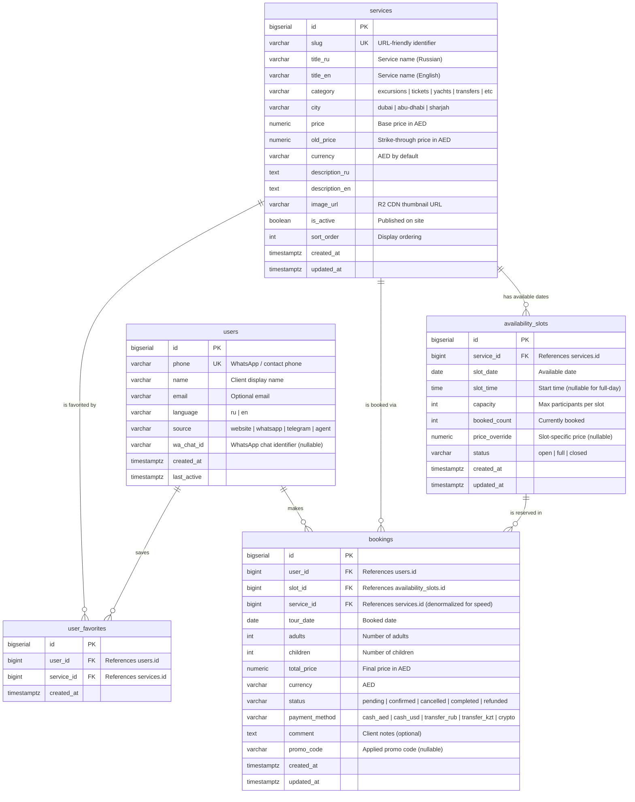

# ERD: Booking System — VIP-DXB-RUS Tourism Website

**Mode:** `diagram` (type: `erDiagram`)
**Date:** 2026-03-14
**Project:** vipdxbrus.com — booking system for tourism services

---

## Context

The tourism website needs a booking database layer to move from WhatsApp-only bookings to calendar-based availability. Five core tables cover the full lifecycle: a **services** catalog, **availability_slots** per date, **users** who browse and book, **bookings** that link users to slots, and **user_favorites** for wishlists.

---

## ERD Diagram



---

## Relationship Summary

| From | To | Cardinality | Meaning |
|------|----|-------------|---------|
| `services` | `availability_slots` | one-to-many | Each service has zero or more date/time slots |
| `services` | `bookings` | one-to-many | Each service can have many bookings (denormalized FK for fast queries) |
| `services` | `user_favorites` | one-to-many | Each service can be favorited by many users |
| `users` | `bookings` | one-to-many | Each user can make many bookings |
| `users` | `user_favorites` | one-to-many | Each user can favorite many services |
| `availability_slots` | `bookings` | one-to-many | Each slot can have multiple bookings (up to capacity) |

## Key Indexes (recommended)

```sql
-- availability_slots: fast lookup by service + date
CREATE INDEX idx_slots_service_date ON availability_slots(service_id, slot_date);

-- bookings: user history
CREATE INDEX idx_bookings_user ON bookings(user_id);

-- bookings: status filtering
CREATE INDEX idx_bookings_status ON bookings(status);

-- user_favorites: unique pair (no duplicate favorites)
CREATE UNIQUE INDEX idx_favorites_unique ON user_favorites(user_id, service_id);

-- users: phone lookup
CREATE UNIQUE INDEX idx_users_phone ON users(phone);

-- services: category + city filtering
CREATE INDEX idx_services_category_city ON services(category, city);
```

## Design Decisions

1. **`bookings.service_id` is denormalized** — duplicated from `availability_slots.service_id` to avoid an extra JOIN on the most common query (user booking history). Kept in sync at application level.
2. **`availability_slots.booked_count`** — counter cache avoids `COUNT(*)` on bookings per slot. Updated via transaction when booking is created/cancelled.
3. **`user_favorites`** uses a junction table (not JSONB array) for proper indexing and referential integrity.
4. **`users.source`** tracks acquisition channel — critical for marketing analytics (WhatsApp vs website vs Telegram).
5. **Prices stored as `numeric`** (not float) to avoid rounding errors with AED amounts.
