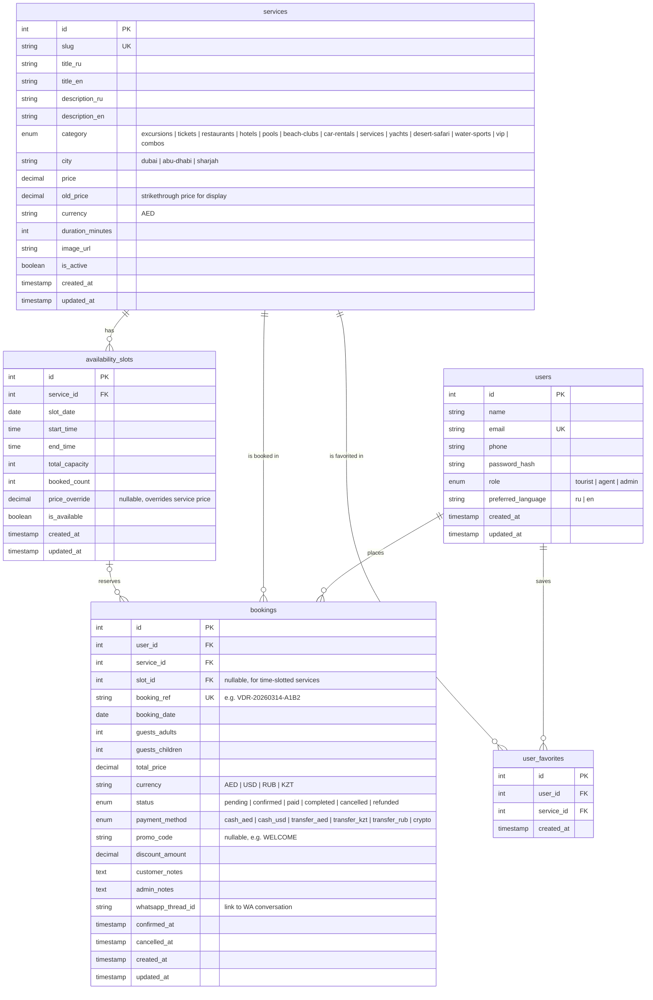

# Booking System ERD

## Table Descriptions

| Table | Purpose |
|-------|---------|
| **users** | Registered users: tourists, agents, admins. Role determines access level. |
| **services** | Catalog of tourism products (236 items across 13 categories). Maps to existing `src/data/` files. |
| **availability_slots** | Date/time slots with capacity tracking per service. Enables Calendar Phase B (real slots from DB). |
| **bookings** | Customer reservations with full lifecycle tracking (pending through completed/cancelled). |
| **user_favorites** | Wishlist / saved services. Currently stored in localStorage; this table enables server-side persistence. |

## Relationships & Cardinality

| Relationship | Cardinality | Meaning |
|-------------|-------------|---------|
| users -> bookings | one-to-many | A user can have many bookings; each booking belongs to one user |
| users -> user_favorites | one-to-many | A user can favorite many services |
| services -> availability_slots | one-to-many | A service can have many date/time slots |
| services -> bookings | one-to-many | A service can appear in many bookings |
| services -> user_favorites | one-to-many | A service can be favorited by many users |
| availability_slots -> bookings | zero/one-to-many | A slot can be referenced by many bookings; bookings for date-only services may have no slot |

## Design Notes

- **booking_ref** uses format `VDR-YYYYMMDD-XXXX` for human-readable WhatsApp communication
- **price_override** on slots allows dynamic pricing (weekends, holidays, peak season)
- **slot_id** is nullable because some services (e.g., car rentals) book by date only, not time slot
- **whatsapp_thread_id** links booking to the WhatsApp conversation for context
- **promo_code / discount_amount** supports the existing WELCOME 5% promo and future codes
- **user_favorites** has a unique constraint on (user_id, service_id) to prevent duplicates
- Payment methods match the business reality: AED/USD cash, AED/KZT/RUB transfers, crypto
