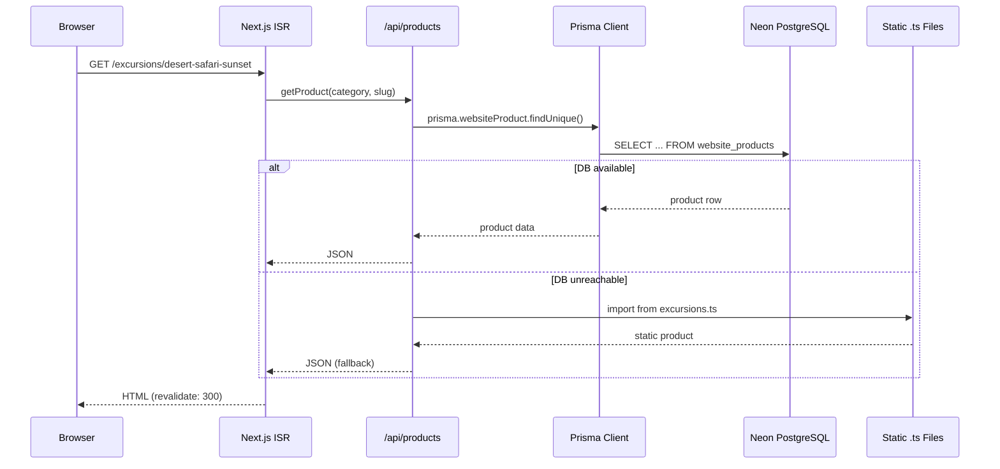
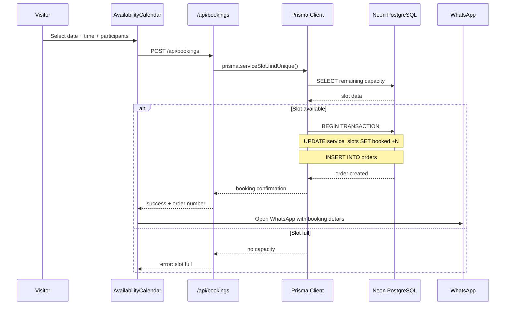
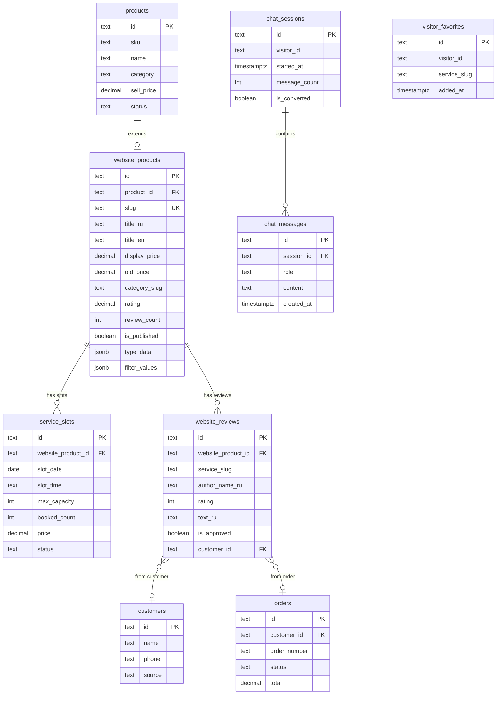

# Tech Spec: Database Integration — vipdxbrus.com + tourism-crm (Neon PostgreSQL)

**Status:** Draft
**Author:** Claude (Feature Blueprint)
**Date:** 2026-03-14
**Approvers:** Sukheil Ganeev
**Related ADR:** None (first iteration)

---

## 1. Overview

The vipdxbrus.com website currently runs entirely on static TypeScript data files (24 files in `src/data/`, 82 products across 13 categories). Bookings use mock-generated availability, reviews are 52 hardcoded demo entries, the AI chat has no conversation history, and favorites are stored in the browser's localStorage only.

This spec describes migration from static data to PostgreSQL (Neon, eu-central-1 Frankfurt) by integrating with the existing tourism-crm project, which already has 49 Prisma models on the same Neon instance. The goal is a shared database where the CRM manages products and bookings, and the website reads/writes through API routes backed by Prisma.

**In plain language:** the website will stop using hardcoded data and start reading from a real database shared with the CRM. Bookings become real, reviews come from actual customers, chat history is saved, and favorites sync across devices.

---

## 2. Goals & Non-Goals

### Goals (what we build)
- Real-time product catalog served from PostgreSQL instead of 24 static .ts files
- Real booking availability and slot management through the database
- Persistent reviews linked to customers and orders (replacing 52 demo reviews)
- AI chat conversation history stored in DB (per session/visitor)
- Cross-device favorites with anonymous visitor ID + optional migration to CRM customer
- Shared Prisma schema between vipdxbrus-website and tourism-crm
- Incremental migration: static data remains as fallback during transition

### Non-Goals (NOT in this iteration)
- User authentication/login on the website (visitors stay anonymous)
- Payment processing on the website (continues via WhatsApp)
- Real-time inventory sync with third-party suppliers
- Full CMS/admin panel for content editing on the website side
- Multi-language content management in DB (i18n stays in code for now)
- Website-side product CRUD (only CRM manages products)

---

## 3. Background & Context

**Current state of vipdxbrus.com:**
- 24 static `.ts` files in `src/data/` totaling 11,435 lines
- 82 products across 13 categories (excursions, tickets, yachts, transfers, restaurants, hotels, car-rentals, beach-clubs, pools, water-activities, buggies, combos, services)
- `generateMockAvailability()` creates fake calendar data deterministically per slug
- 52 hardcoded reviews in `reviews.ts` with fake author names
- AI chat (`/api/chat/route.ts`) uses Claude Haiku streaming but stores nothing
- Favorites stored in `localStorage` via `useFavorites.ts` hook (lost on device switch)
- Search index (`search-index.ts`) imports all 13 data files at build time

**Current state of tourism-crm:**
- 49 Prisma models, 1,370-line schema, 7 applied migrations
- Neon PostgreSQL (eu-central-1 Frankfurt)
- Has `Product`, `Order`, `Customer`, `CustomerReview`, `SeasonalPrice`, `DynamicPricingRule` and other relevant models
- Product model has: name, description, category, purchasePrice, sellPrice, status, duration, image, emirate, and sub-resources (faqs, photos, restrictions, tips, policies, menus, contacts, infrastructure)
- `ProductCategory` enum: CITY_TOUR, DESERT, WATER, TICKETS, INDIVIDUAL_TOUR, GROUP_TOUR, TRANSFER, YACHT, CAR_RENTAL, COMBO
- Missing categories for website: RESTAURANT, BEACH_CLUB, POOL, HOTEL, BUGGY, ADDITIONAL_SERVICE

**Why now?** The website has outgrown static data. Real bookings require real availability. Demo reviews undermine trust. Chat history enables better AI responses. The CRM database already exists with a mature schema — extending it is cheaper than building from scratch.

---

## 4. MoSCoW Prioritization

| Priority | Requirement | Rationale |
|----------|------------|-----------|
| **Must** | Prisma client in vipdxbrus-website connecting to the same Neon DB | Foundation for everything else |
| **Must** | Extend CRM `ProductCategory` enum with 6 missing website categories | Without this, half the catalog cannot be represented |
| **Must** | Website-specific product fields (slug, BiText titles, oldPrice, images array, whatsappText) via new `WebsiteProduct` model or extension table | CRM Product lacks website-specific fields (bilingual content, slug routing, promotional data) |
| **Must** | API routes: `GET /api/products/[category]`, `GET /api/products/[category]/[slug]` | Replace static imports with DB queries |
| **Must** | Seed script to migrate 82 products from .ts files into DB | Data must exist in DB before switching |
| **Must** | Availability slots: `ServiceSlot` table with real capacity, dates, pricing | Replace `generateMockAvailability()` |
| **Must** | Booking submission: `POST /api/bookings` writing to Orders table | Functional booking instead of WhatsApp-only |
| **Should** | Website reviews table linked to products + approval workflow | Replace 52 demo reviews with real ones |
| **Should** | AI chat history: `ChatSession` + `ChatMessage` tables | Enable context-aware conversations |
| **Should** | Cross-device favorites: `VisitorFavorite` table with anonymous visitor ID | Upgrade from localStorage |
| **Should** | ISR (Incremental Static Regeneration) for product pages | Performance: static pages + fresh data |
| **Should** | Fallback to static data if DB is unreachable | Zero-downtime during migration |
| **Could** | Review submission form on website (moderated before display) | UGC reviews |
| **Could** | Admin API for managing availability slots | CRM can manage slots |
| **Could** | Visitor analytics: track page views per product in DB | Supplement GA4/YM |
| **Won't** | User registration/login on website | Visitors stay anonymous this iteration |
| **Won't** | Real-time WebSocket updates for availability | Polling/ISR sufficient for now |
| **Won't** | Content editing UI on website side | CRM handles all CRUD |
| **Won't** | i18n content in DB (bilingual strings stored in code) | Too complex for v1; consider for v2 |

---

## 5. Technical Design

### 5.1 Architecture

```mermaid
flowchart TD
    subgraph Website["vipdxbrus.com (Next.js 15)"]
        PAGES[SSG/ISR Pages\n65+ routes]
        API_PROD["/api/products/[cat]/[slug]"]
        API_BOOK["/api/bookings"]
        API_REV["/api/reviews/[slug]"]
        API_CHAT["/api/chat"]
        API_FAV["/api/favorites"]
        PRISMA_W[Prisma Client\n(read-mostly)]
    end

    subgraph CRM["tourism-crm (Next.js 16)"]
        CRM_UI[CRM Dashboard\n160 API routes]
        PRISMA_C[Prisma Client\n(full CRUD)]
    end

    subgraph DB["Neon PostgreSQL (eu-central-1)"]
        PROD_T[(products\n+ website_products)]
        SLOTS_T[(service_slots)]
        ORDERS_T[(orders)]
        REVIEWS_T[(website_reviews)]
        CHAT_T[(chat_sessions\n+ chat_messages)]
        FAV_T[(visitor_favorites)]
    end

    PAGES --> API_PROD
    PAGES --> API_BOOK
    PAGES --> API_REV
    PAGES --> API_CHAT
    PAGES --> API_FAV

    API_PROD --> PRISMA_W
    API_BOOK --> PRISMA_W
    API_REV --> PRISMA_W
    API_CHAT --> PRISMA_W
    API_FAV --> PRISMA_W

    CRM_UI --> PRISMA_C

    PRISMA_W --> DB
    PRISMA_C --> DB
```

**Data flow for product page:**



**Booking flow:**



### 5.2 Shared Prisma Strategy

Both projects (website + CRM) share the same Neon database. Two approaches were considered:

**Option A: Shared Prisma package (monorepo or npm)** — Extract `prisma/schema.prisma` into a shared package consumed by both projects.

**Option B: Separate schemas, shared DB** — Each project has its own `schema.prisma`, both pointing to the same `DATABASE_URL`. The website schema includes only the models it needs (read views + new website-specific tables). Migrations run from the CRM only.

**Decision: Option B** (separate schemas, shared DB).

Rationale:
- Avoids coupling deployment of CRM and website
- Website needs read-only access to CRM tables + write access to its own tables
- CRM remains the single owner of migrations
- Website uses `prisma db pull` to sync schema from production
- New website-only tables (chat_sessions, visitor_favorites, website_reviews, website_products, service_slots) are added via CRM migrations to keep one migration source of truth

### 5.3 Data Model

#### 5.3.1 Schema Changes to tourism-crm (new models + enum extension)

```sql
-- ============================================================
-- STEP 1: Extend ProductCategory enum (6 new categories)
-- ============================================================
ALTER TYPE "ProductCategory" ADD VALUE IF NOT EXISTS 'RESTAURANT';
ALTER TYPE "ProductCategory" ADD VALUE IF NOT EXISTS 'BEACH_CLUB';
ALTER TYPE "ProductCategory" ADD VALUE IF NOT EXISTS 'POOL';
ALTER TYPE "ProductCategory" ADD VALUE IF NOT EXISTS 'HOTEL';
ALTER TYPE "ProductCategory" ADD VALUE IF NOT EXISTS 'BUGGY';
ALTER TYPE "ProductCategory" ADD VALUE IF NOT EXISTS 'ADDITIONAL_SERVICE';

-- ============================================================
-- STEP 2: website_products — website-specific product data
-- Linked to CRM products table; adds bilingual content,
-- slug, old price, image arrays, WhatsApp text, etc.
-- ============================================================
CREATE TABLE IF NOT EXISTS website_products (
    id              TEXT PRIMARY KEY DEFAULT gen_random_uuid()::text,
    product_id      TEXT UNIQUE NOT NULL REFERENCES products(id) ON DELETE CASCADE,
    slug            TEXT UNIQUE NOT NULL,
    -- Bilingual content (JSON: {"RU": "...", "EN": "..."})
    title_ru        TEXT NOT NULL,
    title_en        TEXT,
    description_ru  TEXT,
    description_en  TEXT,
    full_desc_ru    TEXT,
    full_desc_en    TEXT,
    -- Pricing display
    display_price   DECIMAL(10,2) NOT NULL,
    old_price       DECIMAL(10,2),
    -- Media
    hero_image      TEXT,
    images          TEXT[] DEFAULT '{}',
    -- Category & location
    category_slug   TEXT NOT NULL,  -- "excursions", "tickets", etc.
    location_ru     TEXT,
    location_en     TEXT,
    duration_ru     TEXT,
    duration_en     TEXT,
    -- Ratings (aggregated)
    rating          DECIMAL(3,2) DEFAULT 0,
    review_count    INT DEFAULT 0,
    -- WhatsApp integration
    whatsapp_text_ru TEXT,
    whatsapp_text_en TEXT,
    -- Badge & promo
    badge_ru        TEXT,
    badge_en        TEXT,
    promo_end_date  TIMESTAMPTZ,
    -- SEO
    meta_title_ru   TEXT,
    meta_title_en   TEXT,
    meta_desc_ru    TEXT,
    meta_desc_en    TEXT,
    -- Type-specific data (JSON blob for excursion itinerary,
    -- ticket tiers, yacht specs, etc.)
    type_data       JSONB DEFAULT '{}',
    -- Filter values (JSON: {"city": "dubai", "duration": "half-day"})
    filter_values   JSONB DEFAULT '{}',
    -- Included / not included (JSON arrays of BiText)
    included        JSONB DEFAULT '[]',
    not_included    JSONB DEFAULT '[]',
    highlights      JSONB DEFAULT '[]',
    faq             JSONB DEFAULT '[]',
    directions      JSONB,
    -- Status
    is_published    BOOLEAN DEFAULT TRUE,
    sort_order      INT DEFAULT 0,
    created_at      TIMESTAMPTZ DEFAULT NOW(),
    updated_at      TIMESTAMPTZ DEFAULT NOW()
);

CREATE INDEX IF NOT EXISTS idx_wp_slug ON website_products(slug);
CREATE INDEX IF NOT EXISTS idx_wp_category ON website_products(category_slug);
CREATE INDEX IF NOT EXISTS idx_wp_published ON website_products(is_published);
CREATE INDEX IF NOT EXISTS idx_wp_product_id ON website_products(product_id);

-- ============================================================
-- STEP 3: service_slots — real availability calendar
-- Replaces generateMockAvailability()
-- ============================================================
CREATE TABLE IF NOT EXISTS service_slots (
    id              TEXT PRIMARY KEY DEFAULT gen_random_uuid()::text,
    website_product_id TEXT NOT NULL REFERENCES website_products(id) ON DELETE CASCADE,
    slot_date       DATE NOT NULL,
    slot_time       TEXT NOT NULL,          -- "09:00", "14:00", "18:00"
    label_ru        TEXT,
    label_en        TEXT,
    max_capacity    INT NOT NULL DEFAULT 20,
    booked_count    INT NOT NULL DEFAULT 0,
    price           DECIMAL(10,2) NOT NULL,
    status          TEXT NOT NULL DEFAULT 'available',  -- available | blocked | full
    blocked_reason  TEXT,
    created_at      TIMESTAMPTZ DEFAULT NOW(),
    updated_at      TIMESTAMPTZ DEFAULT NOW(),

    CONSTRAINT uq_slot_product_date_time UNIQUE (website_product_id, slot_date, slot_time),
    CONSTRAINT chk_booked_capacity CHECK (booked_count <= max_capacity),
    CONSTRAINT chk_status CHECK (status IN ('available', 'blocked', 'full'))
);

CREATE INDEX IF NOT EXISTS idx_ss_product_date ON service_slots(website_product_id, slot_date);
CREATE INDEX IF NOT EXISTS idx_ss_date ON service_slots(slot_date);
CREATE INDEX IF NOT EXISTS idx_ss_status ON service_slots(status);

-- ============================================================
-- STEP 4: website_reviews — public reviews shown on the site
-- Separate from CRM's customer_reviews (internal quality tracking)
-- ============================================================
CREATE TABLE IF NOT EXISTS website_reviews (
    id              TEXT PRIMARY KEY DEFAULT gen_random_uuid()::text,
    website_product_id TEXT NOT NULL REFERENCES website_products(id) ON DELETE CASCADE,
    service_slug    TEXT NOT NULL,
    -- Author info (can be anonymous/partial for privacy)
    author_name_ru  TEXT NOT NULL,
    author_name_en  TEXT,
    author_city_ru  TEXT,
    author_city_en  TEXT,
    -- Content
    rating          INT NOT NULL CHECK (rating >= 1 AND rating <= 5),
    text_ru         TEXT NOT NULL,
    text_en         TEXT,
    photos          TEXT[] DEFAULT '{}',
    -- Business response
    response_ru     TEXT,
    response_en     TEXT,
    -- Moderation
    is_verified     BOOLEAN DEFAULT FALSE,
    is_approved     BOOLEAN DEFAULT FALSE,
    -- Linkage (optional: from CRM customer/order)
    customer_id     TEXT REFERENCES customers(id),
    order_id        TEXT REFERENCES orders(id),
    -- Timestamps
    review_date     DATE NOT NULL DEFAULT CURRENT_DATE,
    created_at      TIMESTAMPTZ DEFAULT NOW(),
    updated_at      TIMESTAMPTZ DEFAULT NOW()
);

CREATE INDEX IF NOT EXISTS idx_wr_product ON website_reviews(website_product_id);
CREATE INDEX IF NOT EXISTS idx_wr_slug ON website_reviews(service_slug);
CREATE INDEX IF NOT EXISTS idx_wr_approved ON website_reviews(is_approved);
CREATE INDEX IF NOT EXISTS idx_wr_rating ON website_reviews(rating);

-- ============================================================
-- STEP 5: chat_sessions + chat_messages — AI chat history
-- ============================================================
CREATE TABLE IF NOT EXISTS chat_sessions (
    id              TEXT PRIMARY KEY DEFAULT gen_random_uuid()::text,
    visitor_id      TEXT NOT NULL,          -- anonymous browser fingerprint / cookie
    ip_address      TEXT,
    user_agent      TEXT,
    language        TEXT DEFAULT 'ru',
    started_at      TIMESTAMPTZ DEFAULT NOW(),
    last_message_at TIMESTAMPTZ DEFAULT NOW(),
    message_count   INT DEFAULT 0,
    is_converted    BOOLEAN DEFAULT FALSE,  -- clicked WhatsApp after chat
    metadata        JSONB DEFAULT '{}'
);

CREATE INDEX IF NOT EXISTS idx_cs_visitor ON chat_sessions(visitor_id);
CREATE INDEX IF NOT EXISTS idx_cs_started ON chat_sessions(started_at);

CREATE TABLE IF NOT EXISTS chat_messages (
    id              TEXT PRIMARY KEY DEFAULT gen_random_uuid()::text,
    session_id      TEXT NOT NULL REFERENCES chat_sessions(id) ON DELETE CASCADE,
    role            TEXT NOT NULL CHECK (role IN ('user', 'assistant')),
    content         TEXT NOT NULL,
    tokens_used     INT,
    created_at      TIMESTAMPTZ DEFAULT NOW()
);

CREATE INDEX IF NOT EXISTS idx_cm_session ON chat_messages(session_id);
CREATE INDEX IF NOT EXISTS idx_cm_created ON chat_messages(created_at);

-- ============================================================
-- STEP 6: visitor_favorites — cross-device favorites
-- ============================================================
CREATE TABLE IF NOT EXISTS visitor_favorites (
    id              TEXT PRIMARY KEY DEFAULT gen_random_uuid()::text,
    visitor_id      TEXT NOT NULL,
    service_slug    TEXT NOT NULL,
    added_at        TIMESTAMPTZ DEFAULT NOW(),

    CONSTRAINT uq_visitor_slug UNIQUE (visitor_id, service_slug)
);

CREATE INDEX IF NOT EXISTS idx_vf_visitor ON visitor_favorites(visitor_id);
CREATE INDEX IF NOT EXISTS idx_vf_slug ON visitor_favorites(service_slug);
```

#### 5.3.2 ERD — New Website Tables



### 5.4 API Routes (Website Side)

```
# Products (read-only)
GET  /api/products                          → all published products (paginated)
GET  /api/products/[category]               → products by category slug
GET  /api/products/[category]/[slug]        → single product with full data

# Availability & Booking
GET  /api/availability/[slug]               → 3-month availability for a service
POST /api/bookings                          → create booking (date, time, participants)

# Reviews
GET  /api/reviews/[slug]                    → approved reviews for a service
POST /api/reviews                           → submit review (goes to moderation)

# Chat
POST /api/chat                              → existing Claude Haiku endpoint (enhanced with DB history)
GET  /api/chat/history?session=X            → get chat history for a session

# Favorites
GET  /api/favorites?visitor=X               → get favorites for visitor
POST /api/favorites                         → add/remove favorite
```

### 5.5 Key Decisions

1. **Separate `website_products` table** instead of extending CRM's `Product` model. Rationale: the website needs bilingual content, slugs for URL routing, old prices for promotional display, image arrays, and type-specific JSON data (itineraries, tiers, yacht specs). These are display concerns, not CRM business logic. Keeping them separate avoids bloating the CRM schema.

2. **JSONB for type-specific data** (`type_data` column). Each product type (excursion, ticket, yacht, etc.) has unique fields (itinerary, tiers, capacity, engine size). Rather than 13 additional tables, a single JSONB column with type-validated access in the application layer keeps the schema manageable.

3. **Visitor ID via cookie** (not authentication). A `vipdxbrus_visitor_id` cookie (UUID, 1 year TTL) identifies anonymous visitors across sessions. No login required. If a visitor later becomes a CRM customer, the visitor_id can be linked.

4. **Migrations owned by CRM project only**. The website project never runs `prisma migrate dev`. All schema changes are made in tourism-crm and deployed via `npx prisma migrate deploy`. The website uses `prisma db pull` to update its local schema copy.

5. **ISR with 5-minute revalidation** for product pages. Static generation at build time + on-demand revalidation every 300 seconds balances performance and freshness.

6. **Transactional booking with capacity check**. The `POST /api/bookings` endpoint uses a Prisma transaction: check slot capacity -> increment `booked_count` -> create order. If `booked_count + participants > max_capacity`, the transaction rolls back.

---

## 6. Alternatives Considered

| Option | Pros | Cons | Decision |
|--------|------|------|----------|
| **A: Extend CRM Product model with website fields** | Single source of truth | Bloats CRM schema with display-only data; forces CRM deployments for website content changes | Rejected: separation of concerns |
| **B: website_products as extension table (chosen)** | Clean separation; CRM unaffected; website-specific fields isolated | Requires JOIN for full data; extra table to maintain | **Chosen**: best balance of isolation and integration |
| **C: Completely separate database for website** | Full independence | Loses connection to CRM orders, customers, products; data duplication | Rejected: defeats the purpose of integration |
| **D: Store bilingual content in DB** | Full i18n in DB, editable via CRM | Massive migration (740+ i18n keys); complex queries; slows development | Rejected: too much scope for v1 |
| **E: Headless CMS (Strapi/Sanity) for content** | Rich content editing UI | Another system to maintain; doesn't solve booking/reviews; adds latency | Rejected: overkill for current needs |

---

## 7. Implementation Plan

Total estimated effort: ~18-22 hours across 5 phases.

### Phase 1: Foundation — Prisma + Schema (~4h)

- [ ] TASK-001 [30 min]: Install Prisma in vipdxbrus-website: `npm install prisma @prisma/client`, create `prisma/schema.prisma` with Neon datasource, create `src/lib/prisma.ts` singleton
- [ ] TASK-002 [45 min]: Add new enum values + 6 new tables to tourism-crm `schema.prisma` (website_products, service_slots, website_reviews, chat_sessions, chat_messages, visitor_favorites)
- [ ] TASK-003 [30 min]: Run `npx prisma migrate dev --name add-website-tables` in tourism-crm, verify migration
- [ ] TASK-004 [30 min]: Deploy migration to Neon production: `DATABASE_URL=... npx prisma migrate deploy`
- [ ] TASK-005 [20 min]: `prisma db pull` in vipdxbrus-website to sync schema, generate client
- [ ] TASK-006 [45 min]: Add `DATABASE_URL` to vipdxbrus-website: `.env.local`, Vercel env vars, GitHub Actions secrets, Docker compose

### Phase 2: Product Catalog Migration (~5h)

- [ ] TASK-007 [60 min]: Write seed script `scripts/seed-products.ts` — reads all 13 static data files, maps to `website_products` + creates corresponding CRM `products` entries. Output: 82 products seeded
- [ ] TASK-008 [30 min]: Run seed script against Neon, verify all 82 products exist with correct data
- [ ] TASK-009 [45 min]: Create `src/app/api/products/route.ts` — GET all published products (paginated, filterable by category)
- [ ] TASK-010 [45 min]: Create `src/app/api/products/[category]/[slug]/route.ts` — GET single product with full data
- [ ] TASK-011 [60 min]: Create `src/lib/product-service.ts` — data access layer with DB-first + static fallback pattern:
  ```typescript
  export async function getProduct(category: string, slug: string): Promise<Service | null> {
    try {
      const dbProduct = await prisma.websiteProduct.findUnique({ where: { slug } });
      if (dbProduct) return mapToService(dbProduct);
    } catch (e) { console.error('[product-service] DB error, falling back to static', e); }
    return getStaticProduct(category, slug); // fallback
  }
  ```
- [ ] TASK-012 [45 min]: Update `search-index.ts` to optionally load from DB instead of static imports (with build-time static fallback)

### Phase 3: Availability & Booking (~3.5h)

- [ ] TASK-013 [45 min]: Write seed script `scripts/seed-slots.ts` — generates 3 months of availability slots for all 82 products (similar logic to `generateMockAvailability` but writing to DB)
- [ ] TASK-014 [45 min]: Create `src/app/api/availability/[slug]/route.ts` — GET availability for a service (3 months ahead, grouped by month)
- [ ] TASK-015 [45 min]: Create `src/app/api/bookings/route.ts` — POST booking with transactional capacity check:
  ```typescript
  await prisma.$transaction(async (tx) => {
    const slot = await tx.serviceSlot.findUnique({ where: { id: slotId } });
    if (slot.bookedCount + participants > slot.maxCapacity) throw new Error('Slot full');
    await tx.serviceSlot.update({ data: { bookedCount: { increment: participants } } });
    return tx.order.create({ data: { ... } });
  });
  ```
- [ ] TASK-016 [30 min]: Update `AvailabilityCalendar.tsx` — fetch from `/api/availability/[slug]` instead of calling `generateMockAvailability()`. Keep mock as fallback.
- [ ] TASK-017 [30 min]: Add WhatsApp notification on booking: include order number in WhatsApp deep link text

### Phase 4: Reviews + Chat + Favorites (~4.5h)

- [ ] TASK-018 [45 min]: Write seed script `scripts/seed-reviews.ts` — migrate 52 demo reviews from `reviews.ts` into `website_reviews` table (approved by default)
- [ ] TASK-019 [30 min]: Create `src/app/api/reviews/[slug]/route.ts` — GET approved reviews for a service slug
- [ ] TASK-020 [30 min]: Create `src/app/api/reviews/route.ts` — POST review submission (is_approved=false by default, requires moderation)
- [ ] TASK-021 [45 min]: Update `ServiceDetailPage` review tab to fetch from API instead of static `reviews.ts` import
- [ ] TASK-022 [45 min]: Enhance `/api/chat/route.ts` — add chat session management: create/resume session via `vipdxbrus_session_id` cookie, store messages in DB, load last 10 messages as context
- [ ] TASK-023 [45 min]: Create `src/lib/visitor-id.ts` — generate/read `vipdxbrus_visitor_id` cookie (UUID, HttpOnly, SameSite=Lax, 1 year)
- [ ] TASK-024 [30 min]: Create `src/app/api/favorites/route.ts` — GET/POST favorites by visitor_id
- [ ] TASK-025 [30 min]: Update `useFavorites.ts` — hybrid mode: write to both localStorage (instant UI) and API (persistence). On load, merge localStorage with DB favorites.

### Phase 5: ISR + Deployment + Cleanup (~3h)

- [ ] TASK-026 [30 min]: Update all 14 `[slug]/page.tsx` files — `generateStaticParams()` reads from DB (fallback: static data). Add `revalidate = 300` (5 min ISR).
- [ ] TASK-027 [30 min]: Update `generateMetadata()` in page files — fetch OG data from DB
- [ ] TASK-028 [30 min]: Add `DATABASE_URL` to `deploy/docker-compose.prod.yml` and `.github/workflows/deploy.yml`
- [ ] TASK-029 [30 min]: Update `next.config.ts` — add Neon hostname to `serverExternalPackages` if needed for edge runtime
- [ ] TASK-030 [20 min]: Add health check endpoint `GET /api/health` — verifies DB connectivity
- [ ] TASK-031 [20 min]: Update `CLAUDE.md` — add Prisma, DB connection, new API routes, new tables
- [ ] TASK-032 [20 min]: Update `CHANGELOG.md` — document all changes

---

## 8. Testing Strategy

### Unit Tests
- `product-service.ts`: DB-first + static fallback behavior (mock Prisma client)
- `visitor-id.ts`: cookie generation and parsing
- `/api/bookings/route.ts`: capacity validation, transaction rollback on full slot

### Integration Tests
- Seed DB -> query products API -> verify response matches static data
- Create booking -> verify slot booked_count incremented -> verify order created
- Submit review -> verify is_approved=false -> approve -> verify appears in GET

### E2E Smoke Tests (post-deploy)
- Visit product page -> verify data loads from DB (not empty)
- Open availability calendar -> verify dates load from DB
- Submit booking -> verify success response + order number
- Chat with AI -> close tab -> reopen -> verify history loaded

### Acceptance Criteria
- All 82 products return via API matching static data structure
- Booking creates a real Order in the database
- Reviews display from DB (52 migrated + any new)
- Chat history persists across page refreshes
- Favorites sync across devices (same visitor_id cookie)
- If DB goes down, website falls back to static data (no error pages)

---

## 9. Rollout Plan

### Stage 1: Shadow Mode (1-2 days)
- Deploy with DB connection but keep reading from static files
- API routes exist but are not called by pages
- Validate DB connectivity, seed data, run integration tests

### Stage 2: Read from DB (2-3 days)
- Switch product pages to read from DB (static fallback active)
- Monitor error rates, response times, fallback triggers
- Keep static data files in codebase as fallback

### Stage 3: Write to DB (1-2 days)
- Enable booking writes (AvailabilityCalendar -> POST /api/bookings)
- Enable chat history storage
- Enable favorites sync
- Monitor booking transaction success rate

### Stage 4: Full Migration (after 1 week stable)
- Remove static fallback (or keep as emergency)
- Mark static .ts data files as deprecated (DORMANT: fallback data)
- Update documentation

### Rollback
- Revert to static data: set `USE_STATIC_DATA=true` env var
- All service functions check this flag and skip DB
- Zero-downtime rollback, no DB schema changes needed

---

## 10. Security Considerations

- `DATABASE_URL` stored as secret in Vercel, GitHub Actions, and Docker — never in code
- Website Prisma client uses **read-only** connection where possible (Neon supports read replicas)
- `POST /api/bookings` rate-limited (same as existing chat rate limiter)
- `POST /api/reviews` rate-limited, text sanitized (reuse existing `sanitize()` from chat)
- `visitor_id` cookie: HttpOnly, Secure, SameSite=Lax — not accessible from JS
- No PII stored in chat_sessions beyond IP (hashed) and user_agent
- JSONB fields (type_data, filter_values) validated in application layer before write

---

## 11. Open Questions

- [ ] **Neon connection pooling:** Current CRM uses standard Neon connection. With two apps connecting, should we switch to Neon's connection pooler (PgBouncer)? Likely yes — need to configure `DATABASE_URL` with `?pgbouncer=true` and use `directUrl` for migrations.
- [ ] **Read replica:** Does the Neon plan support read replicas? If so, the website should read from replica to avoid load on primary.
- [ ] **ISR vs SSR:** For product pages, ISR (5 min revalidation) is proposed. Should some pages (availability calendar) use SSR instead for real-time data?
- [ ] **Review moderation:** Who moderates submitted reviews? CRM user via admin panel? Or automatic approval with bad-word filter?
- [ ] **Slot generation cadence:** Who generates availability slots going forward? Manual entry in CRM? Automated script? Weekly cron job?

---

## 12. References

- **Website project:** `D:/Downloads/vipdxbrus-website/` (CLAUDE.md for full context)
- **CRM project:** `D:/Downloads/tourism-crm/` (49 Prisma models, Neon PostgreSQL)
- **CRM schema:** `D:/Downloads/tourism-crm/prisma/schema.prisma` (1,370 lines)
- **Website static data:** `D:/Downloads/vipdxbrus-website/src/data/` (24 files, 11,435 lines)
- **Website types:** `D:/Downloads/vipdxbrus-website/src/data/types.ts` (BaseService, 14 service types)
- **Mock availability:** `D:/Downloads/vipdxbrus-website/src/data/booking-availability.ts`
- **AI chat route:** `D:/Downloads/vipdxbrus-website/src/app/api/chat/route.ts`
- **Favorites hook:** `D:/Downloads/vipdxbrus-website/src/hooks/useFavorites.ts`
- **Neon docs — connection pooling:** https://neon.tech/docs/connect/connection-pooling
- **Next.js ISR docs:** https://nextjs.org/docs/app/building-your-application/data-fetching/incremental-static-regeneration
- **Prisma multi-project setup:** https://www.prisma.io/docs/guides/other/multi-project-setup
