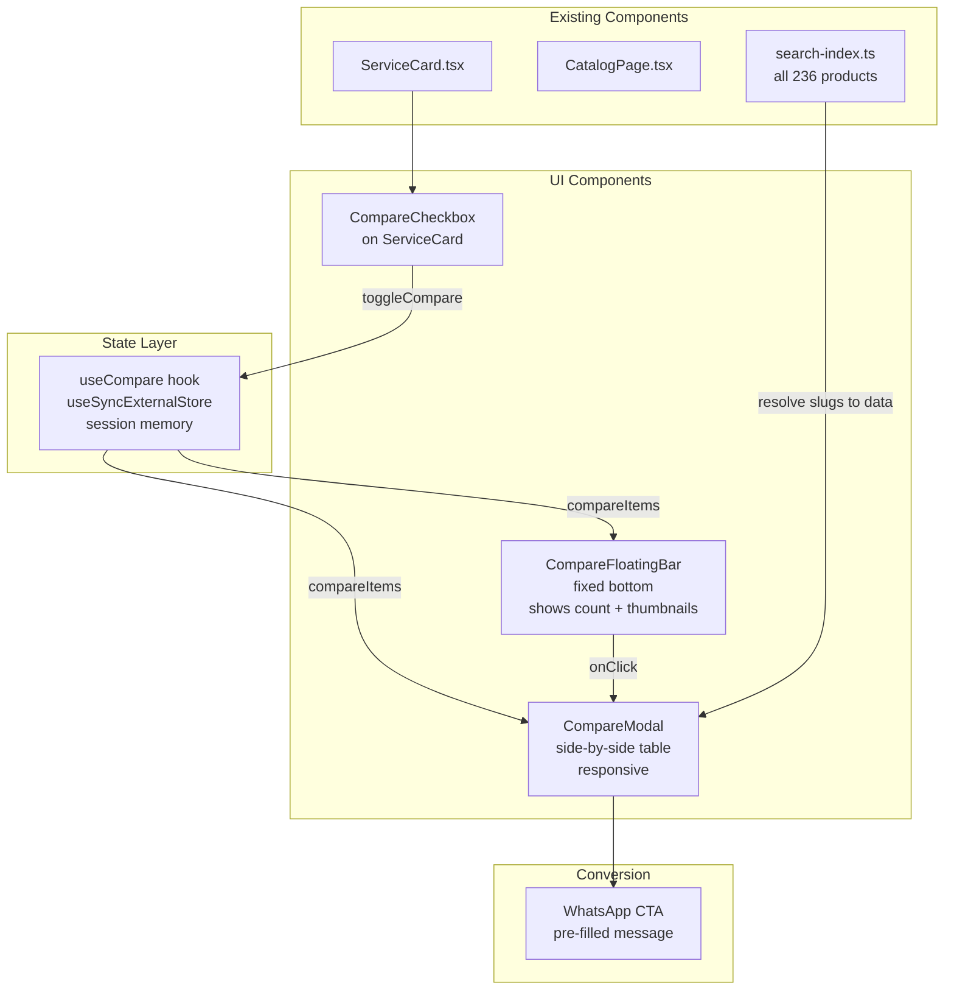
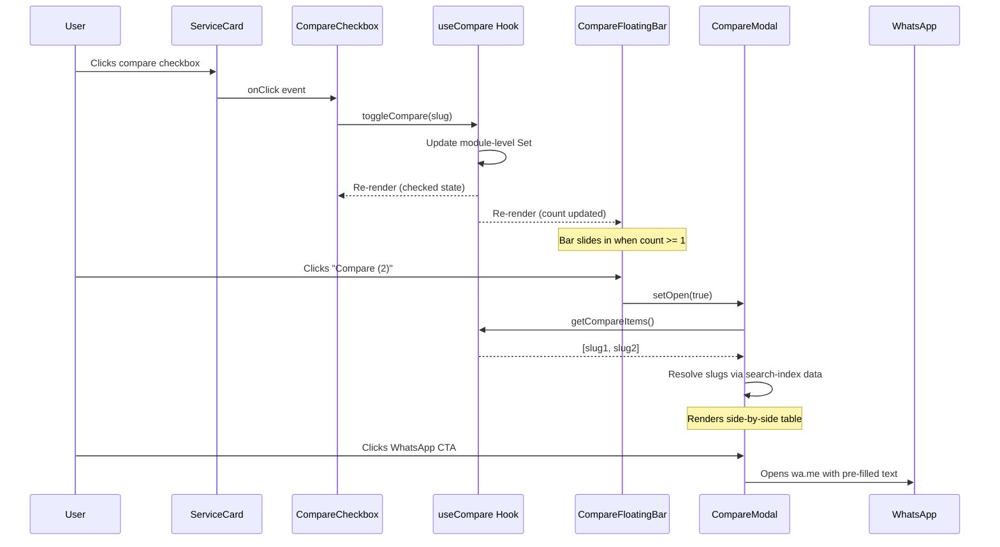
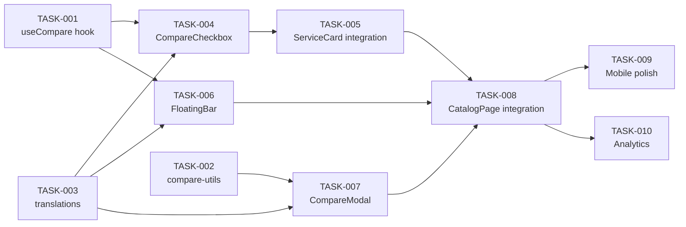

# Tech Spec: Quick Compare — Side-by-Side Service Comparison

**Status:** Draft
**Author:** Claude (feature-blueprint)
**Date:** 2026-03-14
**Approvers:** Sukheil (owner)
**Related ADR:** N/A
**Issue:** I-85

---

## 1. Overview

Quick Compare allows users to select 2-3 services from any catalog page and compare them side-by-side in a modal overlay. The user checks "Compare" on ServiceCard tiles; a floating bar appears at the bottom showing "Compare (N)"; clicking it opens a comparison table with price, duration, rating, city, and highlights. The final CTA sends the user to WhatsApp with a pre-filled message listing the compared services.

This solves the real user problem: visitors browse 15-30 services per category and struggle to remember which ones had the best price-to-value ratio. Instead of opening 3 browser tabs and switching between them, they get a clean side-by-side view -- a pattern proven by Klook, Kayak, and Booking.com.

## 2. Goals & Non-Goals

### Goals (what we build)
- Users can select 2-3 services for comparison from any catalog page
- A floating comparison bar shows the count and lets the user open the comparison modal
- The comparison modal displays a responsive table with key attributes (price, duration, rating, location, highlights)
- Each comparison row links to the service detail page
- CTA sends a WhatsApp message listing all compared services
- State persists across page navigation within the session (not across sessions)

### Non-Goals (what we do NOT build in this iteration)
- Cross-category comparison (e.g., comparing a yacht with an excursion) -- same category only for v1
- Saving comparison sets to localStorage across sessions
- PDF export of comparison table
- Server-side comparison logic or database storage
- Desktop sidebar comparison (modal-only for v1)
- Deep attribute comparison (e.g., tier-by-tier pricing for tickets)

## 3. Background & Context

vipdxbrus.com has 236 products across 13 categories. The average catalog page shows 8-25 services. Mobile users (70%+ of traffic) especially struggle with comparison since they can't easily switch between tabs.

Competitor analysis:
- **Klook:** Checkbox on cards, floating bar, comparison table with shared attributes
- **Kayak:** Side-by-side flight comparison with diff highlighting
- **Booking.com:** Property comparison up to 3 items with sticky header

The site already has a similar UX pattern: **Favorites** (FavoriteButton + useFavorites hook using localStorage + useSyncExternalStore). Quick Compare will follow the same architecture but with session-only state (no localStorage persistence) and a limit of 3 items.

## 4. MoSCoW Prioritization

| Priority | Requirement | Rationale |
|----------|-----------|-----------|
| **Must** | `useCompare` hook with add/remove/clear, max 3 items, session state | Core state management; without it nothing works |
| **Must** | CompareCheckbox on ServiceCard -- toggles compare state | Entry point for the entire feature |
| **Must** | CompareFloatingBar -- shows count, animates in/out, "Compare (N)" button | Without the bar, user has no way to trigger comparison |
| **Must** | CompareModal -- responsive table: image thumbnail, title, price, duration, rating, location | Core value of the feature |
| **Must** | WhatsApp CTA in modal with pre-filled message listing all compared services | Business conversion -- the whole point |
| **Must** | Mobile-responsive: horizontal scroll table or stacked cards on < 640px | 70% mobile traffic |
| **Should** | Highlight best value (lowest price, highest rating) in green | Helps decision-making, Klook does this |
| **Should** | "Remove" button per item in modal (X icon on column header) | UX polish, expected by users |
| **Should** | Animate items entering/leaving the floating bar (service thumbnails) | Visual feedback, luxury feel |
| **Could** | "Add one more" button in modal to jump back to catalog | Nice flow but not critical |
| **Could** | Comparison link shareable via URL query params (?compare=slug1,slug2) | Useful for sharing via WhatsApp |
| **Won't** | Cross-category comparison | Data models differ too much (yacht has cabins, ticket has tiers) |
| **Won't** | PDF/image export of comparison | Overengineered for v1; WhatsApp CTA is sufficient |
| **Won't** | Comparison history / saved comparisons | No backend; keep it simple |

**Validation:** Must Have = ~65% of effort. Acceptable.

## 5. Technical Design

### 5.1 Architecture



**Data flow:**



### 5.2 Data Model

No database changes. All state is client-side, session-only.

**Hook state shape:**

```typescript
// Module-level state (shared across all hook instances, like useFavorites)
const compareSet: Set<string> = new Set(); // max 3 slugs
const MAX_COMPARE = 3;

interface UseCompareReturn {
  compareSlugs: string[];         // Current slugs being compared
  isComparing: (slug: string) => boolean;
  toggleCompare: (slug: string) => void;
  removeFromCompare: (slug: string) => void;
  clearCompare: () => void;
  count: number;
  isFull: boolean;                // count >= MAX_COMPARE
}
```

**Data resolution for the modal:** We reuse the existing `search-index.ts` which already imports all 13 data files. We add a small `getServiceBySlug(slug: string): BaseService | null` utility that looks up a service across all categories.

### 5.3 API / Interface Design

No server API. All client-side.

**New files:**

| File | Purpose |
|------|---------|
| `src/hooks/useCompare.ts` | Compare state hook (useSyncExternalStore pattern) |
| `src/components/CompareCheckbox.tsx` | Checkbox overlay on ServiceCard |
| `src/components/CompareFloatingBar.tsx` | Fixed bottom bar with count + thumbnails |
| `src/components/CompareModal.tsx` | Full comparison modal with table |
| `src/lib/compare-utils.ts` | `getServiceBySlug()`, `buildCompareWhatsAppText()` |

**Modified files:**

| File | Change |
|------|--------|
| `src/components/ServiceCard.tsx` | Add `CompareCheckbox` next to `FavoriteButton` |
| `src/components/CatalogPage.tsx` | Mount `CompareFloatingBar` + `CompareModal` |
| `src/data/translations.ts` | Add `compare.*` i18n keys (RU/EN) |

### 5.4 Key Logic & Decisions

**1. Session-only state via module-level variable + CustomEvent (not localStorage)**

Same pattern as `useFavorites` (useSyncExternalStore + CustomEvent for cross-component sync), but without localStorage persistence. The compare Set lives in module scope. On page refresh, it resets -- this is intentional: comparison is a short-lived browsing action, not a persistent wishlist.

Rationale: Favorites are "save for later" (persist). Compare is "decide now" (ephemeral).

**2. Max 3 items**

Klook and Booking.com both cap at 3-4 items. More than 3 breaks the mobile layout (viewport width / 3 = minimum usable column width). When the user tries to add a 4th item, show a toast: "Remove one to add another."

**3. Cross-category blocking**

When the first item is added, its category is locked. Items from other categories are greyed out (checkbox disabled with tooltip "Same category only"). When all items are removed, category lock resets.

**4. Comparison table attributes**

Universal attributes from `BaseService` (available for all 13 categories):

| Attribute | Source field | Display |
|-----------|------------|---------|
| Thumbnail | `image` | 120x80 WebP |
| Title | `title[lang]` | Text + link to detail |
| Price | `price` / `oldPrice` | Formatted with currency |
| Duration | `duration[lang]` | Text |
| Rating | `rating` | Stars + number |
| Reviews | `reviews` | Count |
| Location | `location[lang]` | Text |
| Highlights | `highlights?.[lang]` | Bullet list (first 3) |
| Badge | `badge?.[lang]` | If present |

Best value highlighting: lowest price gets green text, highest rating gets green text.

**5. Floating bar behavior**

- Appears when `count >= 1` (slide-up animation, same as CatalogStickyBar)
- Hides when mobile menu is open (reuse `data-mobile-menu-open` pattern)
- Hides when footer is visible (IntersectionObserver, same pattern as CatalogStickyBar)
- Shows up to 3 circular thumbnails + "Compare (N)" button
- Desktop: centered bottom, max-width 480px, rounded corners
- Mobile: full-width bottom bar, height ~62px + safe area

**6. Modal layout**

- Desktop (>= 768px): Side-by-side columns (2-3 columns in a CSS Grid)
- Mobile (< 768px): Horizontal scroll with snap (each service card = min-width 280px)
- Close: X button top-right, ESC key, click outside
- Lazy loaded via `next/dynamic` with `ssr: false` (same pattern as SearchModal, AiAssistant)

## 6. Alternatives Considered

| Variant | Pros | Cons | Decision |
|---------|------|------|----------|
| **A: Session state (chosen)** | Simple, no storage overhead, natural "reset on refresh" | Lost on navigation between pages within the session... wait, module state persists across client-side navigation in Next.js SPA | Chosen -- module scope persists across Next.js client navigation, resets only on hard refresh which is acceptable |
| **B: localStorage (like Favorites)** | Persists across sessions | Comparison is ephemeral; persisting stale compare sets confuses users who return days later | Rejected |
| **C: URL query params** | Shareable, bookmarkable | Clutters URL, complex routing, SSR complications | Rejected for v1 (Could Have) |
| **D: Dedicated comparison page (not modal)** | More space, SEO-friendly | Slower UX (full page load), user loses scroll position in catalog | Rejected -- modal is faster and keeps context |

## 7. Implementation Plan

### Phase 1: State + Hook (~1.5h)

- [ ] **TASK-001** `src/hooks/useCompare.ts` -- create hook with useSyncExternalStore, module-level Set, CustomEvent sync, max 3 items, category lock logic (30 min)
- [ ] **TASK-002** `src/lib/compare-utils.ts` -- `getServiceBySlug()` resolver using search-index data, `buildCompareWhatsAppText()` for WA CTA (25 min)
- [ ] **TASK-003** `src/data/translations.ts` -- add `compare.*` keys: compare, removeCompare, compareFull, compareEmpty, compareCategory, compareCta, compareTitle, compareRemove (15 min)

### Phase 2: UI Components (~2.5h)

- [ ] **TASK-004** `src/components/CompareCheckbox.tsx` -- checkbox overlay (scale icon or "compare" toggle), positioned on ServiceCard top-left below badge area, stopPropagation to prevent card click (30 min)
- [ ] **TASK-005** `src/components/ServiceCard.tsx` -- integrate CompareCheckbox next to FavoriteButton area, pass slug + category (20 min)
- [ ] **TASK-006** `src/components/CompareFloatingBar.tsx` -- fixed bottom bar, slide-up animation, circular thumbnails, count badge, "Compare" button, hide on menu/footer (40 min)
- [ ] **TASK-007** `src/components/CompareModal.tsx` -- responsive comparison table/grid, image + attributes rows, best-value highlighting, WhatsApp CTA, remove per item, close on ESC/outside (60 min)

### Phase 3: Integration + Polish (~1h)

- [ ] **TASK-008** `src/components/CatalogPage.tsx` -- mount CompareFloatingBar + CompareModal (lazy loaded), wire to useCompare (20 min)
- [ ] **TASK-009** Mobile testing + responsive polish: horizontal scroll table on mobile, floating bar safe-area handling, z-index coordination with CatalogStickyBar (25 min)
- [ ] **TASK-010** Analytics events: `compare_add`, `compare_remove`, `compare_open`, `compare_whatsapp` via existing `trackEvent()` (15 min)

**Total estimate: ~5 hours**

### Dependency graph



**Parallelism:** TASK-001, TASK-002, TASK-003 can run in parallel (Wave 1). TASK-004, TASK-006, TASK-007 can run in parallel after Wave 1 (Wave 2). TASK-005, TASK-008 are sequential (Wave 3). TASK-009 + TASK-010 are the final polish wave.

## 8. Testing Strategy

- **Unit tests:** `useCompare` hook -- add, remove, toggle, max 3 enforcement, category lock, clear. `compare-utils` -- slug resolution, WhatsApp text generation.
- **Integration tests:** CompareCheckbox toggles state correctly on ServiceCard click. CompareFloatingBar appears/disappears based on count. CompareModal renders correct data for given slugs.
- **Manual E2E:** On catalog page, check 2 services -> floating bar shows "Compare (2)" -> open modal -> verify data matches -> click WhatsApp -> verify pre-filled text -> remove one item -> modal updates -> close modal -> bar updates to "Compare (1)".

Minimum acceptance: `npm run build` succeeds, `npm run typecheck` passes, manual walkthrough on mobile viewport (375px) and desktop (1440px) both work.

## 9. Rollout Plan

- [ ] Implement on feature branch `feature/quick-compare`
- [ ] Manual QA on localhost:3000 (desktop + mobile viewport)
- [ ] Push to master -> GitHub Actions -> auto-deploy to vipdxbrus.com
- [ ] Smoke test on production: open any catalog, compare 2 services, click WhatsApp CTA

**Rollback:** Revert the merge commit. No database or server state involved.

## 10. Security Considerations

- No user data is stored or transmitted (client-side only)
- WhatsApp message text is built from trusted data (service titles from our own data files, not user input) -- no XSS risk
- CompareCheckbox uses `stopPropagation` to prevent unintended navigation -- verify it doesn't break accessibility

## 11. Open Questions

- [ ] Should the compare checkbox be visible by default on all cards, or only on hover (desktop) / long-press (mobile)? **Recommendation:** visible by default (small icon, bottom-left of card) -- discoverability is more important than cleanliness for this feature.
- [ ] Should we show the floating bar on all pages or only on catalog pages? **Recommendation:** catalog pages only for v1, since that's where comparison makes sense.
- [ ] Z-index coordination: CompareFloatingBar and CatalogStickyBar both occupy the bottom of the screen. Should they coexist or should CompareFloatingBar replace CatalogStickyBar when active? **Recommendation:** CompareFloatingBar sits above CatalogStickyBar (higher z-index), and CatalogStickyBar hides when CompareFloatingBar is visible.

## 12. References

- Existing pattern: `src/hooks/useFavorites.ts` (useSyncExternalStore + CustomEvent)
- Existing pattern: `src/components/FavoriteButton.tsx` (overlay button on ServiceCard)
- Existing pattern: `src/components/CatalogStickyBar.tsx` (floating bar with IntersectionObserver)
- Existing pattern: `src/components/SearchModal.tsx` (modal loaded with `next/dynamic ssr:false`)
- Data types: `src/data/types.ts` (BaseService interface)
- All products: `src/lib/search-index.ts` (imports all 13 data files)
- Brand: Copper #C4896E, Tenor Sans headings, Montserrat body
- Competitor references: [Klook Compare](https://www.klook.com), [Kayak Compare](https://www.kayak.com), [Booking.com Compare](https://www.booking.com)

---

## Component Sketches

### CompareCheckbox (on ServiceCard)

```
Position: bottom-left of card image area (opposite to FavoriteButton which is top-right)
States:
  - Unchecked: translucent circle with scale/compare icon, 32x32
  - Checked: copper background, white checkmark, slight pop animation
  - Disabled (category mismatch): greyed out, cursor not-allowed, tooltip
```

### CompareFloatingBar

```
Desktop: centered bottom, max-width 480px, rounded-lg, shadow-lg
  ┌──────────────────────────────────────────────────────────┐
  │  [thumb1] [thumb2] [thumb3]    Compare (2)  [CTA button] │
  └──────────────────────────────────────────────────────────┘

Mobile: full-width bottom bar, 62px height + safe-area
  ┌──────────────────────────────────────────────────────────┐
  │  [thumb1] [thumb2]          Compare (2)  [CTA button]    │
  └──────────────────────────────────────────────────────────┘
```

### CompareModal

```
Desktop (2 items):
  ┌────────────────────────────────────────────────────┐
  │  Compare Services                              [X] │
  ├──────────────────────┬─────────────────────────────┤
  │  [image]             │  [image]                    │
  │  Desert Safari       │  Abu Dhabi City Tour        │
  │  ──────────────────  │  ──────────────────         │
  │  Price: AED 180      │  Price: AED 250 *best*      │ (wait, lower = better)
  │  Duration: 6 hours   │  Duration: 10 hours         │
  │  Rating: 4.9 *best*  │  Rating: 4.7                │
  │  Location: Dubai     │  Location: Abu Dhabi        │
  │  ✓ Dune bashing      │  ✓ Grand Mosque             │
  │  ✓ BBQ dinner        │  ✓ Louvre Museum             │
  │  ✓ Camel ride        │  ✓ Emirates Palace           │
  ├──────────────────────┴─────────────────────────────┤
  │     [WhatsApp: Ask about these services]           │
  └────────────────────────────────────────────────────┘

Mobile: Horizontal scroll with snap, each column min-width 280px
```
