# DB Design: reviews table for vipdxbrus.com

**Mode:** db-design
**Date:** 2026-03-14
**Project:** VIP-DXB-RUS Tourism Website (vipdxbrus.com)
**Stack:** PostgreSQL 16 + Prisma ORM (Next.js 15)
**Purpose:** Real customer reviews with moderation, photos, owner replies, service binding by slug, 1-5 rating

---

## Context

The site currently stores 52 reviews as static TypeScript data (`src/data/reviews.ts`) with the interface:

```typescript
interface Review {
  id: string;            // "rev-001"
  serviceSlug: string;   // "desert-safari-sunset"
  author: BiText;        // { RU: "...", EN: "..." }
  city?: BiText;
  date: string;          // "2026-02-20"
  rating: number;        // 1-5
  text: BiText;
  photos?: string[];     // Unsplash URLs
  verified?: boolean;
  response?: BiText;     // Owner reply
}
```

The goal is to move reviews from static data to PostgreSQL, enabling:
- Customer-submitted reviews (via website form or WhatsApp import)
- Moderation workflow (pending -> approved / rejected)
- Owner replies per review
- Photo attachments (stored on Cloudflare R2)
- Bilingual content (RU/EN) consistent with the site's i18n system
- Future CRM integration (tourism-crm already has a simpler `customer_reviews` table)

### Design decisions

1. **BIGSERIAL PK** (not CUID) — numeric IDs are faster for joins, pagination, and human readability in admin panels.
2. **service_slug VARCHAR(120)** — binds to any of 236 products across 13 categories without a rigid FK to a services table that doesn't exist yet in PostgreSQL. Slug is the universal identifier on the site.
3. **service_category** — denormalized for fast filtering ("excursions", "tickets", "yachts", etc.) without joining to a services table.
4. **Bilingual columns** — `_ru` / `_en` suffix pattern instead of JSONB. Prisma works better with scalar columns; indexing and validation are simpler.
5. **Separate review_photos table** — one-to-many, not a JSON array. Enables ordering, individual moderation of photos, and R2 metadata per photo.
6. **moderation_status ENUM** — three states: `pending`, `approved`, `rejected`. New reviews start as `pending`.
7. **owner_response in the same table** — not a separate table. One review = zero or one owner reply. No threading needed.
8. **Soft delete** — `deleted_at TIMESTAMPTZ` for audit trail. `NULL` = active.

---

## 1. CREATE TABLE

```sql
-- =============================================================
-- Table: reviews
-- Real customer reviews for vipdxbrus.com services
-- =============================================================

-- Custom ENUM for moderation status
CREATE TYPE review_status AS ENUM ('pending', 'approved', 'rejected');

CREATE TABLE IF NOT EXISTS reviews (
    -- Primary key
    id                  BIGSERIAL       PRIMARY KEY,

    -- Service binding (by slug, not FK — services live in static TS data for now)
    service_slug        VARCHAR(120)    NOT NULL,
    service_category    VARCHAR(60)     NOT NULL,
        -- e.g. "excursions", "tickets", "yachts", "car-rentals", etc.

    -- Author info (anonymous — no FK to users table, reviews can come from WhatsApp)
    author_name_ru      VARCHAR(255)    NOT NULL,
    author_name_en      VARCHAR(255),
    author_city_ru      VARCHAR(120),
    author_city_en      VARCHAR(120),
    author_email        VARCHAR(255),
        -- Optional, for follow-up. NOT displayed publicly.
    author_phone        VARCHAR(40),
        -- Optional, for verification. NOT displayed publicly.
    author_source       VARCHAR(40)     NOT NULL DEFAULT 'website',
        -- 'website', 'whatsapp', 'google', 'manual', 'import'

    -- Review content
    rating              SMALLINT        NOT NULL CHECK (rating >= 1 AND rating <= 5),
    text_ru             TEXT            NOT NULL,
    text_en             TEXT,
    review_date         DATE            NOT NULL DEFAULT CURRENT_DATE,
        -- Date the customer visited / wrote the review (user-facing)

    -- Verification & moderation
    is_verified         BOOLEAN         NOT NULL DEFAULT FALSE,
        -- TRUE = we confirmed this person actually used the service
    moderation_status   review_status   NOT NULL DEFAULT 'pending',
    moderated_by        VARCHAR(120),
        -- Admin name or email who approved/rejected
    moderated_at        TIMESTAMPTZ,
    rejection_reason    TEXT,
        -- Why the review was rejected (internal, not shown to customer)

    -- Owner response
    response_ru         TEXT,
    response_en         TEXT,
    responded_at        TIMESTAMPTZ,
    responded_by        VARCHAR(120),
        -- Name of person who wrote the response (usually "Sukheil")

    -- Metadata
    is_featured         BOOLEAN         NOT NULL DEFAULT FALSE,
        -- Hand-picked reviews for homepage / hero section
    display_order       INT             DEFAULT 0,
        -- Manual sorting override within a service (0 = default chronological)
    ip_address          INET,
        -- For spam detection. NOT displayed publicly.
    user_agent          TEXT,
        -- For bot detection.

    -- Timestamps
    created_at          TIMESTAMPTZ     NOT NULL DEFAULT NOW(),
    updated_at          TIMESTAMPTZ     NOT NULL DEFAULT NOW(),
    deleted_at          TIMESTAMPTZ
        -- Soft delete: NULL = active, non-NULL = deleted
);

-- =============================================================
-- Table: review_photos
-- Photos attached to reviews (stored on Cloudflare R2)
-- =============================================================

CREATE TABLE IF NOT EXISTS review_photos (
    id                  BIGSERIAL       PRIMARY KEY,
    review_id           BIGINT          NOT NULL REFERENCES reviews(id) ON DELETE CASCADE,
    url                 TEXT            NOT NULL,
        -- Full R2 URL: https://pub-5ae97056834749bd97c9ff1dca1f1631.r2.dev/reviews/{review_id}/photo_01.webp
    thumbnail_url       TEXT,
        -- Resized version for listing pages (400px width)
    alt_text_ru         VARCHAR(255),
    alt_text_en         VARCHAR(255),
    sort_order          SMALLINT        NOT NULL DEFAULT 0,
    width               INT,
    height              INT,
    file_size_bytes     INT,
    content_type        VARCHAR(60)     DEFAULT 'image/webp',
    is_approved         BOOLEAN         NOT NULL DEFAULT TRUE,
        -- Photos can be individually moderated
    created_at          TIMESTAMPTZ     NOT NULL DEFAULT NOW()
);
```

---

## 2. Indexes

```sql
-- =============================================================
-- Indexes for reviews
-- =============================================================

-- Primary query: list approved reviews for a service page
CREATE INDEX IF NOT EXISTS idx_reviews_slug_status
    ON reviews(service_slug, moderation_status)
    WHERE deleted_at IS NULL;

-- Admin panel: list pending reviews for moderation queue
CREATE INDEX IF NOT EXISTS idx_reviews_moderation
    ON reviews(moderation_status, created_at DESC)
    WHERE deleted_at IS NULL;

-- Category listing page: all approved reviews for a category
CREATE INDEX IF NOT EXISTS idx_reviews_category_status
    ON reviews(service_category, moderation_status)
    WHERE deleted_at IS NULL;

-- Homepage: featured reviews
CREATE INDEX IF NOT EXISTS idx_reviews_featured
    ON reviews(is_featured, display_order)
    WHERE deleted_at IS NULL AND moderation_status = 'approved';

-- Rating aggregation: AVG(rating) per service
CREATE INDEX IF NOT EXISTS idx_reviews_slug_rating
    ON reviews(service_slug, rating)
    WHERE deleted_at IS NULL AND moderation_status = 'approved';

-- Deduplication: prevent same email from reviewing same service twice
CREATE UNIQUE INDEX IF NOT EXISTS idx_reviews_unique_email_slug
    ON reviews(author_email, service_slug)
    WHERE author_email IS NOT NULL AND deleted_at IS NULL;

-- Chronological listing (most recent first)
CREATE INDEX IF NOT EXISTS idx_reviews_created
    ON reviews(created_at DESC)
    WHERE deleted_at IS NULL;

-- =============================================================
-- Indexes for review_photos
-- =============================================================

-- List photos for a review, sorted
CREATE INDEX IF NOT EXISTS idx_review_photos_review
    ON review_photos(review_id, sort_order);
```

---

## 3. Mermaid ERD

```mermaid
erDiagram
    reviews {
        bigserial id PK
        varchar service_slug
        varchar service_category
        varchar author_name_ru
        varchar author_name_en
        varchar author_city_ru
        varchar author_city_en
        varchar author_email
        varchar author_phone
        varchar author_source
        smallint rating
        text text_ru
        text text_en
        date review_date
        boolean is_verified
        review_status moderation_status
        varchar moderated_by
        timestamptz moderated_at
        text rejection_reason
        text response_ru
        text response_en
        timestamptz responded_at
        varchar responded_by
        boolean is_featured
        int display_order
        inet ip_address
        text user_agent
        timestamptz created_at
        timestamptz updated_at
        timestamptz deleted_at
    }

    review_photos {
        bigserial id PK
        bigint review_id FK
        text url
        text thumbnail_url
        varchar alt_text_ru
        varchar alt_text_en
        smallint sort_order
        int width
        int height
        int file_size_bytes
        varchar content_type
        boolean is_approved
        timestamptz created_at
    }

    services_static["services (static TS data)"] {
        varchar slug PK
        varchar category
        varchar name_ru
        varchar name_en
        numeric price
    }

    reviews ||--o{ review_photos : "has"
    services_static ||--o{ reviews : "service_slug"
```



---

## 4. Prisma Schema

```prisma
// =============================================================
// Prisma model — paste into prisma/schema.prisma
// =============================================================

enum ReviewStatus {
  pending
  approved
  rejected

  @@map("review_status")
}

model Review {
  id                BigInt        @id @default(autoincrement())
  serviceSlug       String        @map("service_slug") @db.VarChar(120)
  serviceCategory   String        @map("service_category") @db.VarChar(60)

  // Author
  authorNameRu      String        @map("author_name_ru") @db.VarChar(255)
  authorNameEn      String?       @map("author_name_en") @db.VarChar(255)
  authorCityRu      String?       @map("author_city_ru") @db.VarChar(120)
  authorCityEn      String?       @map("author_city_en") @db.VarChar(120)
  authorEmail       String?       @map("author_email") @db.VarChar(255)
  authorPhone       String?       @map("author_phone") @db.VarChar(40)
  authorSource      String        @default("website") @map("author_source") @db.VarChar(40)

  // Content
  rating            Int           @db.SmallInt
  textRu            String        @map("text_ru")
  textEn            String?       @map("text_en")
  reviewDate        DateTime      @default(now()) @map("review_date") @db.Date

  // Moderation
  isVerified        Boolean       @default(false) @map("is_verified")
  moderationStatus  ReviewStatus  @default(pending) @map("moderation_status")
  moderatedBy       String?       @map("moderated_by") @db.VarChar(120)
  moderatedAt       DateTime?     @map("moderated_at") @db.Timestamptz(3)
  rejectionReason   String?       @map("rejection_reason")

  // Owner response
  responseRu        String?       @map("response_ru")
  responseEn        String?       @map("response_en")
  respondedAt       DateTime?     @map("responded_at") @db.Timestamptz(3)
  respondedBy       String?       @map("responded_by") @db.VarChar(120)

  // Display
  isFeatured        Boolean       @default(false) @map("is_featured")
  displayOrder      Int           @default(0) @map("display_order")

  // Anti-spam
  ipAddress         String?       @map("ip_address") @db.Inet
  userAgent         String?       @map("user_agent")

  // Timestamps
  createdAt         DateTime      @default(now()) @map("created_at") @db.Timestamptz(3)
  updatedAt         DateTime      @updatedAt @map("updated_at") @db.Timestamptz(3)
  deletedAt         DateTime?     @map("deleted_at") @db.Timestamptz(3)

  // Relations
  photos            ReviewPhoto[]

  @@index([serviceSlug, moderationStatus])
  @@index([moderationStatus, createdAt(sort: Desc)])
  @@index([serviceCategory, moderationStatus])
  @@index([isFeatured, displayOrder])
  @@index([serviceSlug, rating])
  @@unique([authorEmail, serviceSlug])
  @@index([createdAt(sort: Desc)])
  @@map("reviews")
}

model ReviewPhoto {
  id              BigInt    @id @default(autoincrement())
  reviewId        BigInt    @map("review_id")
  review          Review    @relation(fields: [reviewId], references: [id], onDelete: Cascade)
  url             String
  thumbnailUrl    String?   @map("thumbnail_url")
  altTextRu       String?   @map("alt_text_ru") @db.VarChar(255)
  altTextEn       String?   @map("alt_text_en") @db.VarChar(255)
  sortOrder       Int       @default(0) @db.SmallInt @map("sort_order")
  width           Int?
  height          Int?
  fileSizeBytes   Int?      @map("file_size_bytes")
  contentType     String    @default("image/webp") @map("content_type") @db.VarChar(60)
  isApproved      Boolean   @default(true) @map("is_approved")
  createdAt       DateTime  @default(now()) @map("created_at") @db.Timestamptz(3)

  @@index([reviewId, sortOrder])
  @@map("review_photos")
}
```

---

## 5. Migration (idempotent)

```sql
-- =============================================================
-- Migration: 001_create_reviews
-- Idempotent — safe to run multiple times
-- =============================================================

-- Step 1: Create enum (idempotent via DO block)
DO $$
BEGIN
    IF NOT EXISTS (SELECT 1 FROM pg_type WHERE typname = 'review_status') THEN
        CREATE TYPE review_status AS ENUM ('pending', 'approved', 'rejected');
    END IF;
END
$$;

-- Step 2: Create reviews table
CREATE TABLE IF NOT EXISTS reviews (
    id                  BIGSERIAL       PRIMARY KEY,
    service_slug        VARCHAR(120)    NOT NULL,
    service_category    VARCHAR(60)     NOT NULL,
    author_name_ru      VARCHAR(255)    NOT NULL,
    author_name_en      VARCHAR(255),
    author_city_ru      VARCHAR(120),
    author_city_en      VARCHAR(120),
    author_email        VARCHAR(255),
    author_phone        VARCHAR(40),
    author_source       VARCHAR(40)     NOT NULL DEFAULT 'website',
    rating              SMALLINT        NOT NULL CHECK (rating >= 1 AND rating <= 5),
    text_ru             TEXT            NOT NULL,
    text_en             TEXT,
    review_date         DATE            NOT NULL DEFAULT CURRENT_DATE,
    is_verified         BOOLEAN         NOT NULL DEFAULT FALSE,
    moderation_status   review_status   NOT NULL DEFAULT 'pending',
    moderated_by        VARCHAR(120),
    moderated_at        TIMESTAMPTZ,
    rejection_reason    TEXT,
    response_ru         TEXT,
    response_en         TEXT,
    responded_at        TIMESTAMPTZ,
    responded_by        VARCHAR(120),
    is_featured         BOOLEAN         NOT NULL DEFAULT FALSE,
    display_order       INT             DEFAULT 0,
    ip_address          INET,
    user_agent          TEXT,
    created_at          TIMESTAMPTZ     NOT NULL DEFAULT NOW(),
    updated_at          TIMESTAMPTZ     NOT NULL DEFAULT NOW(),
    deleted_at          TIMESTAMPTZ
);

-- Step 3: Create review_photos table
CREATE TABLE IF NOT EXISTS review_photos (
    id                  BIGSERIAL       PRIMARY KEY,
    review_id           BIGINT          NOT NULL REFERENCES reviews(id) ON DELETE CASCADE,
    url                 TEXT            NOT NULL,
    thumbnail_url       TEXT,
    alt_text_ru         VARCHAR(255),
    alt_text_en         VARCHAR(255),
    sort_order          SMALLINT        NOT NULL DEFAULT 0,
    width               INT,
    height              INT,
    file_size_bytes     INT,
    content_type        VARCHAR(60)     DEFAULT 'image/webp',
    is_approved         BOOLEAN         NOT NULL DEFAULT TRUE,
    created_at          TIMESTAMPTZ     NOT NULL DEFAULT NOW()
);

-- Step 4: Create indexes (all idempotent with IF NOT EXISTS)
CREATE INDEX IF NOT EXISTS idx_reviews_slug_status
    ON reviews(service_slug, moderation_status) WHERE deleted_at IS NULL;

CREATE INDEX IF NOT EXISTS idx_reviews_moderation
    ON reviews(moderation_status, created_at DESC) WHERE deleted_at IS NULL;

CREATE INDEX IF NOT EXISTS idx_reviews_category_status
    ON reviews(service_category, moderation_status) WHERE deleted_at IS NULL;

CREATE INDEX IF NOT EXISTS idx_reviews_featured
    ON reviews(is_featured, display_order)
    WHERE deleted_at IS NULL AND moderation_status = 'approved';

CREATE INDEX IF NOT EXISTS idx_reviews_slug_rating
    ON reviews(service_slug, rating)
    WHERE deleted_at IS NULL AND moderation_status = 'approved';

CREATE UNIQUE INDEX IF NOT EXISTS idx_reviews_unique_email_slug
    ON reviews(author_email, service_slug)
    WHERE author_email IS NOT NULL AND deleted_at IS NULL;

CREATE INDEX IF NOT EXISTS idx_reviews_created
    ON reviews(created_at DESC) WHERE deleted_at IS NULL;

CREATE INDEX IF NOT EXISTS idx_review_photos_review
    ON review_photos(review_id, sort_order);

-- Step 5: updated_at trigger (auto-update on row modification)
CREATE OR REPLACE FUNCTION update_updated_at_column()
RETURNS TRIGGER AS $$
BEGIN
    NEW.updated_at = NOW();
    RETURN NEW;
END;
$$ LANGUAGE plpgsql;

DROP TRIGGER IF EXISTS trg_reviews_updated_at ON reviews;
CREATE TRIGGER trg_reviews_updated_at
    BEFORE UPDATE ON reviews
    FOR EACH ROW
    EXECUTE FUNCTION update_updated_at_column();
```

---

## 6. Seed Data (import from existing static reviews)

SQL to migrate the 52 existing static reviews. Example for one review:

```sql
-- Example: import existing review rev-001
INSERT INTO reviews (
    service_slug, service_category,
    author_name_ru, author_name_en,
    author_city_ru, author_city_en,
    rating, text_ru, text_en,
    review_date, is_verified,
    moderation_status, moderated_at,
    author_source, created_at
) VALUES (
    'desert-safari-sunset', 'excursions',
    'Dmitriy i Ekaterina L.', 'Dmitry & Ekaterina L.',
    'Sankt-Peterburg', 'Saint Petersburg',
    5,
    'Rebyata, spasibo ogromnoe! ...',   -- full RU text
    'Guys, thank you so much! ...',     -- full EN text
    '2026-02-20', TRUE,
    'approved', NOW(),
    'import', NOW()
);

-- For reviews with photos:
INSERT INTO review_photos (review_id, url, sort_order)
VALUES
    (1, 'https://pub-5ae97056834749bd97c9ff1dca1f1631.r2.dev/reviews/1/photo_01.webp', 0),
    (1, 'https://pub-5ae97056834749bd97c9ff1dca1f1631.r2.dev/reviews/1/photo_02.webp', 1);

-- For reviews with owner response:
UPDATE reviews SET
    response_ru = 'Anna, spasibo za tyoplye slova! ...',
    response_en = 'Anna, thank you for the kind words! ...',
    responded_at = NOW(),
    responded_by = 'Sukheil'
WHERE id = 2;
```

A full migration script should iterate over all 52 reviews in `src/data/reviews.ts` and generate INSERT statements.

---

## 7. Key Queries

```sql
-- Approved reviews for a service page (most common query)
SELECT r.*,
       COALESCE(json_agg(json_build_object(
           'url', rp.url,
           'thumbnail', rp.thumbnail_url,
           'alt_ru', rp.alt_text_ru,
           'alt_en', rp.alt_text_en
       )) FILTER (WHERE rp.id IS NOT NULL), '[]') AS photos
FROM reviews r
LEFT JOIN review_photos rp ON rp.review_id = r.id AND rp.is_approved = TRUE
WHERE r.service_slug = 'desert-safari-sunset'
  AND r.moderation_status = 'approved'
  AND r.deleted_at IS NULL
GROUP BY r.id
ORDER BY r.is_featured DESC, r.review_date DESC;

-- Average rating + count for a service (for star display)
SELECT
    service_slug,
    ROUND(AVG(rating), 1) AS avg_rating,
    COUNT(*) AS review_count
FROM reviews
WHERE service_slug = 'desert-safari-sunset'
  AND moderation_status = 'approved'
  AND deleted_at IS NULL
GROUP BY service_slug;

-- Moderation queue (admin panel)
SELECT id, service_slug, author_name_ru, rating,
       LEFT(text_ru, 100) AS preview, created_at
FROM reviews
WHERE moderation_status = 'pending'
  AND deleted_at IS NULL
ORDER BY created_at ASC;

-- Featured reviews for homepage
SELECT r.*, json_agg(json_build_object('url', rp.url)) FILTER (WHERE rp.id IS NOT NULL) AS photos
FROM reviews r
LEFT JOIN review_photos rp ON rp.review_id = r.id AND rp.is_approved = TRUE
WHERE r.is_featured = TRUE
  AND r.moderation_status = 'approved'
  AND r.deleted_at IS NULL
GROUP BY r.id
ORDER BY r.display_order, r.review_date DESC
LIMIT 6;

-- Approve a review
UPDATE reviews SET
    moderation_status = 'approved',
    moderated_by = 'sukheil@vipdxbrus.com',
    moderated_at = NOW()
WHERE id = 42;

-- Add owner response
UPDATE reviews SET
    response_ru = 'Spasibo za otzyv!',
    response_en = 'Thank you for the review!',
    responded_at = NOW(),
    responded_by = 'Sukheil'
WHERE id = 42;
```

---

## 8. Capacity Estimates

| Metric | Estimate |
|--------|----------|
| Current static reviews | 52 |
| Expected growth | ~20-40 reviews/month |
| Year 1 total | ~300-500 reviews |
| Year 3 total | ~1,000-1,500 reviews |
| Avg photos per review | 1.5 |
| Year 3 photos | ~2,000 rows |
| Row size (reviews) | ~1.5 KB avg |
| Row size (photos) | ~0.3 KB avg |
| Year 3 total storage | ~2 MB (data only, photos on R2) |

At this scale, all queries remain fast without partitioning. The partial indexes keep the working set small.

---

## 9. Non-Goals (out of scope)

- **Reply threading** — one owner reply per review is sufficient. No customer-owner conversations.
- **Upvotes / "helpful" count** — not needed for a tourism site with 300-500 reviews.
- **User accounts** — reviews are anonymous (name + optional email). No login required.
- **Full-text search on reviews** — not needed at this scale. Filter by slug/category is enough.
- **Real-time updates** — reviews are moderated, so near-real-time (page revalidation) is fine.
- **Multi-language beyond RU/EN** — site only supports Russian and English.
