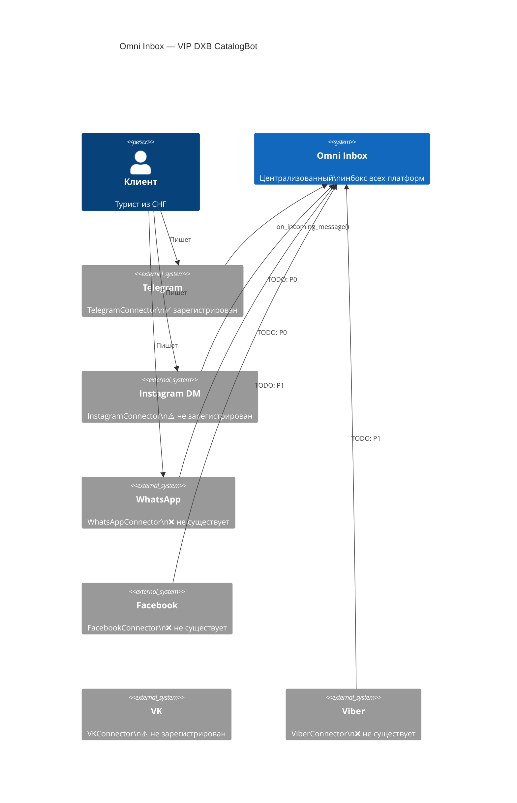
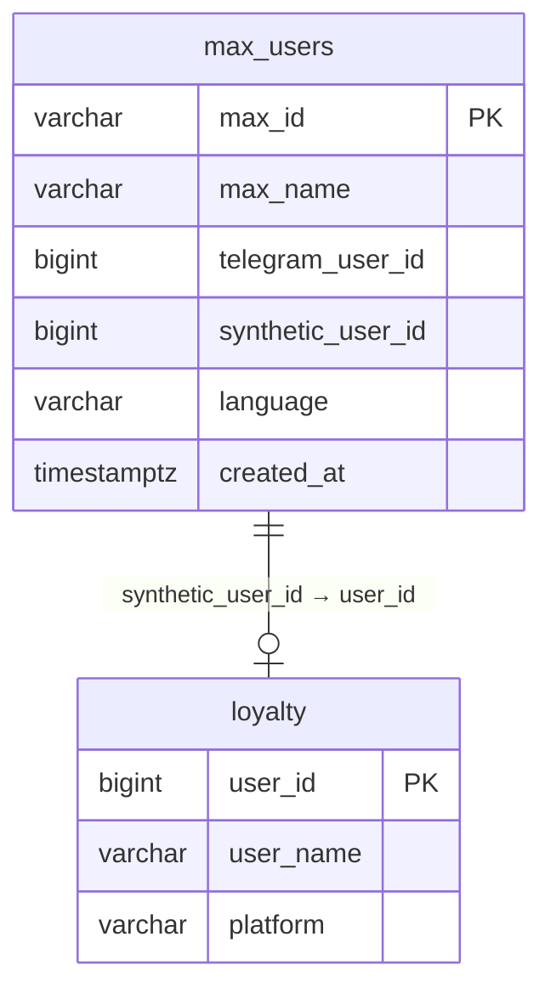

# Feature Blueprint

## Overview

Большинство ошибок в разработке происходит не из-за плохого кода, а из-за того, что начали писать код до того, как поняли задачу. Feature Blueprint решает эту проблему: прежде чем открыть редактор — нарисуй архитектуру, опиши схему данных, зафиксируй решение.

Скилл объединяет три инструмента в единый workflow:

```
Идея / запрос
     │
     ▼
┌─────────────────────────────────────────────────────────┐
│  feature-blueprint                                      │
│                                                         │
│  plan ──► Tech Spec (MoSCoW + задачи)                  │
│  adr  ──► Architecture Decision Record                  │
│  diagram ──► Mermaid (flowchart / sequence / ERD / C4) │
│  db-design ──► PostgreSQL Schema + Migration            │
│  breakdown ──► Задачи по 15-60 минут                   │
└─────────────────────────────────────────────────────────┘
     │
     ▼
Начало реализации (с пониманием что и зачем)
```

**Боль, которую решает скилл:**

- Начали делать "добавь новую платформу" — три дня спустя оказалось, что нужна новая таблица в БД, новые поля в существующих таблицах, и изменение в 5 других хэндлерах. Если бы был план — это стало бы известно в первый час.
- "Спроектируй таблицу" — получили таблицу без индексов, без учёта существующего synthetic user_id pattern, без миграции. Сломали production.
- "Нарисуй архитектуру Omni Inbox" — нарисовали блок-схему в Paint, которую никто не может прочитать и которая не живёт в git.

**Принцип:** 30 минут планирования экономят 3+ часа переделок.

---

## When to Use

Используй `feature-blueprint` когда слышишь или думаешь:

| Триггер | Режим |
|---------|-------|
| "Хочу добавить новую платформу" | `plan` |
| "Как это должно работать?" | `plan` или `diagram` |
| "Почему мы выбрали именно это решение?" | `adr` |
| "Нарисуй архитектуру / схему / поток" | `diagram` |
| "Спроектируй таблицу в БД" | `db-design` |
| "Разбей задачу на шаги" | `breakdown` |
| "Документация до начала работы" | `plan` + `diagram` |
| "RFC / нужно согласование" | `plan` → `adr` |

### Конкретные примеры из VIP-DXB-CatalogBot

**Пример 1 — Новая платформа:**
> "Хочу добавить Max Bot (VK Messenger)"

Запускаем `plan` → получаем:
- ADR: почему Max Bot, а не другая платформа
- MoSCoW: что обязательно, что потом
- Mermaid sequence diagram: webhook flow (VK Messenger → FastAPI → handler → PostgreSQL)
- ERD: таблица `max_users` со synthetic user_id в диапазоне -4000..-4999
- 8 задач по 30 минут с файлами и зависимостями

**Пример 2 — Архитектурная диаграмма:**
> "Нарисуй архитектуру Omni Inbox"

Запускаем `diagram` → получаем C4 Context diagram всех 7 платформ + TelegramConnector как единственный зарегистрированный коннектор, остальные показаны как "не подключены".

**Пример 3 — Проектирование таблицы:**
> "Спроектируй таблицу для wishlist с уведомлением при снижении цены"

Запускаем `db-design` → получаем:
- `CREATE TABLE wishlist` с правильными типами (BIGINT user_id, BIGINT block_id, NUMERIC target_price)
- `ALTER TABLE` для добавления индексов
- Миграция `_migrate_vXX_wishlist()` в стиле CatalogDB
- Mermaid ERD: wishlist → blocks, wishlist → loyalty

### Когда НЕ использовать

- Однострочные правки (typo, переименование переменной)
- Хотфикс: сервер горит, нет времени на план
- Когда спек уже написан и одобрен — просто реализуй
- Тривиальные скрипты без будущего (one-off миграции)

---

## Modes

### mode: plan — Полный Tech Spec

Используется: перед началом любой нетривиальной фичи.

**Шаги:**

1. Извлечь требования из размытого запроса
2. Применить MoSCoW приоритизацию
3. Описать архитектуру (+ предложить Mermaid diagram)
4. Спроектировать DB schema (+ автогенерировать ERD)
5. Разбить на задачи с оценкой времени

**Вызов:**

```
blueprint: plan
feature: "Добавление Max Bot в Omni Inbox"
```

**Что получишь:**

```
# Tech Spec: Max Bot Integration

Status: Draft
Date: 2026-03-12

## MoSCoW
Must: webhook endpoint, get_or_create_max_user(), бронирование
Should: поиск по каталогу, geo nearby
Could: голосовые сообщения
Won't: видео-каруселей (Max Bot API не поддерживает)

## Architecture
[Mermaid sequence diagram: Max Bot → FastAPI → handler → PostgreSQL]

## DB Schema
[CREATE TABLE max_users + индексы + миграция]

## Tasks (8 задач, ~4 часа суммарно)
TASK-001: max_bot/app.py — FastAPI + webhook (30 мин)
...
```

**Шаблон:** `references/spec-templates.md` → Tech Spec Template

---

### mode: adr — Architecture Decision Record

Используется: когда принимается важное техническое решение, которое нужно зафиксировать.

**Когда писать ADR:**
- Выбор между двумя технологиями или подходами
- Решение о паттерне ID (synthetic vs real vs offset)
- Выбор стратегии авторизации или роутинга
- Любое "почему мы так сделали?" которое всплывёт через 6 месяцев

**Вызов:**

```
blueprint: adr
decision: "Выбор диапазона synthetic user_id для Max Bot (-4000..-4999)"
```

**Что получишь:**

```markdown
# ADR-005: Synthetic user_id range для Max Bot

Status: Proposed
Date: 2026-03-12

## Context
В CatalogBot каждая платформа использует отрицательные synthetic user_id
для маппинга на loyalty table. Текущие диапазоны: IG -1..-999, WA -1000..-1999,
FB -2000..-2999, Viber -3000..-3999. Max Bot требует свой диапазон.

## Decision
Использовать диапазон -4000..-4999 для Max Bot, добавить MAX_ID_OFFSET в core/user_ids.py.

## Consequences
Positive: согласованность с существующим паттерном, легко читаемо
Negative: фиксированный лимит 1000 Max Bot пользователей на synthetic range
Neutral: нужна новая константа в core/user_ids.py

## Alternatives
Option A: начать с -10000 (больший диапазон)
  Rejected: нарушает компактность, пропускает диапазоны без назначения

Option B: использовать реальные Max Bot user_id как offset (+30B)
  Rejected: нарушает единообразие с IG/WA/FB/Viber (все используют negative)
```

**Шаблон:** `assets/templates/adr-template.md`

---

### mode: diagram — Mermaid Диаграмма

Используется: для визуализации архитектуры, потоков, состояний, схем БД.

**Поддерживаемые типы:**

| Тип | Когда | Пример запроса |
|-----|-------|---------------|
| `flowchart` | Архитектура компонентов | "Нарисуй структуру Omni Inbox" |
| `sequenceDiagram` | Webhook flow, API calls | "Покажи как работает Max Bot webhook" |
| `erDiagram` | Схема таблиц БД | "ERD для wishlist и notifications" |
| `stateDiagram-v2` | FSM бронирования | "Состояния 7-step booking FSM" |
| `C4Context` | Системный контекст | "Все 7 платформ CatalogBot" |
| `gantt` | Roadmap, таймлайн | "План Omni Inbox по неделям" |

**Вызов:**

```
blueprint: diagram
type: C4Context
subject: "Omni Inbox — все коннекторы"
```

**Пример вывода — C4Context для Omni Inbox:**



**Правила Mermaid (главные):**

- ID узлов — латиница (кириллица нестабильна): `start_node[Старт]` ✅ `Старт --> Конец` ⚠️
- Спецсимволы в метках — в кавычки: `B["Hello (World)"]` ✅
- ERD: FK в полях не рисует линии — нужна явная строка `TABLE1 ||--o{ TABLE2 : "связь"`
- Диаграммы > 25 узлов — разбить на несколько

**Patterns:** `references/diagram-patterns.md`

---

### mode: db-design — PostgreSQL Schema

Используется: при добавлении новой таблицы или изменении существующей.

**Принципы (production-ready):**

1. **3NF по умолчанию** — нормализация, если нет явной причины денормализации
2. **Типы с умом** — `BIGSERIAL` для PK, `BIGINT` для FK, `NUMERIC(10,2)` для цен, `TIMESTAMPTZ` для дат
3. **Все таблицы имеют** `created_at TIMESTAMPTZ DEFAULT NOW()`
4. **Индексы явно** — по FK, по часто фильтруемым полям, UNIQUE там где нужно
5. **Миграция идемпотентна** — `IF NOT EXISTS`, проверка наличия колонок через `information_schema`
6. **Synthetic user_id паттерн** — для webhook-платформ: отрицательные ID, маппинг в отдельной таблице

**Вызов:**

```
blueprint: db-design
table: "max_users"
purpose: "Маппинг Max Bot user_id на synthetic user_id для CatalogBot"
```

**Что получишь:**

```sql
-- CREATE TABLE
CREATE TABLE IF NOT EXISTS max_users (
    max_id          VARCHAR(64) PRIMARY KEY,
    max_name        VARCHAR(255),
    telegram_user_id BIGINT,
    synthetic_user_id BIGINT UNIQUE NOT NULL,
    language        VARCHAR(10) DEFAULT 'ru',
    created_at      TIMESTAMPTZ DEFAULT NOW(),
    last_active     TIMESTAMPTZ DEFAULT NOW()
);

-- INDEXES
CREATE INDEX IF NOT EXISTS idx_max_users_synthetic
    ON max_users(synthetic_user_id);

-- MIGRATION (CatalogDB стиль)
async def _migrate_v22_max_bot(self):
    await self.pool.execute("""
        CREATE TABLE IF NOT EXISTS max_users (
            max_id          VARCHAR(64) PRIMARY KEY,
            ...
        )
    """)
```

**Плюс:** автоматически предлагается Mermaid ERD для новой таблицы.

**Паттерны:** `references/diagram-patterns.md` → секция "ERD для новой платформы"

---

### mode: breakdown — Декомпозиция на задачи

Используется: после написания спека — превратить его в конкретный план работы.

**Правила хороших задач:**

- Каждая задача: 15–60 минут (не "сделай систему авторизации")
- Каждая задача: один конкретный проверяемый результат
- Порядок: данные → типы → DAL → сервис → handler → тесты → документация
- Каждая задача ссылается на секцию спека

**Вызов:**

```
blueprint: breakdown
spec: "Tech Spec: Max Bot Integration"
```

**Что получишь:**

```
TASK-001 [spec: §4.2 DB Schema]
  Описание: Создать таблицу max_users + миграция v22
  Файлы: data/database.py (_migrate_v22_max_bot, get_or_create_max_user)
  Результат: таблица создана, метод работает, тест проходит
  Зависит от: ничего
  Оценка: 30 мин

TASK-002 [spec: §4.1 Architecture]
  Описание: max_bot/app.py — FastAPI + webhook endpoint
  Файлы: max_bot/app.py, max_bot/config.py
  Результат: GET /webhook проходит verification, POST /webhook логирует события
  Зависит от: TASK-001
  Оценка: 25 мин

TASK-003 [spec: §4.3 HMAC Auth]
  Описание: max_bot/webhook_verify.py — signature verification
  Файлы: max_bot/webhook_verify.py
  Результат: неверная подпись → 403, верная → продолжение
  Зависит от: TASK-002
  Оценка: 20 мин

...и так далее по каждой секции спека
```

---

## Synergy Rules — Автосвязи между режимами

Режимы designed to work together. Правила автоматических связей:

### plan → diagram (автопредложение)

Когда `plan` генерирует секцию "Architecture" — автоматически предлагает:

```
[Blueprint] Секция Architecture готова. Предлагаю создать Mermaid diagram?
  Варианты:
  1. sequenceDiagram — webhook flow для Max Bot
  2. C4Context — системный контекст с новой платформой
  3. flowchart — компоненты max_bot/ модуля
Введи номер или "нет":
```

### db-design → erDiagram (автогенерация)

После генерации `CREATE TABLE` — автоматически добавляет Mermaid ERD:



### breakdown → diagram refs (автоссылки)

Задачи в `breakdown` содержат ссылки на диаграммы:

```
TASK-001 [spec: §4.2] [diagram: max_users ERD]
  Описание: Создать таблицу max_users
  Диаграмма: см. ERD выше (max_users ↔ loyalty)
  ...
```

### adr → plan ref (обратная ссылка)

ADR автоматически включает ссылку на Tech Spec:

```markdown
## References
- Tech Spec: Max Bot Integration (feature-spec.md)
- Related ADR: ADR-001 (synthetic user_id strategy)
- core/user_ids.py — существующие диапазоны
```

---

## Output Format

Что получает пользователь в каждом режиме:

| Режим | Формат вывода | Объём | Можно сохранить как |
|-------|--------------|-------|-------------------|
| `plan` | Markdown с секциями | 100-200 строк | `docs/specs/feature-name.md` |
| `adr` | ADR Markdown | 30-60 строк | `docs/adr/ADR-NNN-title.md` |
| `diagram` | Mermaid code block | 10-50 строк | Вставить в любой `.md` |
| `db-design` | SQL + Python migration | 30-80 строк | Прямо в `data/database.py` |
| `breakdown` | Пронумерованный task list | 8-20 задач | В Linear / GitHub Issues |

---

## Quick Reference

| Режим | Команда вызова | Когда использовать |
|-------|---------------|-------------------|
| `plan` | `blueprint: plan / feature: "..."` | Перед любой нетривиальной фичей |
| `adr` | `blueprint: adr / decision: "..."` | Важный технический выбор |
| `diagram` | `blueprint: diagram / type: X / subject: "..."` | Визуализация архитектуры |
| `db-design` | `blueprint: db-design / table: "..." / purpose: "..."` | Новая таблица в PostgreSQL |
| `breakdown` | `blueprint: breakdown / spec: "..."` | После одобрения спека |

**Shortcut фразы** (без явного вызова):

- "напиши спек для..." → `plan`
- "нарисуй диаграмму..." → `diagram`
- "спроектируй таблицу..." → `db-design`
- "зафикси решение о..." → `adr`
- "разбей на задачи..." → `breakdown`

---

## Common Mistakes

### 1. Начать писать код без плана

Самая дорогостоящая ошибка. Особенно критично для:
- Новых платформ (затрагивают: DB, core/, множество handlers)
- Изменений DB schema (могут сломать production миграции)
- Изменений в omni_inbox.py (единственный источник правды для Omni Inbox)

**Правило:** если задача затрагивает > 3 файлов → сначала `plan`.

### 2. ADR без секции Consequences

Самая ценная часть ADR — это trade-offs, которые вы приняли. Пустой `Consequences` = потерянные знания.

### 3. DB schema без идемпотентной миграции

В CatalogBot все миграции должны быть идемпотентными (`IF NOT EXISTS`, проверка через `information_schema`). Иначе повторный деплой упадёт.

```python
# НЕВЕРНО
async def _migrate_v22_max_bot(self):
    await self.pool.execute("CREATE TABLE max_users (...)")

# ВЕРНО
async def _migrate_v22_max_bot(self):
    await self.pool.execute("CREATE TABLE IF NOT EXISTS max_users (...)")
```

### 4. Mermaid с кириллицей в ID узлов

```
# НЕСТАБИЛЬНО
Старт --> Конец

# НАДЁЖНО
start_node[Старт] --> end_node[Конец]
```

### 5. ERD без явных relationships

Поле `FK` в таблице не рисует линии в Mermaid. Нужно явно:

```
max_users ||--o| loyalty : "synthetic_user_id → user_id"
```

### 6. Не обновить CLAUDE.md после изменений архитектуры

В VIP-DXB-CatalogBot правило: каждое изменение архитектуры, DB схемы, новой платформы или паттерна — обновляет `CLAUDE.md`. Tech Spec без финального обновления документации = незавершённая задача.

### 7. Plan без Non-Goals

Non-goals предотвращают scope creep. Если не написать "видео-карусели — вне скопа для Max Bot", кто-то обязательно попросит это на третий день.

### 8. Breakdown с гигантскими задачами

"TASK-001: Реализовать Max Bot целиком — 8 часов" — это не задача, это ужас. Каждая задача ≤ 60 минут, один проверяемый результат.

---

## References

- `references/spec-templates.md` — шаблоны Tech Spec, ADR, RFC, MoSCoW
- `references/diagram-patterns.md` — Mermaid patterns для bot webhook flow, FSM, ERD, C4, deployment
- `assets/templates/feature-spec.md` — заполненный пример: "Добавление Max Bot в Omni Inbox"
- `assets/templates/adr-template.md` — ADR пример: "ADR-001: Synthetic user_id strategy для Max Bot"
- Source skills:
  - `spec-driven-dev` v1.1.0 (terminal-skills + local extensions, Apache-2.0)
  - `mermaid` v1.0 (terminal-skills, Apache-2.0)
  - `database-schema-designer` (terminal-skills, PostgreSQL best practices)
- Omni Inbox status: `docs/OMNI_INBOX_ROLLOUT_BACKLOG.md`
- DB patterns: `docs/DB_VERIFICATION_STRATEGIES.md`
- CatalogDB migrations: `data/database.py`
