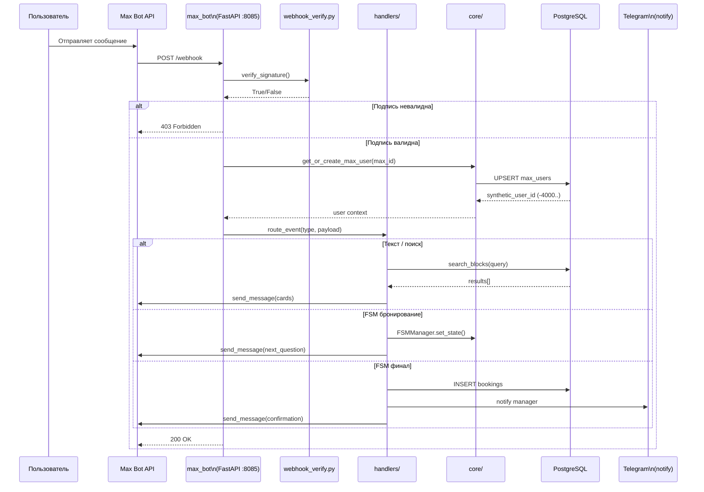
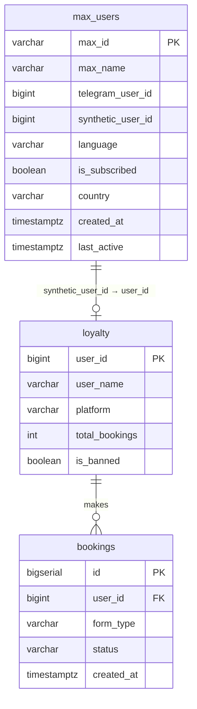

# Tech Spec: Добавление Max Bot в Omni Inbox

**Status:** Draft
**Author:** VIP-DXB-CatalogBot
**Date:** 2026-03-12
**Approvers:** Суxейль
**Related ADR:** ADR-001 (synthetic user_id для Max Bot)

---

## 1. Overview

Добавляем поддержку Max Bot — нового мессенджера от VK (бывший TamTam). Пользователи смогут искать экскурсии и бронировать туры прямо в Max Bot так же, как это сейчас работает в Telegram, WhatsApp, Instagram, Facebook и Viber.

С точки зрения архитектуры это 7-я платформа в CatalogBot. Весь паттерн уже отработан на Phase 21 (Viber Bot) — повторяем его с адаптацией под Max Bot API.

---

## 2. Goals & Non-Goals

### Goals (что делаем)
- Webhook endpoint на порту 8085, принимающий входящие события Max Bot
- HMAC-SHA256 верификация подписи (обязательна для production)
- Регистрация и маппинг Max Bot user_id → synthetic_user_id (-4000..-4999)
- Просмотр каталога: Эмираты → Категории → Карточки блоков
- Текстовый поиск по каталогу
- 7-step booking FSM с form_type="MB_GT"
- Уведомление менеджера в Telegram при новом бронировании
- Интеграция в Omni Inbox (TelegramConnector уже подключён — добавляем MaxConnector)
- Таблица `max_users` в PostgreSQL + миграция v22
- Константа `MAX_ID_OFFSET` в `core/user_ids.py`
- Документация: `max_bot/CLAUDE.md`

### Non-Goals (что НЕ делаем в этой итерации)
- Видео-карусели (Max Bot API v1 не поддерживает)
- Push-уведомления (требует отдельного согласования с Max Bot)
- Голосовые сообщения (Whisper интеграция — откладываем)
- A/B тесты карточек
- Прямые платежи через Max Bot Pay (изучить позже)

---

## 3. Background & Context

Текущее состояние: CatalogBot работает на 6 платформах (Telegram, VK, Instagram, WhatsApp, Facebook, Viber). Omni Inbox infrastructure существует, но подключён только TelegramConnector (статус: 2026-03-10).

Max Bot — новый мессенджер VK с 50M+ пользователей в СНГ. Большая часть нашей аудитории — туристы из СНГ. Добавление Max Bot увеличивает охват и завершает покрытие всех major мессенджеров СНГ.

Паттерн webhook-платформы полностью отработан на Phase 21 (Viber Bot, 211 тестов, production). Повторяем его, адаптируя под Max Bot API.

---

## 4. MoSCoW Prioritization

| Приоритет | Требование | Обоснование |
|-----------|-----------|-------------|
| **Must** | Webhook endpoint + HMAC verify | Без этого Max Bot не доставляет события |
| **Must** | `max_users` таблица + synthetic user_id | Без этого нельзя хранить пользователей |
| **Must** | Просмотр каталога (3 уровня) | Основной use case |
| **Must** | 7-step booking FSM | Основная монетизация |
| **Must** | Telegram notify при бронировании | Менеджер должен знать о новом заказе |
| **Should** | Текстовый поиск по каталогу | Быстрый доступ к нужной экскурсии |
| **Should** | Omni Inbox MaxConnector | Единый инбокс всех платформ |
| **Should** | max_bot/CLAUDE.md документация | Обслуживание кода |
| **Could** | Голосовой ввод через Whisper | Если Max Bot API поддерживает аудио |
| **Won't** | Max Bot Pay | Требует отдельного исследования |
| **Won't** | Видео-карусели | Не поддерживается в Max Bot API v1 |

---

## 5. Technical Design

### 5.1 Architecture



### 5.2 Структура файлов

```
max_bot/
├── app.py              — FastAPI + webhook endpoint (GET verify + POST events)
├── config.py           — re-export из core/config.py + MAX_BOT_TOKEN, MAX_VERIFY_TOKEN
├── webhook_verify.py   — HMAC-SHA256 с MAX_BOT_TOKEN как ключом
├── max_api.py          — MaxBotAPI class (send_text, send_carousel, get_user_info)
├── fsm.py              — MaxState enum (14 состояний) + FSMManager (1h timeout)
├── formatters.py       — plain-text форматирование (inherits formatter_base.py)
├── templates.py        — карточки каталога, Quick Replies
├── handlers/
│   ├── common.py       — event router (text, callback, command)
│   ├── catalog.py      — Эмираты → Категории → Блоки
│   ├── booking.py      — 7-step FSM + form_type="MB_GT"
│   └── search.py       — текстовый поиск + карточки результатов
├── CLAUDE.md           — документация платформы
└── tests/
    ├── test_webhook.py      — signature verification
    ├── test_catalog.py      — catalog navigation
    ├── test_booking.py      — 7-step FSM
    ├── test_search.py       — text search
    ├── test_max_api.py      — API calls
    └── test_integration.py  — end-to-end flows
```

### 5.3 Data Model

```sql
-- Новая таблица
CREATE TABLE IF NOT EXISTS max_users (
    max_id            VARCHAR(64) PRIMARY KEY,
    max_name          VARCHAR(255),
    telegram_user_id  BIGINT,
    synthetic_user_id BIGINT UNIQUE NOT NULL,
    language          VARCHAR(10) DEFAULT 'ru',
    is_subscribed     BOOLEAN DEFAULT TRUE,
    country           VARCHAR(10),
    created_at        TIMESTAMPTZ DEFAULT NOW(),
    last_active       TIMESTAMPTZ DEFAULT NOW()
);

CREATE INDEX IF NOT EXISTS idx_max_users_synthetic
    ON max_users(synthetic_user_id);
CREATE INDEX IF NOT EXISTS idx_max_users_language
    ON max_users(language);
```

**Новые DB методы:**
```python
# data/database.py
async def get_or_create_max_user(
    self,
    max_id: str,
    max_name: str | None = None,
    country: str | None = None
) -> int:  # returns synthetic_user_id
    ...

async def _migrate_v22_max_bot(self):
    # идемпотентная миграция
    ...
```

**Synthetic user_id range:**
```python
# core/user_ids.py
MAX_ID_OFFSET = -4000   # диапазон -4000..-4999
```

ERD:



### 5.4 API / Env Vars

```bash
# Новые переменные в .env
MAX_BOT_TOKEN=<токен из Max Bot Developer Console>
MAX_VERIFY_TOKEN=<произвольная строка для верификации webhook>
MAX_WEBHOOK_PORT=8085
```

### 5.5 Key Decisions

- **FSM:** in-memory FSMManager (аналогично IG/WA/FB/Viber), 1h timeout
- **HMAC:** MAX_BOT_TOKEN как ключ (аналогично Viber — не app_secret, а auth_token)
- **form_type:** `"MB_GT"` — стандарт для групповых туров через Max Bot
- **Notify:** httpx POST к Telegram Bot API (без aiogram) — паттерн идентичен IG/WA/FB/Viber

---

## 6. Alternatives Considered

| Вариант | Плюсы | Минусы | Решение |
|---------|-------|--------|---------|
| Long Poll (как Telegram/VK) | Не нужен публичный URL | Не поддерживается Max Bot API | Отклонён — API только webhook |
| Shared webhook с VK Bot | Меньше портов | Усложняет routing, разные подписи | Отклонён — изоляция платформ |
| Диапазон ID -10000..-10999 | Больший диапазон | Пропускает диапазоны без назначения | Отклонён — следуем паттерну (-3000, -2000 и т.д.) |
| Отдельный репозиторий | Изоляция | Дублирование core/ кода | Отклонён — монорепо паттерн работает |

---

## 7. Implementation Plan

Суммарная оценка: ~4.5 часа

### Phase 1: Foundation (~1.5ч)
- [ ] TASK-001: `data/database.py` — таблица max_users + _migrate_v22_max_bot + get_or_create_max_user (30 мин)
- [ ] TASK-002: `core/user_ids.py` — MAX_ID_OFFSET, обновить is_max_user(), get_platform() (15 мин)
- [ ] TASK-003: `max_bot/app.py` + `max_bot/config.py` — FastAPI skeleton + env vars (20 мин)
- [ ] TASK-004: `max_bot/webhook_verify.py` — HMAC-SHA256 verification (20 мин)
- [ ] TASK-005: `max_bot/max_api.py` — MaxBotAPI class, send_text, send_carousel (25 мин)

### Phase 2: Core Handlers (~2ч)
- [ ] TASK-006: `max_bot/fsm.py` — MaxState enum + FSMManager (20 мин)
- [ ] TASK-007: `max_bot/formatters.py` + `max_bot/templates.py` — карточки + Quick Replies (25 мин)
- [ ] TASK-008: `max_bot/handlers/common.py` — event router (25 мин)
- [ ] TASK-009: `max_bot/handlers/catalog.py` — 3-level navigation (35 мин)
- [ ] TASK-010: `max_bot/handlers/booking.py` — 7-step FSM + Telegram notify (45 мин)
- [ ] TASK-011: `max_bot/handlers/search.py` — text search (20 мин)

### Phase 3: Omni Inbox + Tests + Docs (~1ч)
- [ ] TASK-012: `bot/services/omni_inbox.py` — MaxConnector регистрация (20 мин)
- [ ] TASK-013: `tests/test_max_bot/` — 6 тест-файлов, ~200 тестов (35 мин)
- [ ] TASK-014: `max_bot/CLAUDE.md` + обновить `CLAUDE.md` + `AGENTS.md` (20 мин)

---

## 8. Testing Strategy

- Unit: каждый handler изолированно с mock DB и mock Max Bot API
- Integration: webhook flow end-to-end с реальной тестовой БД
- Acceptance: `pytest tests/test_max_bot/ -q` — все зелёные

Минимальный bar для merge: все тесты pass + `pytest tests --collect-only -q` показывает ~3130 тестов (2930 + ~200 новых).

---

## 9. Rollout Plan

1. Локально: `ngrok http 8085` → зарегистрировать webhook в Max Bot Developer Console
2. CI/CD: `git push origin main` → GitHub Actions → deploy на GCP VM tourist-bot
3. Docker Compose: добавить `max_bot` сервис в `deploy/docker-compose.prod.yml`
4. Smoke test: отправить `/start` в Max Bot → проверить ответ
5. Rollback: `docker compose stop max_bot` — не затрагивает другие 6 платформ

---

## 10. Security Considerations

- HMAC-SHA256 обязателен — MAX_BOT_TOKEN как ключ, не передавать в логах
- synthetic_user_id — не передавать наружу в API responses
- html.escape() для всех user inputs, которые отображаются в Telegram notify
- MAX_BOT_TOKEN и MAX_VERIFY_TOKEN — в .env, не коммитить

---

## 11. Open Questions

- [ ] Поддерживает ли Max Bot API HMAC-SHA256 или другую схему подписи? (уточнить в документации Max Bot)
- [ ] Какой формат callback_data — строки или JSON? (влияет на FSM design)
- [ ] Есть ли 24h messaging window как у Meta API? (влияет на notify стратегию)

---

## 12. References

- Phase 21 реализация (шаблон): `viber_bot/` + `viber_bot/CLAUDE.md`
- DB migration pattern: `data/database.py` → `_migrate_v21_viber()`
- ID pattern: `core/user_ids.py` → существующие диапазоны
- Omni Inbox status: `docs/OMNI_INBOX_ROLLOUT_BACKLOG.md`
- ADR: `docs/adr/ADR-001-max-bot-user-id.md` (см. adr-template.md)
- Max Bot API docs: https://dev.max.ru/docs (проверить актуальность)
