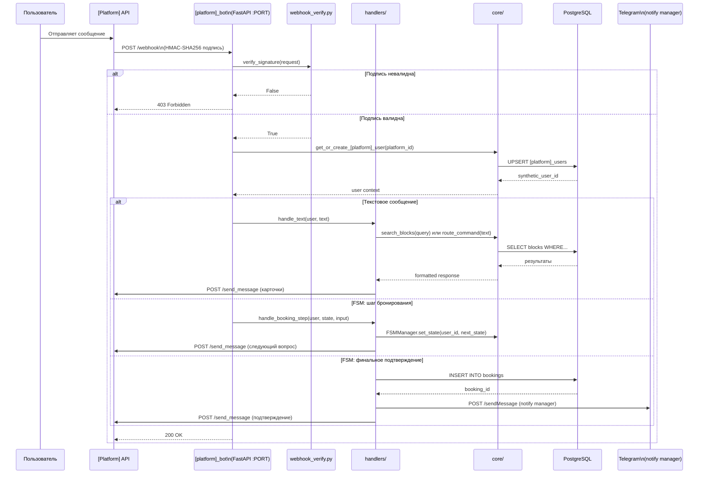
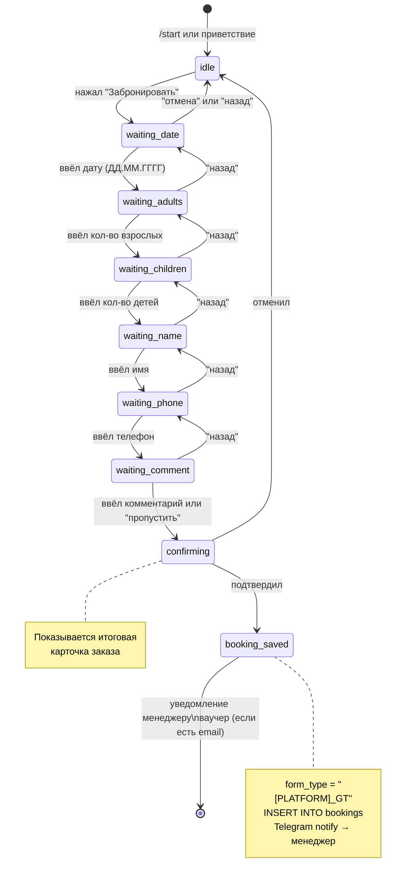
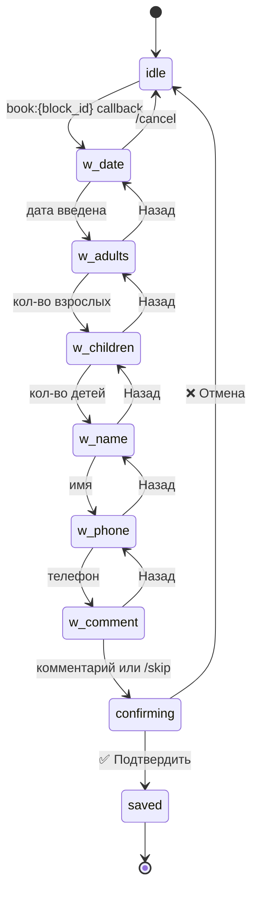
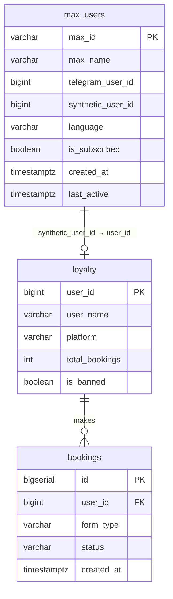
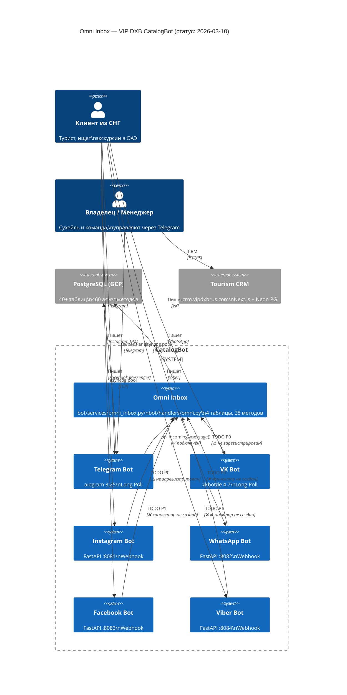
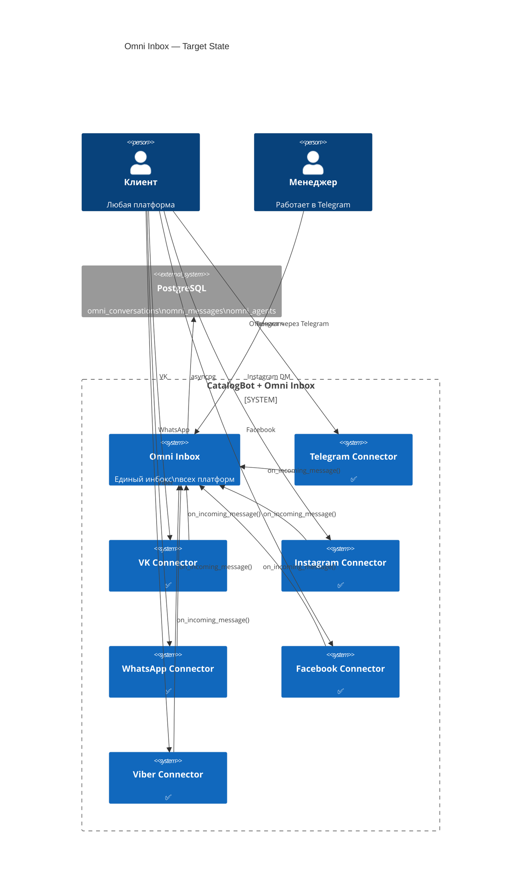
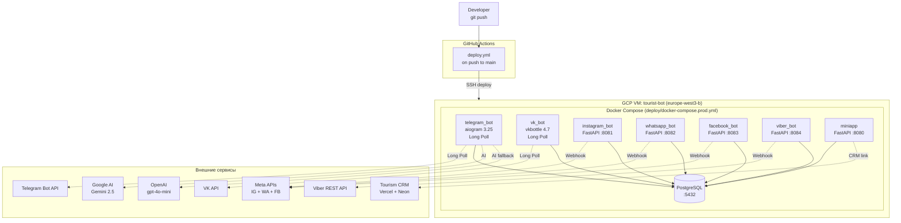
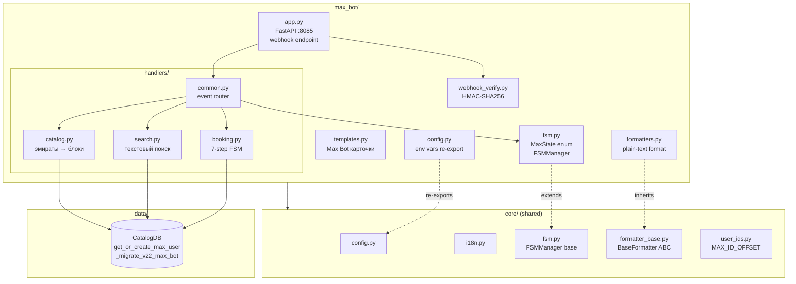

# Diagram Patterns — Feature Blueprint

Готовые Mermaid паттерны для VIP-DXB-CatalogBot. Скопируй и адаптируй под свою задачу.

---

## Pattern 1: Bot Webhook Flow (sequenceDiagram)

Универсальный шаблон для любой новой платформы с webhook архитектурой.



**Замени в шаблоне:**
- `[Platform]` → `Max Bot`, `Telegram`, `WhatsApp` и т.д.
- `PORT` → `8085`, `8082`, `8081` и т.д.
- `[platform]` → `max`, `whatsapp`, `instagram` и т.д.

---

## Pattern 2: FSM State Machine (stateDiagram-v2)

Шаблон 7-step booking FSM — используется в WhatsApp, Viber, Instagram, Facebook.



**Telegram / VK (8-step, включает waiting_comment):**



---

## Pattern 3: ERD для новой платформы

Стандартная структура таблицы маппинга платформы + связи с loyalty.

**Шаблон (заменить `[platform]` и `[prefix]`):**

```mermaid
erDiagram
    [platform]_users {
        varchar [prefix]_id PK
        varchar [prefix]_name
        bigint telegram_user_id
        bigint synthetic_user_id
        varchar language
        boolean is_subscribed
        varchar country
        timestamptz created_at
        timestamptz last_active
    }

    loyalty {
        bigint user_id PK
        varchar user_name
        varchar language
        int total_bookings
        numeric total_spent
        int bonus_points
        varchar platform
        boolean is_banned
        timestamptz created_at
    }

    bookings {
        bigserial id PK
        bigint user_id FK
        bigint block_id FK
        varchar form_type
        date tour_date
        int adults
        varchar status
        numeric total_price
        timestamptz created_at
    }

    [platform]_users ||--o| loyalty : "synthetic_user_id = user_id"
    loyalty ||--o{ bookings : "makes"
```

**Пример для Max Bot:**



---

## Pattern 4: C4 Context — Omni Inbox (все 7 платформ)

Актуальное состояние Omni Inbox (статус коннекторов на 2026-03-10):



**Шаблон для "после подключения всех коннекторов":**



---

## Pattern 5: Deployment Diagram (flowchart)

Docker Compose + GCP production setup:



---

## Pattern 6: Component Diagram нового модуля (flowchart)

Шаблон для документирования структуры нового `[platform]_bot/`:



---

## Mermaid Quick Rules

**Всегда соблюдай:**

1. **ID узлов — латиница:**
   ```
   # Плохо (нестабильно)
   Старт --> Конец

   # Хорошо
   start_node[Старт] --> end_node[Конец]
   ```

2. **Спецсимволы — в кавычки:**
   ```
   # Плохо
   A --> B[Hello (World)]

   # Хорошо
   A --> B["Hello (World)"]
   ```

3. **ERD — явные relationships:**
   ```
   # Только поле FK недостаточно для линии
   max_users ||--o| loyalty : "synthetic_user_id → user_id"
   ```

4. **Не больше 20-25 узлов** в одной диаграмме — разбивай на части

5. **sequenceDiagram стрелки без пробелов:**
   ```
   # Плохо
   A - ->> B: message

   # Хорошо
   A-->>B: message
   ```

6. **Рендеринг в GitHub** — просто оберни в блок кода с языком `mermaid`:
   ````
   ```mermaid
   flowchart LR
       A --> B
   ```
   ````
