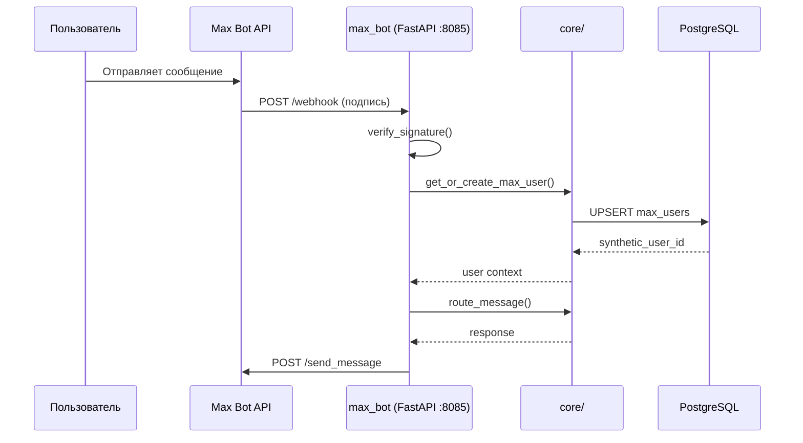

# Spec Templates — Feature Blueprint

Готовые шаблоны для каждого типа документации. Скопируй, заполни `[...]` поля, удели секциям примерно 30–60 минут.

---

## Tech Spec Template

```markdown
# Tech Spec: [Название фичи]

**Status:** Draft | In Review | Approved | Implemented
**Author:** [имя]
**Date:** [YYYY-MM-DD]
**Approvers:** [имена / роли]
**Related ADR:** [ADR-NNN или "нет"]

---

## 1. Overview

Один абзац: что строим и зачем. Написать так, чтобы понял человек без технического бэкграунда.

Пример: "Добавляем поддержку Max Bot — мессенджера от VK. Пользователи смогут искать экскурсии
и бронировать туры прямо в Max Bot так же, как это работает в Telegram и Instagram."

## 2. Goals & Non-Goals

### Goals (что делаем)
- [Конкретный измеримый результат 1]
- [Конкретный измеримый результат 2]
- [Конкретный измеримый результат 3]

### Non-Goals (что НЕ делаем в этой итерации)
- [Вещь вне скопа 1]
- [Вещь вне скопа 2]

## 3. Background & Context

Почему сейчас? Какое текущее состояние? Какую проблему решает?

Пример для новой платформы: "70% нашей аудитории пользуется VK. Max Bot — новый мессенджер
VK с 50M+ пользователей. CatalogBot уже поддерживает 6 платформ; добавление Max Bot
завершает охват всей аудитории из СНГ. Паттерн уже отработан на Instagram/WhatsApp/Facebook/Viber."

## 4. MoSCoW Prioritization

| Приоритет | Требование | Обоснование |
|-----------|-----------|-------------|
| **Must** | [обязательно 1] | Без этого фича не работает |
| **Must** | [обязательно 2] | Без этого фича не работает |
| **Should** | [желательно 1] | Высокая ценность, не блокер |
| **Should** | [желательно 2] | Высокая ценность, не блокер |
| **Could** | [опционально 1] | Если останется время |
| **Won't** | [вне скопа 1] | Явно исключено из этой итерации |
| **Won't** | [вне скопа 2] | Явно исключено из этой итерации |

**Правило:** "Быстро", "Безопасно", "Масштабируемо" — это НЕ требования.
Требования измеримы: "API отвечает < 500ms", "все эндпоинты с HMAC-SHA256".

## 5. Technical Design

### 5.1 Architecture

Описание компонентов и потоков данных. Включи Mermaid diagram если применимо.



### 5.2 Data Model

Новые или изменённые таблицы. Всегда включать полный DDL + миграцию.

```sql
CREATE TABLE IF NOT EXISTS max_users (
    max_id            VARCHAR(64) PRIMARY KEY,
    max_name          VARCHAR(255),
    telegram_user_id  BIGINT,
    synthetic_user_id BIGINT UNIQUE NOT NULL,
    language          VARCHAR(10) DEFAULT 'ru',
    is_subscribed     BOOLEAN DEFAULT TRUE,
    created_at        TIMESTAMPTZ DEFAULT NOW(),
    last_active       TIMESTAMPTZ DEFAULT NOW()
);

CREATE INDEX IF NOT EXISTS idx_max_users_synthetic
    ON max_users(synthetic_user_id);
```

**Synthetic user_id:** добавить `MAX_ID_OFFSET` в `core/user_ids.py`, диапазон: -4000..-4999.

### 5.3 API / Interface Design

Эндпоинты, функции, callback-ы.

```
GET  /webhook?hub.verify_token=...    → верификация (Max Bot)
POST /webhook                         → входящие события

Новые DB методы (data/database.py):
  get_or_create_max_user(max_id, max_name) → synthetic_user_id
```

### 5.4 Key Logic & Decisions

Нетривиальные решения: FSM стратегия, паттерн авторизации, обработка ошибок.

Пример: "FSM реализуется через `core/fsm.py` FSMManager с 1h timeout, аналогично Instagram/WhatsApp.
Состояния хранятся in-memory (не в DB) как во всех webhook-ботах."

## 6. Alternatives Considered

| Вариант | Плюсы | Минусы | Решение |
|---------|-------|--------|---------|
| Вариант A (выбран) | ... | ... | Выбран потому что... |
| Вариант B | ... | ... | Отклонён потому что... |

## 7. Implementation Plan

Каждая фаза = логически связанные задачи. Оценки в минутах (каждая задача ≤ 60 мин).

### Phase 1: Foundation (~2ч)
- [ ] TASK-001: `data/database.py` — таблица max_users + миграция v22 (30 мин)
- [ ] TASK-002: `core/user_ids.py` — MAX_ID_OFFSET + диапазон (15 мин)
- [ ] TASK-003: `max_bot/app.py` — FastAPI skeleton + webhook endpoint (25 мин)
- [ ] TASK-004: `max_bot/webhook_verify.py` — HMAC-SHA256 signature (20 мин)

### Phase 2: Core Handlers (~2.5ч)
- [ ] TASK-005: `max_bot/handlers/common.py` — event router (30 мин)
- [ ] TASK-006: `max_bot/handlers/catalog.py` — каталог эмиратов → категории → карточки (40 мин)
- [ ] TASK-007: `max_bot/handlers/booking.py` — 7-step FSM + form_type="MB_GT" (45 мин)
- [ ] TASK-008: `max_bot/handlers/search.py` — текстовый поиск (25 мин)

### Phase 3: Tests & Docs (~1.5ч)
- [ ] TASK-009: `tests/test_max_bot/` — 6 тест-файлов, ~200 тестов (50 мин)
- [ ] TASK-010: `max_bot/CLAUDE.md` — документация платформы (20 мин)
- [ ] TASK-011: Обновить `CLAUDE.md` и `AGENTS.md` (15 мин)

## 8. Testing Strategy

- Unit tests: [что тестируем на уровне функций]
- Integration tests: [что тестируем на уровне потоков]
- E2E tests: [что тестируем end-to-end]

Минимальный acceptance: `pytest tests/test_max_bot/ -q` — все тесты зелёные.

## 9. Rollout Plan

- [ ] Локальное тестирование с ngrok: `ngrok http 8085`
- [ ] Регистрация webhook в Max Bot Developer Console
- [ ] Deploy на GCP: `git push origin main` → GitHub Actions
- [ ] Smoke test в production: отправить /start, проверить ответ

**Rollback:** остановить контейнер `max_bot` в Docker Compose без влияния на другие сервисы.

## 10. Security Considerations

- HMAC-SHA256 обязателен (аналогично Meta API / Viber)
- Все user inputs через html.escape() если отображаются в Telegram уведомлениях
- synthetic_user_id — не передавать наружу

## 11. Open Questions

- [ ] [Вопрос, который блокирует дизайн-решение]
- [ ] [Вопрос, который изменяет скоп]

Правило: не начинать реализацию пока есть открытые блокирующие вопросы.

## 12. References

- Аналогичная реализация: `viber_bot/` (Phase 21)
- DB pattern: `data/database.py` → `_migrate_v21_viber()`
- ID pattern: `core/user_ids.py`
- Omni Inbox: `docs/OMNI_INBOX_ROLLOUT_BACKLOG.md`
```

---

## ADR Template

```markdown
# ADR-[NNN]: [Краткий заголовок решения]

**Status:** Proposed | Accepted | Deprecated | Superseded by ADR-[NNN]
**Date:** [YYYY-MM-DD]
**Deciders:** [кто принял или одобрил решение]

---

## Context

Какая ситуация потребовала решения? Какие ограничения (техника, время, деньги)?

Пиши как будто читатель — это ты через 6 месяцев без контекста.

## Decision

Что решили сделать. Без обоснования — просто факт:

> Мы будем использовать [X] для [цели].

## Consequences

### Positive (плюсы)
- [Выгода 1]
- [Выгода 2]

### Negative / Trade-offs (минусы, которые мы принимаем)
- [Недостаток 1]
- [Ограничение 2]

### Neutral (побочные эффекты, не хорошие и не плохие)
- [Нейтральный эффект]

## Alternatives Considered

### Option A: [название]
- Описание: ...
- Плюсы: ...
- Минусы: ...
- Отклонён потому что: ...

### Option B: [название]
- Описание: ...
- Плюсы: ...
- Минусы: ...
- Отклонён потому что: ...

## References
- [Ссылка на Tech Spec, PR, issue или внешний ресурс]
```

---

## RFC Template

Для больших изменений, которые затрагивают несколько компонентов или требуют согласования.

```markdown
# RFC-[NNN]: [Описательный заголовок]

**Status:** Draft | Open for Comments | Final Comment Period | Accepted | Rejected | Withdrawn
**Author:** [имя]
**Created:** [YYYY-MM-DD]
**Comment deadline:** [YYYY-MM-DD]
**Tracking issue:** [ссылка]

---

## Summary

Два предложения: что меняем и зачем.

## Motivation

Какую проблему решает это изменение? Почему текущее состояние неприемлемо?
Если есть метрики — приведи ("сейчас 40% тикетов поддержки связаны с X").

## Detailed Design

Полное техническое предложение. Достаточно подробно, чтобы кто-то другой мог реализовать без уточнений.

Включи:
- Изменения интерфейсов (API, DB schema, env vars)
- Изменения поведения (что изменится для пользователей, вызывающих, downstream-систем)
- Путь миграции из текущего в предложенное состояние

## Drawbacks

Почему НЕ надо этого делать? Какова цена?
Честная оценка недостатков — признак хорошего RFC.

## Alternatives

Какие другие подходы рассматривались? Почему они были отклонены?

## Unresolved Questions

- [Вопрос 1 — нужно ответить до принятия RFC]
- [Вопрос 2 — можно решить в процессе реализации]

## Future Possibilities

Что это откроет в будущем? Что намеренно вынесено за скоп сейчас?
```

---

## MoSCoW Analysis Template

Используй как отдельный быстрый артефакт когда нужно только приоритизировать, без полного спека.

```markdown
# MoSCoW: [Название фичи / итерации]

**Date:** [YYYY-MM-DD]
**Context:** [одна строка контекста]

## Must Have (обязательно — без этого релиз невозможен)

- [ ] [Требование с критерием приёмки]
- [ ] [Требование с критерием приёмки]

## Should Have (желательно — высокая ценность, но не блокер)

- [ ] [Требование]
- [ ] [Требование]

## Could Have (опционально — если останется время)

- [ ] [Требование]
- [ ] [Требование]

## Won't Have This Time (явно вне скопа этой итерации)

- [Вещь, которую мы сознательно откладываем]
- [Вещь, которую мы сознательно откладываем]

---

**Правило валидации:**

Если "Must Have" занимает > 70% доступного времени → разбей фичу на два релиза.
Если в "Won't" пусто → скорее всего, скоп не ограничен.
```

---

## Где хранить документы

| Тип | Путь | Пример |
|-----|------|--------|
| Tech Spec | `docs/specs/feature-name.md` | `docs/specs/max-bot-integration.md` |
| ADR | `docs/adr/ADR-NNN-title.md` | `docs/adr/ADR-005-max-bot-user-id.md` |
| RFC | `docs/rfc/RFC-NNN-title.md` | `docs/rfc/RFC-001-omni-inbox.md` |
| MoSCoW | Внутри Tech Spec (секция 4) | — |
