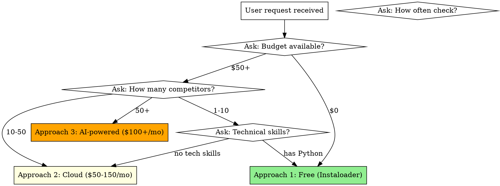

# Instagram Competitor Analysis

## Overview

Systematic framework for choosing and implementing Instagram competitor analysis solutions. Core principle: Match solution complexity to actual needs—start simple, scale only when needed.

## When to Use

Use when users want to:
- Monitor competitor Instagram posts automatically
- Track competitor pricing, tours, products from social media
- Extract posts, images, captions from multiple Instagram accounts
- Choose between scraping tools (Instaloader, cloud services, custom scripts)
- Set up automated reporting from competitor Instagram data

**Do NOT use for:**
- General social media management (not competitor-focused)
- Instagram content creation (different use case)
- Single manual check of one competitor (no automation needed)

## Decision Framework



## Quick Reference

| Criterion | Approach 1: Free | Approach 2: Cloud | Approach 3: AI |
|-----------|------------------|-------------------|----------------|
| **Cost** | $0 | $49-149/mo | $85-110/mo |
| **Setup** | 1 hour | 2-3 hours | 1-2 days |
| **Competitors** | 1-10 | 10-50 | 50+ |
| **Frequency** | Weekly | Daily | Real-time |
| **Tech needed** | Python basics | None | Python + Make.com |
| **AI analysis** | No | No | Yes (Claude API) |
| **Auto reports** | No | Partial | Yes (Telegram) |
| **Risk blocking** | Medium | Low | Low |

## Three Approaches

### Approach 1: Python + Instaloader (Free)

**When:** Budget $0, have Python, 1-10 competitors, weekly checks sufficient

**Tools:** Instaloader library, Windows Task Scheduler

**What you get:**
- Posts downloaded (images, videos, captions)
- Metadata (likes, comments, hashtags)
- CSV export for Excel analysis

**Limitations:**
- Requires your Instagram account
- Risk of temporary blocking if too aggressive
- Computer must run on schedule

**Keywords:** Python script, local scraping, Instagram API alternative, free Instagram monitoring

### Approach 2: Cloud Services ($50-150/mo)

**When:** Budget $50+, no tech skills, 10-50 competitors, daily monitoring

**Tool options:**
- **Apify** ($49/mo) - Best for developers, powerful API
- **Phantom Buster** ($59/mo) - Visual interface, no code needed
- **Octoparse** ($75/mo) - Visual scraper builder

**What you get:**
- 24/7 automated collection
- Google Sheets / Notion integration
- No Instagram account needed
- Professional IP rotation (avoids blocks)

**Limitations:**
- Monthly cost
- Vendor lock-in
- Limited by plan quotas

**Keywords:** Apify Instagram scraper, Phantom Buster automation, cloud scraping service, Instagram data extraction

### Approach 3: AI-Powered Analysis ($100+/mo)

**When:** Budget $100+, need insights (not just data), 20+ competitors

**Stack:** Apify + Make.com + Claude API + Telegram Bot

**What you get:**
- Everything from Approach 2
- AI analysis: prices extracted, tours identified, tone detected
- Automated weekly Telegram reports
- Looker Studio dashboard
- Competitor insights and recommendations

**Limitations:**
- Complex setup (1-2 days)
- Multiple services to maintain
- Highest cost

**Keywords:** AI competitor analysis, Claude API integration, automated insights, Instagram intelligence, competitive intelligence automation

## Progressive Implementation Path

**Recommended:** Start small, scale when proven valuable.

```
Week 1-2: Approach 1 (Free)
          ↓
          Test with 3-5 competitors
          Validate data is useful
          ↓
Week 3-8: Approach 2 (Cloud)
          ↓
          Automate collection
          Build analysis habits
          ↓
Month 3+: Approach 3 (AI)
          ↓
          Add intelligent insights
          Full automation
```

**Why progressive:** Avoids premature optimization. Learn what metrics matter before investing in automation.

## User Communication Pattern

**When user asks vague question** ("can you help me track competitors on Instagram"):

1. **Clarify scope first:**
   - How many competitors? (Changes approach)
   - How often need to check? (Daily vs weekly)
   - Budget available? (Free vs paid tools)
   - Technical background? (Python ok vs need no-code)

2. **Present 2-3 options** (not all 3 if clearly wrong):
   - If they say "$0 budget" → skip Approach 2 and 3
   - If they say "no programming" → skip Approach 1
   - If they say "just 2 competitors" → recommend simple solutions first

3. **Use progressive disclosure:**
   - Start with simplest viable solution
   - Mention "you can upgrade later if needed"
   - Don't overwhelm with all options upfront

**Example:**
```
User: "Help me track Instagram competitors"

You: "I can help! Quick questions:
1. How many competitors? (this determines approach)
2. Your budget: $0 / $50-150/mo / $150+?
3. Technical comfort: can run Python script / prefer no-code?"

[Based on answers, recommend 1-2 specific approaches with tradeoffs]
```

## Common Mistakes

| Mistake | Fix |
|---------|-----|
| Starting with Approach 3 immediately | Ask budget/needs first, recommend progressive path |
| Recommending scraping without warning about Instagram ToS | Always mention: "Instagram prohibits automated scraping in ToS, but millions use it for business intelligence. Use at own risk." |
| Using technical jargon (API, scraping, rate limits) with non-technical users | Translate: API → "connection", scraping → "automatic collection", rate limits → "Instagram's speed limits" |
| Not asking about existing failed solutions | If user mentions "tried before", ask WHY it failed before recommending same approach |
| Ignoring sunk cost pressure | If user spent money on broken solution, objectively evaluate: fix vs rebuild vs use service |

## Integration with Existing Project

**Reference existing documentation:** The instagram_competitor_analysis project in D:/Downloads/ contains ready-to-use implementations:

- `approach_1_instaloader/` - Complete Python scripts, config templates
- `approach_2_cloud_services/` - Apify API clients, setup guides
- `approach_3_full_automation/` - Claude API analyzer, Make.com workflows

**When user wants implementation:** Point to specific folder, don't recreate from scratch.

## Red Flags - STOP and Clarify

- User says "urgent, need today" → Clarify what "analysis" means, set realistic expectations
- User has no specific competitors in mind → Help them identify competitors first
- User wants to scrape private/protected accounts → Not possible, explain limitation
- User expects free solution to work like $1000 enterprise tool → Set expectations about free tool limitations

## Real-World Considerations

**Instagram blocking:** Instaloader (Approach 1) can trigger "challenge required" if:
- Scraping >50 posts/hour
- Using important business account
- Not using delays between requests

**Solution:** Use throwaway Instagram account, add 60-120 second delays.

**Budget ROI:** For tourism business, Approach 2 ($100/mo) pays for itself if insights lead to 1 extra booking/week.

**Time investment:** Approach 1 needs 2 hours/week manual work. Approach 2/3 needs 15 min/week review time. Calculate time cost.

## Keywords for Search

Instagram scraping, competitor monitoring, social media intelligence, Instaloader tutorial, Apify Instagram, Phantom Buster alternative, Instagram data extraction, competitor analysis automation, Instagram API scraping, Python Instagram scraper, cloud Instagram monitoring, Instagram business intelligence, competitor tracking tools, Instagram analytics automation, social media competitor analysis
