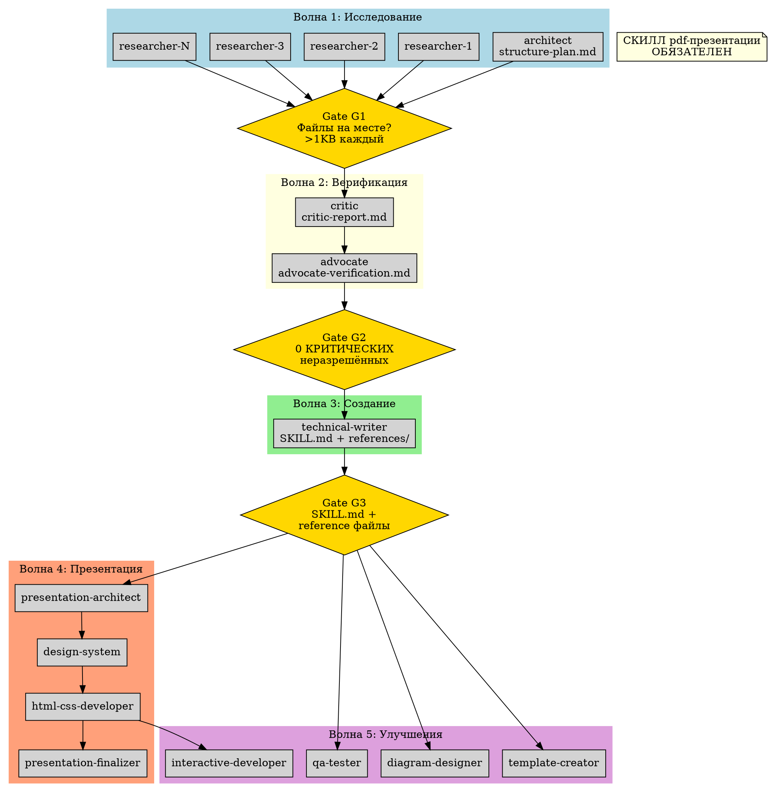

# Workflow-диаграммы и визуализации

> Источник: SKILL.md -- визуальные схемы координации

---

## 1. Dot-граф: Волны и Quality Gates

Главная диаграмма скилла. Показывает полный жизненный цикл проекта от исследования до презентации и улучшений, включая Quality Gates между волнами.

### Как читать

- **Прямоугольники** (box) -- агенты и их выходные артефакты
- **Ромбы** (diamond, золотые) -- Quality Gates (точки контроля между волнами)
- **Кластеры** (цветные зоны) -- волны (группы параллельных задач)
- **Стрелки** -- зависимости (задача B ждёт задачу A)
- **rankdir=TB** -- поток сверху вниз (Top to Bottom)

### Диаграмма



### Пояснение потока

1. **Волна 1** (lightblue): architect создаёт structure-plan.md, N исследователей работают ПАРАЛЛЕЛЬНО
2. **Gate G1** (gold): лидер проверяет -- все файлы на месте, каждый >1KB
3. **Волна 2** (lightyellow): critic ищет ошибки, advocate верифицирует критические
4. **Gate G2** (gold): 0 неразрешённых КРИТИЧЕСКИХ ошибок
5. **Волна 3** (lightgreen): technical-writer создаёт SKILL.md и references/
6. **Gate G3** (gold): SKILL.md и все reference файлы на месте
7. **Волна 4** (lightsalmon): конвейер презентации (pres_arch -> design -> html -> finalizer)
8. **Волна 5** (plum): QA, диаграммы, шаблоны, интерактивность -- ПАРАЛЛЕЛЬНО с Волной 4

Важно: Волны 4 и 5 стартуют ПАРАЛЛЕЛЬНО после Gate G3, так как обе зависят от одной и той же предыдущей волны.

---

## 2. ASCII-схема: Волновой паттерн (принцип)

Визуализация ключевого принципа волн: параллельность внутри, зависимости между.

```
  ВОЛНА 1: Исследование          ВОЛНА 2: Верификация       ВОЛНА 3: Создание
  ========================        ====================       ==================
  [architect  ] ---+
  [researcher-1] --+              [critic ] ----+
  [researcher-2] --+--> [G1] --> [advocate] ---+--> [G2] --> [writer] --> [G3]
  [researcher-3] --+
  [researcher-N] --+

                                                                          |
                                                    +---------------------+
                                                    |                     |
                                              ВОЛНА 4: Презентация   ВОЛНА 5: Улучшения
                                              ====================   ===================
                                              [pres-architect]       [qa-tester     ]
                                                    |                [diagram-designer]
                                              [design-system ]       [template-creator]
                                                    |                [interactive-dev ]
                                              [html-css-dev  ]
                                                    |
                                              [finalizer     ]
```

### Пояснение

- Горизонтальные стрелки (`-->`) -- последовательные зависимости
- Вертикальные группы (`[...]`) -- параллельные агенты внутри волны
- `[G1]`, `[G2]`, `[G3]` -- Quality Gates (контрольные точки)
- Волны 4 и 5 расходятся от G3 параллельно

---

## 3. ASCII-схема: Handoff-протокол между волнами

Показывает какие артефакты передаются от волны к волне.

```
  Волна 1                    Волна 2                    Волна 3
  =======                    =======                    =======
  structure-plan.md -------> critic-report.md --------> SKILL.md
  research-1.md ---+                                    references/
  research-2.md ---+-------> advocate-verification.md     faq.md
  research-3.md ---+                                      cheatsheet.md
  ...              |                                      troubleshooting.md
  research-N.md ---+

  7 файлов _research/        2 файла верификации        Основной результат
  "Ищи ПРОТИВОРЕЧИЯ"         "Только КРИТИЧЕСКИЕ"       "ИСПРАВЛЕННЫЕ данные!"
```

### Правила handoff

| Откуда | Куда | Что передать | Критическое указание |
|--------|------|-------------|---------------------|
| Волна 1 | Волна 2 (critic) | Пути к 7 файлам _research/ | "Ищи ПРОТИВОРЕЧИЯ между файлами" |
| Волна 2 (critic) | Волна 2 (advocate) | critic-report.md | "Верифицируй ТОЛЬКО критические и средние" |
| Волна 2 | Волна 3 | ВСЕ 9 файлов + исправления | "Используй ИСПРАВЛЕННЫЕ данные, НЕ исходные!" |
| Волна 3 | Волна 4 | SKILL.md + проектная папка | "Создай презентацию ПО этим файлам" |
| Волна 3 | Волна 5 (qa) | Все файлы скилла | "Проверь ВСЁ" |
| Волна 3 | Волна 5 (diagrams) | SKILL.md + references/ | "Создай диаграммы ПО этим данным" |
| Волна 4 (html) | Волна 5 (interactive) | presentation.html | "Добавь интерактивность В этот файл" |

---

## 4. ASCII-схема: Quality Gate протокол

Детальный flowchart проверки gate.

```
                   +--------------------+
                   | Волна N завершена  |
                   +--------+-----------+
                            |
                   +--------v-----------+
                   | Запуск Explore-    |
                   | агента для         |
                   | проверки gate      |
                   +--------+-----------+
                            |
                   +--------v-----------+
                   | Файлы на месте?    |
                   | Каждый >1KB?       |
                   +---+------------+---+
                       |            |
                      ДА          НЕТ
                       |            |
              +--------v---+  +-----v-----------+
              | Gate       |  | Определи что    |
              | ПРОЙДЕН    |  | не так           |
              +--------+---+  +-----+-----------+
                       |            |
              +--------v---+  +-----v-----------+
              | Запуск     |  | Fix-агент для   |
              | Волны N+1  |  | устранения      |
              +------------+  +-----+-----------+
                                    |
                              +-----v-----------+
                              | Повтори gate    |
                              +-----------------+
```

### Критерии прохождения gates

| Gate | Между | Что проверить | Критерий прохождения |
|------|-------|--------------|---------------------|
| G1 | Волна 1 -> 2 | Все файлы на месте, не пустые | 100% файлов существуют, >1KB каждый |
| G2 | Волна 2 -> 3 | Критические ошибки в critic-report | 0 неразрешённых КРИТИЧЕСКИХ |
| G3 | Волна 3 -> 4,5 | Основные файлы созданы | SKILL.md + все reference файлы |

---

## 5. ASCII-схема: Восстановление при сбоях (диагностика)

Протокол диагностики ПЕРЕД перезапуском агента.

```
              +--------------------+
              | Агент упал / нет   |
              | результата         |
              +--------+-----------+
                       |
              +--------v-----------+
              | СТОП! НЕ           |
              | перезапускай сразу |
              +--------+-----------+
                       |
              +--------v-----------+
              | ls целевого файла  |
              | (через Bash)       |
              +---+--------+---+---+
                  |        |       |
            Файл есть   Файл есть  Файла нет
            и полный    но пуст
                  |        |       |
         +--------v-+  +---v-----+ +--v---------+
         | Задача   |  | Mailbox | | Агент не   |
         | выполнена|  | miss    | | стартовал  |
         +----------+  +---+-----+ +--+---------+
                            |          |
                       +----v----+ +---v---------+
                       | Субагент| | Перезапуск  |
                       | (без   | | с тем же    |
                       | team)  | | промптом    |
                       +---------+ +-------------+

   Дополнительные сценарии:
   +----------------------------+    +----------------------------+
   | "Prompt is too long"       |    | Rate limit ошибка          |
   | -> раздели на 2 агента    |    | -> подожди 60 сек          |
   |    по 3-4 файла           |    | -> дай другим приоритет    |
   +----------------------------+    +----------------------------+
```

### Retry Budget по ролям

| Роль | Max повторов | Всего попыток | Почему |
|------|-------------|--------------|--------|
| Исследователь | 2 | 3 | Данные можно собрать с 2й-3й попытки |
| Critic | 1 | 2 | Критичная задача, 2й сбой = эскалация |
| Advocate | 1 | 2 | API-вызовы, повтор дорог |
| Technical-writer | 1 | 2 | Объёмная задача, контекст ограничен |
| Presentation-* | 2 | 3 | HTML/CSS может потребовать итераций |
| QA/Diagrams/Templates | 1 | 2 | Некритичные задачи |

---

## 6. ASCII-схема: Pre-Research протокол

Предварительное исследование ПЕРЕД Волной 1.

```
                     +---------------------+
                     | Новый проект        |
                     +----------+----------+
                                |
                     +----------v----------+
                     | Тема новая или      |
                     | есть примеры?       |
                     +---+------------+----+
                         |            |
                        ДА          НЕТ
                         |            |
           +-------------+--+    +----v-----------+
           | ПАРАЛЛЕЛЬНО:   |    | Сразу к        |
           |                |    | Волне 1         |
           | [Агент 1]      |    +----------------+
           | Анализ примеров|
           | (Explore)      |
           |                |
           | [Агент 2]      |
           | WebSearch темы |
           | (general)      |
           +-------+--------+
                   |
           +-------v--------+
           | Результаты в   |
           | _research/     |
           | pre-research/  |
           +-------+--------+
                   |
           +-------v--------+
           | Architect       |
           | получает INPUT  |
           | для plan.md     |
           +----------------+
```

### Пояснение

- Pre-research = ДОПОЛНЕНИЕ к Волне 1, не замена
- Оба агента запускаются параллельно (run_in_background: true)
- Timeout: 300 секунд (легковесные задачи)
- Если не дал результатов -- не задерживай проект

---

## 7. ASCII-схема: Контент-миграция (формат A -> формат B)

Специализированный паттерн для проектов миграции данных.

```
  Волна 0: Подготовка       Волна 1: Конвертация          Волна 2: QA + Фиксы
  ====================       =====================         ====================
  [mapper] ----+             [конвертер-1] ---+
               |             [конвертер-2] ---+--> [G] --> [verifier] --> [fixer]
  mapping.md   |             [конвертер-3] ---+
  templates/   |             [конвертер-4] ---+
               |
               +-----------> (шаблон = контракт для всех конвертеров)
```

### Пояснение

- БЕЗ WebSearch (все данные локальные)
- 1 verifier достаточно (вместо critic + advocate)
- Маппинг в Волне 0 ОБЯЗАТЕЛЕН -- корректирует оценку масштаба
- Правило: >10 файлов на агента = разделяй на 2 агента
- Рекомендуемый размер: 3-6 агентов + 1 fixer (15% запас)

---

## 8. ASCII-схема: Презентация из исследования (конвейер)

Последовательный конвейер для создания презентации из множества исходных файлов.

```
  Основная команда (ПОСЛЕДОВАТЕЛЬНО):

  [researcher] --> [presenter] --> [debugger]
       |                |              |
  content_brief.md  presentation.html  скриншоты + отчёт


  Опциональная команда анимации (ПОСЛЕДОВАТЕЛЬНО):

  [animator] --> [debugger]
       |              |
  presentation_   скриншоты + отчёт
  animated.html
```

### Пояснение

- ПОСЛЕДОВАТЕЛЬНЫЙ конвейер -- каждый агент зависит от предыдущего
- Researcher ОБЯЗАТЕЛЕН если >10 файлов / >200KB
- Debugger через Chrome DevTools MCP
- Анимация = отдельная команда (не раздувает контекст основной)
- Рекомендуемый размер: 3 основных + 2 анимация + 1 lead = 6 участников

---

## 9. Формула: Калькулятор размера команды

Визуализация формулы расчёта количества агентов.

```
  INPUT:                               FORMULA:
  ======                               ========
  sections (6-16)          ------->    researchers = ceil(sections / 2.5)
  verification (none/basic/full) -->    critic = 1 if basic|full
  presentation (yes/no)    ------->    advocate = 1 if full
  complexity (low/med/high) ------>    pre_research = 2 if med|high

  ALWAYS:
  =======
  architect = 1
  writer = 1

  CONDITIONAL:
  ============
  presentation = 4 if yes
  qa = 1 if basic|full
  diagrams = 1 if med|high
  templates = 1 if med|high
  interactive = 1 if presentation

  TOTAL = SUM(all above)
  BUFFER = ceil(TOTAL * 0.15)    <-- 15% запас на фиксы
```

### Быстрая таблица размеров

| Разделов | Верификация | Презентация | Сложность | Pre-research | Итого агентов |
|----------|-------------|-------------|-----------|-------------|---------------|
| 6 | basic | no | low | 0 | 7 |
| 10 | basic | no | medium | 2 | 11 |
| 10 | full | yes | medium | 2 | 18 |
| 14 | full | yes | high | 2 | 20 |
| 14 | full | yes (слияние) | high | 2 | 18 |
| 16 | full | yes | high | 2 | 24 |

---

## 10. ASCII-схема: Приоритеты при нехватке ресурсов

```
  P0 -- НЕЛЬЗЯ ПРОПУСТИТЬ:
  =========================
  [Волна 1: Исследование] --> [Волна 2: Верификация] --> [Волна 3: Создание]
       Без данных                 Без проверки               Основной
       нет проекта                данные ненадёжны            результат

  P1 -- ПОТЕРЯ КАЧЕСТВА:
  =======================
  [QA-тестер]  [Diagram-designer]  [Quality Gates]
  Ошибки       Нет визуализации    Возможны сбои
  останутся

  P2 -- МОЖНО ПОЗЖЕ:
  ===================
  [Презентация]  [Template-creator]  [Interactive-developer]
  Добавить       Шаблоны не          Интерактивность =
  потом          критичны            бонус
```

### Минимальная жизнеспособная команда (MVP)

```
  [researcher-1] --+
  [researcher-2] --+--> [critic-advocate] --> [technical-writer]
  [researcher-3] --+    (совмещённая роль)

  ИТОГО: 5-6 агентов (без презентации и QA)
```

---

## 11. ASCII-схема: Конкуренция за ресурсы

Приоритеты доступа агентов к API.

```
  API с лимитами (например, Google Maps 15 вызовов):

  ВЫСШИЙ приоритет:   [advocate]    -- верификация, дорогие вызовы
  СРЕДНИЙ приоритет:  [critic]      -- перепроверка
  НИЗШИЙ приоритет:   [researcher]  -- основной сбор данных

  Правила:
  +-------------------------------------------+
  | advocate = эксклюзивный доступ в Волне 2  |
  | researchers = ТОЛЬКО WebSearch в Волне 1  |
  | rate limit = подождать 60 сек, retry      |
  | 2 агента НИКОГДА не пишут в 1 файл       |
  +-------------------------------------------+
```

---

## 12. ASCII-схема: Слияние ролей

Какие роли можно объединить для экономии агентов.

```
  МОЖНО объединять:                          НЕЛЬЗЯ объединять:
  ==================                         ====================
  critic + advocate = verifier               researcher + critic (СВОЙ файл)
  qa + template = qa-templates               architect + researcher
  diagram + template = assets-creator        html-css + interactive
  pres-arch + design = pres-planner          writer + researcher
  design + html = pres-builder [Битрикс24]
  finalizer + interactive = pres-polisher [Битрикс24]
```

### Пример команды из 8 агентов (со слиянием)

```
  [1. architect    ] --+
  [2. researcher-1 ] --+
  [3. researcher-2 ] --+--> [5. verifier         ] --> [6. tech-writer     ]
  [4. researcher-3 ] --+    (critic + advocate)            |
                                                     +-----+-----+
                                                     |           |
                                              [7. qa-templates]  [8. presentation-full]
                                              (qa + template)    (arch + design + html + finalizer)
```

---

## 13. Фазовая архитектура (из проекта MLCR Investor Bot)

Альтернатива волновому паттерну для проектов с модульной архитектурой.

```
  Фаза A + C (ПАРАЛЛЕЛЬНО):
  ==========================
  [Модуль A: агент-1] --+
  [Модуль A: агент-2] --+     [Модуль C: агент-5] --+
                         |                            |
                         v                            v

  Фаза B (ПОСЛЕДОВАТЕЛЬНО):
  ==========================
  [Модуль B: агент-3] --> [Модуль B: агент-4]

  Фаза D (ПАРАЛЛЕЛЬНО):
  ==========================
  [Интеграция: агент-6] --+
  [Интеграция: агент-7] --+

  Фаза E + QA:
  ==========================
  [QA-агент = фиксер] --> [Финальная сборка]
```

### Ключевой урок

При параллельных агентах на связанных модулях -- определить интерфейсы ЗАРАНЕЕ:
- Имена функций
- Имена классов
- Enum values
- Передать ВСЕМ агентам один список

Без этого: конфликты имён API (Investor Bot: 5 критических багов в Фазе 3).

---

## Как рендерить диаграммы

### Dot-граф (секция 1)

Способы рендеринга:
1. **Graphviz online:** https://dreampuf.github.io/GraphvizOnline/
2. **VS Code расширение:** Graphviz Preview
3. **CLI:** `dot -Tpng waves.dot -o waves.png`
4. **Python:** `graphviz` библиотека

### ASCII-диаграммы (секции 2-13)

Отображаются корректно в любом моноширинном редакторе или markdown-просмотрщике.
