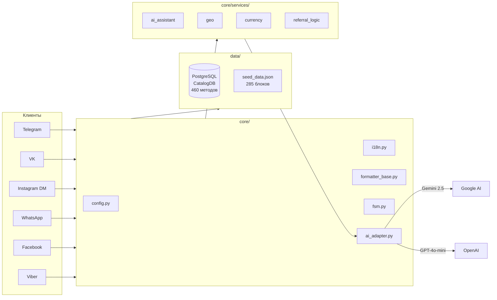
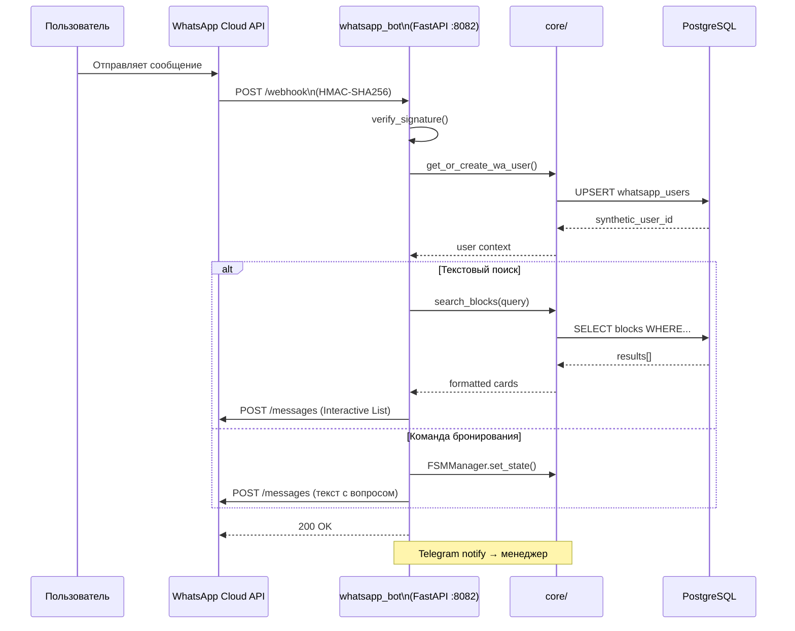
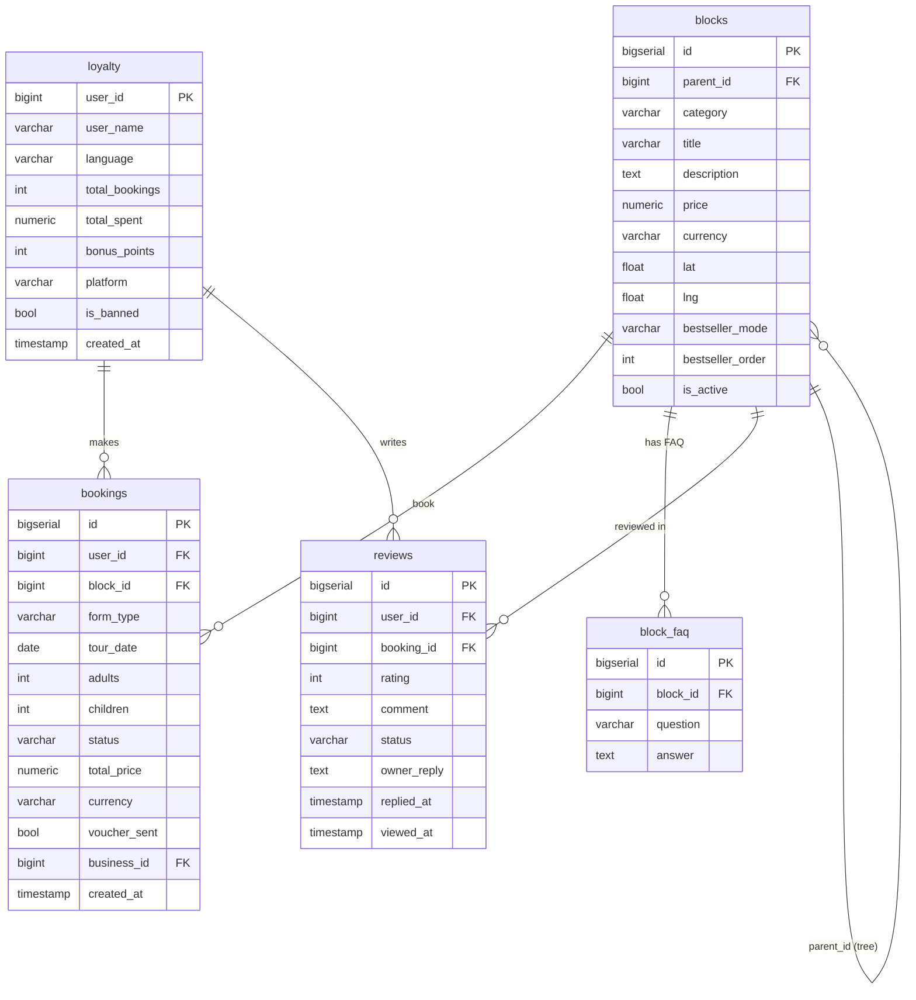
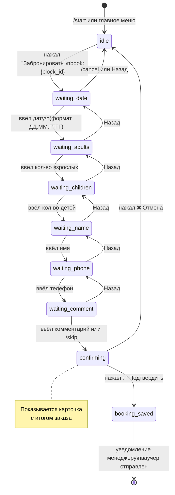
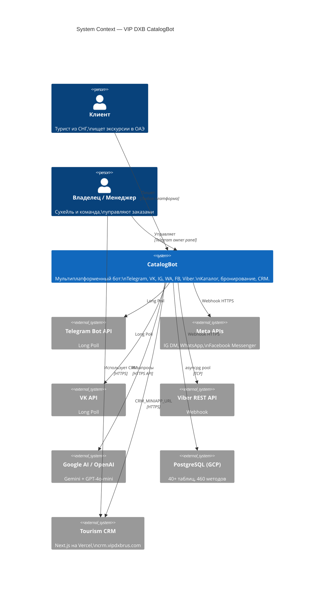
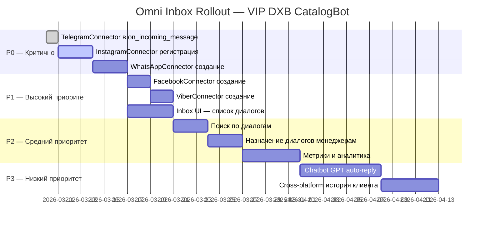
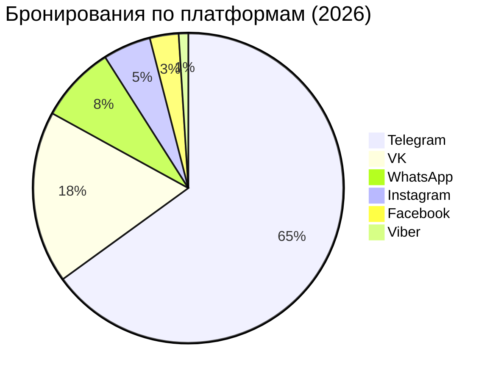
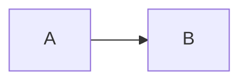

# Mermaid Diagrams

## Overview

Mermaid — это библиотека диаграмм на JavaScript, которая позволяет создавать визуальные схемы прямо внутри Markdown-файлов с помощью простого текстового синтаксиса.

**Где рендерится нативно (без плагинов):**
- GitHub — в любом `.md` файле, PR description, Issue, Wiki
- GitLab — аналогично GitHub
- Notion — блок `/code` → язык `mermaid`
- VS Code — плагин "Markdown Preview Mermaid Support"
- VitePress, Docusaurus, Obsidian
- Онлайн редактор: https://mermaid.live

**Ключевой принцип:** диаграммы версионируются в Git вместе с кодом, проходят code review, не устаревают.

---

## When to Use / When NOT to Use

**Использовать Mermaid когда:**
- Документируешь архитектуру системы, микросервисов, ботов
- Описываешь FSM (конечный автомат) — состояния бронирования, авторизации
- Показываешь схему базы данных (ERD)
- Визуализируешь API / webhook flow (sequence diagram)
- Строишь roadmap или план спринта (Gantt)
- Рисуешь простые диаграммы распределения (pie chart)

**НЕ использовать когда:**
- Нужен красивый дизайн для презентации клиенту — используй Figma/draw.io
- Диаграмма сложнее 20-25 узлов — разбей на несколько
- Нужны кастомные иконки или бренд-цвета — лучше изображение

---

## Diagram Types

### flowchart — Процессы и архитектура

**Синтаксис:**
```
flowchart LR          (или TD — сверху вниз)
    A[Прямоугольник]
    B(Скругленный)
    C{Ромб — решение}
    D[(Цилиндр — БД)]
    E((Круг))

    A --> B
    B -->|да| C
    B -->|нет| D
    C --> E
```

**Направления:** `LR` (left→right), `TD` (top→down), `RL`, `BT`

**Формы узлов:**
- `[текст]` — прямоугольник
- `(текст)` — скругленный
- `{текст}` — ромб (решение)
- `[(текст)]` — цилиндр (база данных)
- `((текст))` — круг
- `>текст]` — флаг
- `/текст/` — параллелограмм

**Пример — Архитектура CatalogBot:**


---

### sequenceDiagram — API и Webhook потоки

**Синтаксис:**
```
sequenceDiagram
    participant A as Клиент
    participant B as Сервер
    participant C as БД

    A->>B: POST /webhook
    B->>C: INSERT INTO bookings
    C-->>B: OK
    B-->>A: 200 {"status":"ok"}

    Note over A,B: Синхронный обмен
    activate B
    B->>C: SELECT ...
    deactivate B
```

**Стрелки:**
- `->>` — сплошная стрелка (синхронный вызов)
- `-->>` — пунктирная стрелка (ответ)
- `-x` — стрелка с крестом (ошибка/блокировка)
- `-)` — открытая стрелка (async)

**Пример — WhatsApp Webhook Flow:**


---

### erDiagram — Схема базы данных

**Синтаксис:**
```
erDiagram
    TABLE1 {
        int id PK
        string name
        int fk_id FK
    }
    TABLE2 {
        int id PK
        string value
    }

    TABLE1 ||--o{ TABLE2 : "has"
```

**Типы связей:**
- `||--||` — один к одному
- `||--|{` — один ко многим (обязательно)
- `||--o{` — один ко многим (опционально)
- `}|--|{` — многие ко многим

**Пример — Основные таблицы CatalogBot:**


---

### stateDiagram-v2 — FSM состояния

**Синтаксис:**
```
stateDiagram-v2
    [*] --> Начало
    Начало --> Шаг1 : событие
    Шаг1 --> Шаг2 : условие
    Шаг2 --> [*] : завершение

    state "Составное состояние" as CS {
        [*] --> Подсостояние1
        Подсостояние1 --> Подсостояние2
    }

    note right of Шаг1
        Подсказка
    end note
```

**Пример — FSM бронирования (Telegram/VK):**


---

### C4Context — Системная архитектура (C4 Model)

**Синтаксис:**
```
C4Context
    title System Context — Название системы

    Person(user, "Пользователь", "Описание")
    System(sys, "Система", "Описание")
    System_Ext(ext, "Внешняя система", "Описание")

    Rel(user, sys, "Использует", "HTTPS")
    Rel(sys, ext, "Интегрируется", "API")
```

**Пример — Контекст CatalogBot:**


---

### gantt — Дорожная карта и таймлайн

**Синтаксис:**
```
gantt
    title Название проекта
    dateFormat YYYY-MM-DD
    excludes weekends

    section Секция 1
    Задача завершена   :done,    t1, 2026-01-01, 2026-01-10
    Задача активная    :active,  t2, 2026-01-10, 7d
    Будущая задача     :         t3, after t2, 5d
    Критическая        :crit,    t4, 2026-01-20, 3d
```

**Пример — Roadmap Omni Inbox:**


---

### pie — Распределение и доли

**Синтаксис:**
```
pie title Заголовок
    "Категория 1" : 42
    "Категория 2" : 30
    "Категория 3" : 28
```

**Пример — Распределение бронирований по платформам:**


---

## Quick Reference

| Тип диаграммы | Когда использовать | Ключевое слово |
|---|---|---|
| `flowchart` | Архитектура, процессы, дерево решений | `flowchart LR` / `TD` |
| `sequenceDiagram` | API вызовы, webhook flow, взаимодействие сервисов | `sequenceDiagram` |
| `erDiagram` | Схема БД, связи между таблицами | `erDiagram` |
| `stateDiagram-v2` | FSM, состояния пользователя, lifecycle | `stateDiagram-v2` |
| `C4Context` | Системный контекст, внешние интеграции | `C4Context` |
| `gantt` | Roadmap, спринты, таймлайн задач | `gantt` |
| `pie` | Доли, распределения, статистика | `pie title` |
| `classDiagram` | ООП классы, иерархия наследования | `classDiagram` |
| `mindmap` | Брейншторм, структура знаний | `mindmap` |

---

## Rendering

### GitHub
Нативно в любом `.md` файле — просто оберни в блок кода с языком `mermaid`:
````

````

### VS Code
Плагин: **"Markdown Preview Mermaid Support"** (Mamei Software).
После установки — стандартный preview (`Ctrl+Shift+V`) рендерит диаграммы.

### Notion
1. Напиши `/code`
2. Выбери язык `mermaid`
3. Вставь синтаксис диаграммы

### Онлайн редактор
https://mermaid.live — вставь код, получи SVG/PNG, поделись ссылкой.

### GitLab
Нативно, синтаксис идентичен GitHub.

---

## Common Mistakes

### 1. Пробелы и спецсимволы в именах узлов
```
# НЕВЕРНО — пробел сломает парсер
A[My Node] --> B[Another Node]

# ВЕРНО — если нет скобок, пробелы недопустимы в ID
myNode[My Node] --> anotherNode[Another Node]
```

### 2. Специальные символы требуют кавычек
```
# НЕВЕРНО
A --> B[Hello (World)]

# ВЕРНО — используй кавычки внутри скобок
A --> B["Hello (World)"]
```

### 3. Кириллица в ID узлов — лучше избегать
```
# РИСК — может работать, но нестабильно
Старт --> Конец

# НАДЁЖНО — латинские ID, кириллица только в метках
start_node[Старт] --> end_node[Конец]
```

### 4. Слишком длинные стрелки в sequenceDiagram
```
# НЕВЕРНО — лишние пробелы
A - - >> B: message

# ВЕРНО
A-->>B: message
```

### 5. ERD: FK должны явно описываться в relationships
```
# Просто добавить FK в поля недостаточно для линий связи
# НУЖНО явно написать:
TABLE1 ||--o{ TABLE2 : "описание связи"
```

### 6. Пустые диаграммы не рендерятся
Всегда должен быть хотя бы один узел или участник.

---

## Tips & Tricks

**Группировка узлов в flowchart:**
```
flowchart TD
    subgraph Backend["Backend Services"]
        API[FastAPI]
        DB[(PostgreSQL)]
    end
    Client --> API
    API --> DB
```

**Стили узлов:**
```
flowchart LR
    A[Нормальный]
    B[Ошибка]:::error
    C[Успех]:::success

    classDef error fill:#ff6b6b,color:#fff
    classDef success fill:#51cf66,color:#fff
```

**Ссылки на узлы (GitHub поддерживает):**
```
flowchart LR
    A[Документация] --> B[API]
    click A href "https://docs.example.com" "Открыть документацию"
```

---

## Sources

- Источник скилла: https://github.com/TerminalSkills/skills/tree/main/skills/mermaid
- Официальная документация: https://mermaid.js.org/intro/
- Онлайн редактор: https://mermaid.live
- Размер файла: ~7.5 KB
