# Dubai Metro Map — Red Line & Green Line
> Схема метро Дубая: 35 станций Red Line + 20 станций Green Line с пересадками Union и BurJuman

```mermaid
graph LR
    %% ===== RED LINE =====
    R11["R11 Centrepoint"]:::red --> R12["R12 Emirates"]:::red
    R12 --> R13["R13 Airport T3"]:::red
    R13 --> R14["R14 Airport T1"]:::red
    R14 --> R15["R15 GGICO"]:::red
    R15 --> R16["R16 City Centre Deira"]:::red
    R16 --> R17["R17 Al Rigga"]:::red
    R17 --> R18["R18 UNION"]:::transfer
    R18 --> R19["R19 BURJUMAN"]:::transfer
    R19 --> R20["R20 ADCB"]:::red
    R20 --> R21["R21 max"]:::red
    R21 --> R22["R22 World Trade Centre"]:::red
    R22 --> R23["R23 Emirates Towers"]:::red
    R23 --> R24["R24 Financial Centre"]:::red
    R24 --> R25["R25 Burj Khalifa / Dubai Mall"]:::redstar
    R25 --> R26["R26 Business Bay"]:::red
    R26 --> R29["R29 ONPASSIVE"]:::red
    R29 --> R31["R31 Equiti"]:::red
    R31 --> R32["R32 Mall of the Emirates"]:::redstar
    R32 --> R33["R33 InsuranceMarket"]:::red
    R33 --> R34["R34 Dubai Internet City"]:::red
    R34 --> R35["R35 Al Fardan Exchange"]:::red
    R35 --> R36["R36 Sobha Realty"]:::tramlink
    R36 --> R37["R37 DMCC"]:::tramlink
    R37 --> R38["R38 Ibn Battuta"]:::red
    R38 --> R39["R39 Energy"]:::red
    R39 --> R40["R40 Danube"]:::red
    R40 --> R42["R42 Life Pharmacy"]:::red
    R42 --> R70["R70-R76 Route 2020 (7 st.)"]:::red

    %% ===== GREEN LINE =====
    G11["G11 Etisalat by e&"]:::green --> G12["G12-G19 Al Qusais...Salah Al Din"]:::green
    G12 --> G20["G20 UNION"]:::transfer
    G20 --> G21["G21 Baniyas Square"]:::green
    G21 --> G22["G22 Gold Souq"]:::greenstar
    G22 --> G23["G23 Al Ras"]:::green
    G23 --> G24["G24 Al Ghubaiba"]:::greenstar
    G24 --> G25["G25 Sharaf DG"]:::green
    G25 --> G26["G26 BURJUMAN"]:::transfer
    G26 --> G27["G27 Oud Metha"]:::green
    G27 --> G28["G28 Dubai Healthcare City"]:::green
    G28 --> G29["G29 Al Jadaf"]:::green
    G29 --> G30["G30 Creek"]:::green

    %% ===== TRANSFERS =====
    R18 <-.->|"Пересадка ~5 мин"| G20
    R19 <-.->|"Пересадка ~3 мин"| G26

    %% ===== STYLES =====
    classDef red fill:#FF0000,stroke:#CC0000,color:#FFFFFF,font-weight:bold
    classDef redstar fill:#FF4444,stroke:#FF0000,color:#FFFFFF,font-weight:bold,stroke-width:3px
    classDef green fill:#00AA00,stroke:#008800,color:#FFFFFF,font-weight:bold
    classDef greenstar fill:#00CC00,stroke:#00AA00,color:#FFFFFF,font-weight:bold,stroke-width:3px
    classDef transfer fill:#FFD700,stroke:#FFA500,color:#000000,font-weight:bold,stroke-width:4px
    classDef tramlink fill:#FF6600,stroke:#CC4400,color:#FFFFFF,font-weight:bold,stroke-width:3px
```

## Легенда
- **Красные узлы** — станции Red Line (R11-R76, 35 станций, 67 км)
- **Зеленые узлы** — станции Green Line (G11-G30, 20 станций, 22.5 км)
- **Желтые узлы (UNION, BURJUMAN)** — пересадочные станции между Red и Green
- **Оранжевые узлы (Sobha Realty, DMCC)** — пересадка на Dubai Tram
- **Узлы с толстой обводкой** — ключевые туристические станции
- Пунктирные связи — пересадки между линиями
