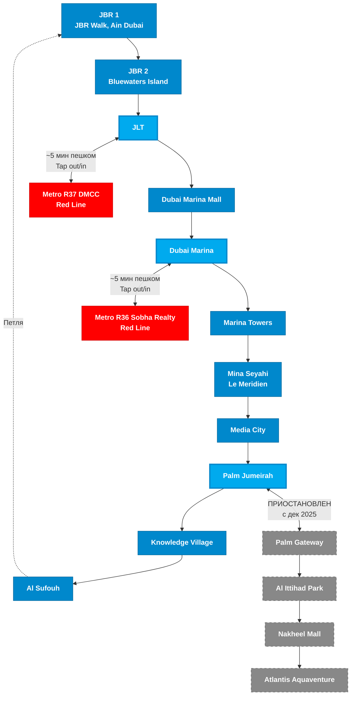

# Dubai Tram & Connections
> 11 станций Dubai Tram с пересадками на Metro (DMCC, Sobha Realty) и Monorail (Palm Jumeirah)

## Легенда
- **Синие узлы** — станции Dubai Tram (11 станций, 10.6 км, Зона nol 2)
- **Синие с толстой обводкой** — пересадочные станции Tram
- **Красные узлы** — станции Metro Red Line (пересадка с Tram)
- **Серые пунктирные узлы** — Palm Monorail (ПРИОСТАНОВЛЕН с декабря 2025)
- Пересадка Metro-Tram: tap out Metro, tap in Tram (в 30 мин = одна поездка)
- Tram работает петлей: Пн-Сб 06:00-01:00, Вс 09:00-01:00, интервал 8-15 мин
