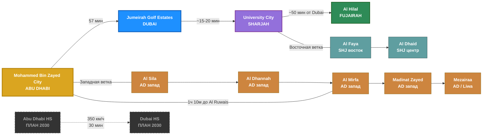

# Etihad Rail — National Railway UAE
> Национальная железная дорога ОАЭ: 11 станций, до 200 км/ч, запуск 2026

## Легенда
- **Золотой** — Abu Dhabi (Mohammed Bin Zayed City — главная станция)
- **Синий** — Dubai (Jumeirah Golf Estates — рядом с Red Line R73)
- **Фиолетовый** — Sharjah (University City)
- **Зеленый** — Fujairah (Al Hilal)
- **Коричневые** — западная ветка (Al Sila, Al Dhannah, Al Mirfa, Madinat Zayed, Mezairaa)
- **Бирюзовые** — восточная ветка (Al Faya, Al Dhaid)
- **Серые пунктирные** — высокоскоростная линия AD-Dubai (план 2030, 350 км/ч, 30 мин)
- Скорость: до 200 км/ч | Вместимость: ~400 пассажиров | Интеграция с nol Card
