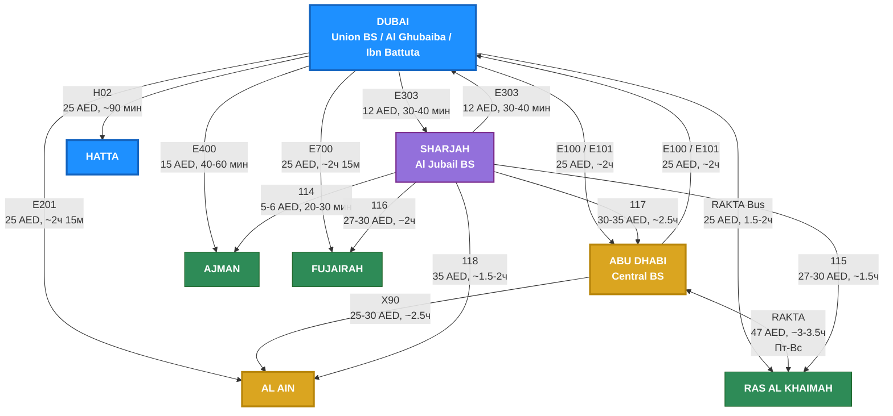

# Intercity Bus Network UAE
> Автобусная сеть между 7 эмиратами: маршруты, время в пути и стоимость

## Легенда
- **Синий (Dubai)** — главный хаб: Union BS (E303, E400, E700, RAKTA), Al Ghubaiba (E100, E201), Ibn Battuta (E101)
- **Золотой (Abu Dhabi, Al Ain)** — эмират Abu Dhabi: Central BS, X90 до Al Ain
- **Фиолетовый (Sharjah)** — Al Jubail BS: транзитный хаб для северных эмиратов (114-118)
- **Зеленый** — северные эмираты (Ajman, RAK, Fujairah)
- Оплата: E-маршруты = nol Card, SRTA (114-118) = Sayer Card, RAKTA = Saqr Card, ITC (X90) = Hafilat Card
