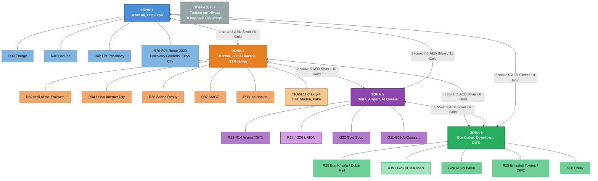

# NOL Zones — Dubai Transit Zones & Tariffs
> 7 зон nol Card с ключевыми станциями и тарифами между зонами

## Легенда
- **Синяя (Зона 1)** — Jebel Ali, DIP, Expo City (R39-R76)
- **Оранжевая (Зона 2)** — Marina, JLT, Al Barsha + все 11 станций Tram (R29-R38)
- **Фиолетовая (Зона 5)** — Deira, Airport, Al Qusais, Union (R11-R18, G11-G23)
- **Зеленая (Зона 6)** — Bur Dubai, Downtown, DIFC, Business Bay (R19-R26, G24-G30)
- **Серая (Зоны 3, 4, 7)** — только автобусы и водный транспорт (нет Metro)
- Тарифы: 1 зона = 3/6 AED, 2 зоны = 5/10 AED, 3+ зон = 7.5/15 AED (Silver/Gold)
- Daily Cap: Silver 14 AED, Gold 28 AED (безлимит за день)
