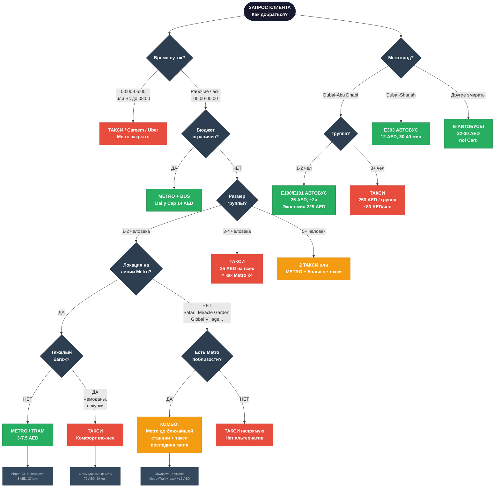

# Transit Decision Tree — Авто vs Общественный транспорт
> Дерево решений для выбора оптимального транспорта в Дубае и ОАЭ

## Легенда
- **Темные узлы** — вопросы-решения (время, бюджет, группа, багаж, локация)
- **Зеленые** — общественный транспорт (Metro, Tram, Bus) — выгодно для 1-2 человек
- **Красные** — такси / Careem / Uber — для групп, ночью, с багажом
- **Оранжевые** — комбо Metro + такси (оптимальное соотношение цена/время)
- **Серые** — примеры конкретных маршрутов с ценами

### Ключевые правила
1. **Ночь (00:00-05:00, Вс до 08:00)** — только такси
2. **Бюджет** — всегда Metro/Bus (Daily Cap 14 AED)
3. **3+ человек** — такси выгоднее (35 AED / 4 = 8.75 AED/чел)
4. **Solo/пара на Metro** — экономия 70-90%
5. **Нет Metro рядом** — комбо Metro + такси последняя миля
