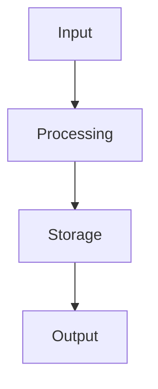

# README мирового уровня — Скилл

## ТРИГГЕРЫ (активируй при):
- "создай readme", "сделай ридми", "readme проекта"
- "обнови readme", "улучши readme"
- "документация проекта", "описание проекта"
- Любой запрос на создание README.md для проекта

## ПРОЦЕСС (3 волны субагентов)

### Волна 1: Исследование (2 субагента ПАРАЛЛЕЛЬНО)

**Субагент A — Исследование лучших практик:**
```
Промт: Исследуй лучшие примеры README от топовых компаний.
Поищи в интернете:
1. Структуру README от: Anthropic, OpenAI, Google, Meta, FastAPI, aiogram
2. Лучшие практики README.md на GitHub
3. Визуальные элементы: badges, shields, ASCII-арт, mermaid диаграммы
4. Как оформляют Features — списки vs таблицы vs скриншоты
5. Какие секции обязательны

Дай отчёт:
- Порядок секций
- Визуальные элементы
- Паттерны запоминающихся README
- Markdown snippets
- Что НЕ надо делать
```
- subagent_type: general-purpose
- model: sonnet (экономия)
- run_in_background: true

**Субагент B — Сбор метрик проекта:**
```
Промт: Исследуй проект [ПУТЬ] и собери ВСЮ информацию для README.
Прочитай: главный конфиг, changelog, requirements, архитектуру, тесты.
Посчитай: файлы, строки кода, тесты, команды, модули.
Дай отчёт: фичи, тех.стек, архитектура, метрики, уникальности.
```
- subagent_type: Explore
- run_in_background: true

### Волна 2: Создание README (1 субагент после завершения Волны 1)

**Субагент C — Написание README:**
```
Промт: Создай README.md мирового уровня для проекта [ПУТЬ].
[Вставить данные из субагентов A и B]

СТРУКТУРА (17 секций):
1. Header — центрированный <div align="center"> + <h1> + <p><strong>
2. Badges — 7-8 shields.io с логотипами (?logo=python)
3. Quick Links — якорные ссылки на секции
4. About — 3-4 предложения (что/для кого/уникальность)
5. Key Metrics — таблица конкретных чисел
6. Features — таблицы с эмодзи по категориям
7. Architecture — Mermaid flowchart (```mermaid)
8. Quick Start — 4 шага (clone → install → configure → run)
9. Configuration — таблицы .env по группам
10. Commands — collapsible <details> секции
11. Project Structure — collapsible дерево файлов
12. Tech Stack — таблица технологий
13. Deployment — среды разработки/продакшн
14. Roadmap — чекбоксы [x] / [ ]
15. Testing — команды запуска тестов
16. Documentation — ссылки на доп.документы
17. License + Footer

ПРАВИЛА:
- README на АНГЛИЙСКОМ (стандарт GitHub)
- Back to top после каждой крупной секции
- Не более 8 badges
- Collapsible через <details><summary>
- Mermaid рендерится на GitHub
- Числа конкретные (1419, а не "много")
- Нет пустых секций
- Max ~500 строк
```
- subagent_type: general-purpose
- mode: bypassPermissions

## ЗОЛОТЫЕ ПРАВИЛА README

### ДА:
1. **Show, don't tell** — GIF/скриншот стоит 1000 слов
2. **Числа = доверие** — "1,419 tests" лучше чем "tested"
3. **Одна строка-крючок** — [прилагательное] + [что] + [для кого] + [преимущество]
4. **Progressive disclosure** — badges → GIF → features → install → advanced
5. **Collapsible секции** — `<details>` для длинного контента
6. **Mermaid диаграммы** — рендерятся прямо в GitHub
7. **Back to top** — `<p align="right"><a href="#top">⬆ Back to top</a></p>`

### НЕТ:
1. ❌ Пустые секции ("TODO", "Coming soon")
2. ❌ Только текст без визуальных элементов
3. ❌ "See documentation" без кода
4. ❌ 15+ badges (визуальный шум, max 8)
5. ❌ Жаргон без объяснений
6. ❌ Устаревшие версии
7. ❌ Стена текста без разделителей

## ШАБЛОНЫ

### Badge с логотипом:
```markdown


```

Логотипы: python, telegram, whatsapp, fastapi, pytest, docker, postgresql, redis, react, typescript, javascript, go, rust, java. Все на [simpleicons.org](https://simpleicons.org).

### Центрированный заголовок:
```markdown
<div align="center">
  <h1>🎙 ProjectName</h1>
  <p><strong>One-line description in English</strong></p>
  <p><em>Описание на русском (опционально)</em></p>
</div>
```

### Collapsible секция:
```markdown
<details>
<summary>📱 <strong>Section Title (count)</strong></summary>

| Column | Column |
|--------|--------|
| data   | data   |

</details>
```

### Mermaid архитектура:
````markdown

````

### Quick Start:
```markdown
## 🚀 Quick Start

\`\`\`bash
# 1. Clone
git clone https://github.com/user/repo.git
cd repo

# 2. Install
pip install -r requirements.txt

# 3. Configure
cp .env.example .env

# 4. Run
python main.py
\`\`\`
```

### Roadmap:
```markdown
## 🗺 Roadmap

- [x] Feature 1
- [x] Feature 2
- [ ] Planned feature
- [ ] Future feature
```

## ИСТОЧНИКИ ВДОХНОВЕНИЯ
- [FastAPI](https://github.com/fastapi/fastapi) — эталон features + code examples
- [othneildrew/Best-README-Template](https://github.com/othneildrew/Best-README-Template) — шаблон 14k+ stars
- [lobehub/lobe-chat](https://github.com/lobehub/lobe-chat) — enterprise визуализация
- [matiassingers/awesome-readme](https://github.com/matiassingers/awesome-readme) — коллекция лучших
- [Make a README](https://www.makeareadme.com/) — справочник

## РЕЗУЛЬТАТ

После применения этого скилла README будет содержать:
- Центрированный заголовок с badges
- Mermaid архитектурная диаграмма
- Таблицы фич с эмодзи
- Quick Start в 4 шага
- Collapsible секции для длинного контента
- Roadmap с чекбоксами
- Back to top навигация
- ~500 строк, профессиональный уровень Google/Meta/Anthropic
