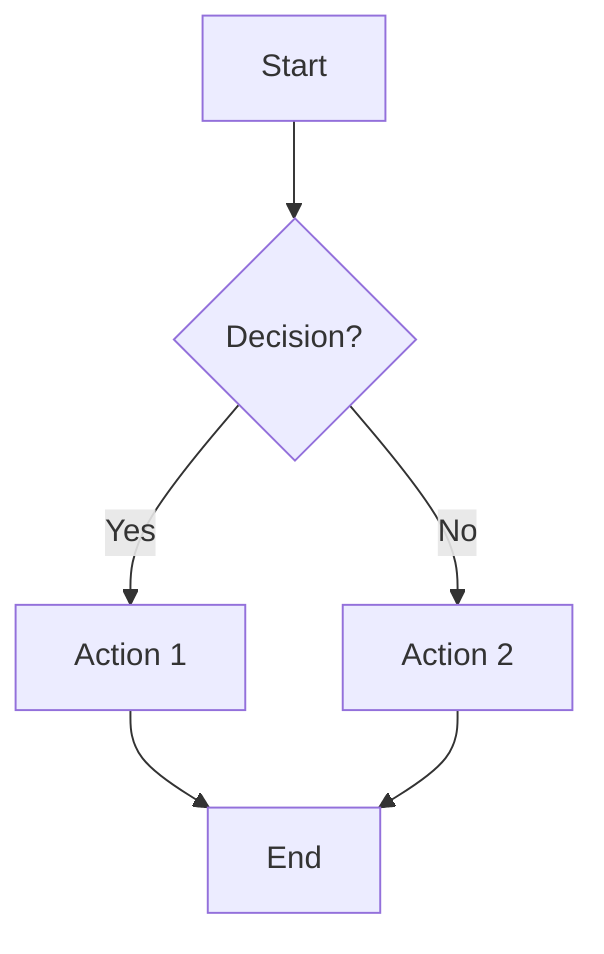
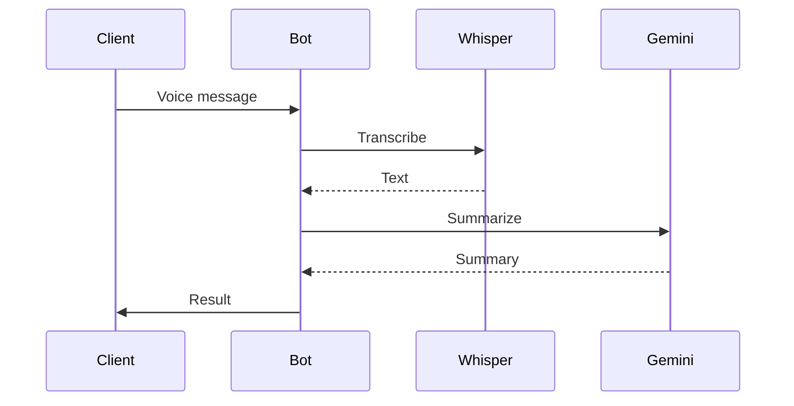
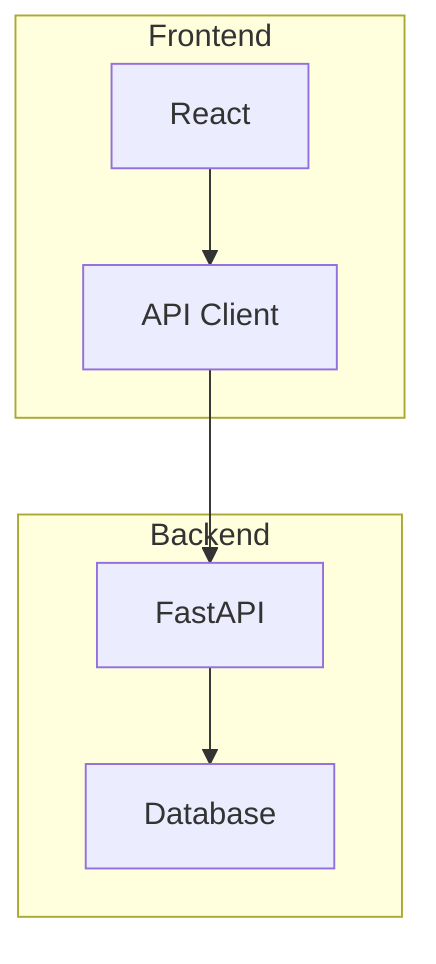

# Шпаргалка: README элементы

## Badges (shields.io)

### Формат
```

```

### Цвета
| Цвет | Код | Использование |
|------|-----|---------------|
| brightgreen | `brightgreen` | Статус OK, тесты проходят |
| green | `green` | Активный, поддерживается |
| yellow | `yellow` | Лицензия, предупреждение |
| orange | `orange` | Beta, эксперимент |
| red | `red` | Deprecated, ошибка |
| blue | `blue` | Информация, версия |
| 3776AB | `3776AB` | Python (фирменный цвет) |
| 2CA5E0 | `2CA5E0` | Telegram |
| 25D366 | `25D366` | WhatsApp |
| 009688 | `009688` | FastAPI |

### Популярные логотипы
python, javascript, typescript, react, vue, angular, nodejs, go, rust, java, docker, kubernetes, postgresql, redis, mongodb, telegram, whatsapp, fastapi, flask, django, pytest, github, gitlab, aws, googlecloud, azure

### Примеры готовых badges
```markdown


```

## Mermaid диаграммы

### Flowchart (самая частая)
````markdown

````

### Sequence Diagram
````markdown

````

### Subgraphs
````markdown

````

## HTML в Markdown (GitHub поддерживает)

### Центрирование
```html
<div align="center">
  <h1>Title</h1>
  <p>Description</p>
</div>
```

### Collapsible
```html
<details>
<summary>Click to expand</summary>

Content here (need empty line after summary!)

</details>
```

### Back to top
```html
<p align="right"><a href="#readme-top">⬆ Back to top</a></p>
```

### Изображение с размером
```html

```
