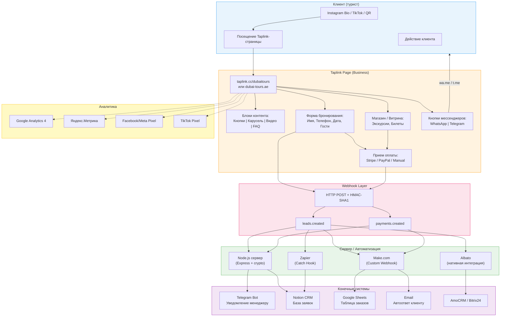

# Архитектура интеграций Taplink

Полная схема потока данных от Taplink-страницы до конечных систем: CRM, мессенджеры, аналитика, платежи.

## Легенда

| Элемент | Описание |
|---------|----------|
| Сплошные линии | Основной поток данных |
| Пунктирные линии | Аналитические трекеры (JS-скрипты) |
| CLIENT | Точки входа клиента |
| TAPLINK | Платформа Taplink (тариф Business) |
| WEBHOOK LAYER | Исходящие HTTP POST запросы |
| MIDDLEWARE | Серверы обработки / платформы автоматизации |
| DESTINATIONS | Конечные системы получения данных |
| ANALYTICS | Системы аналитики и отслеживания |
