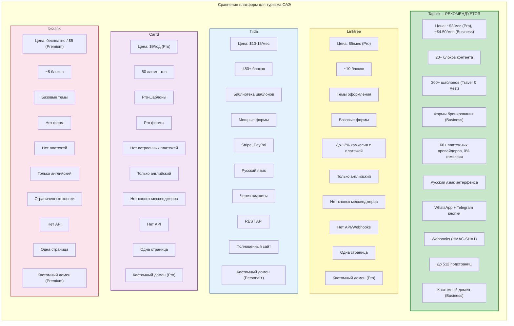
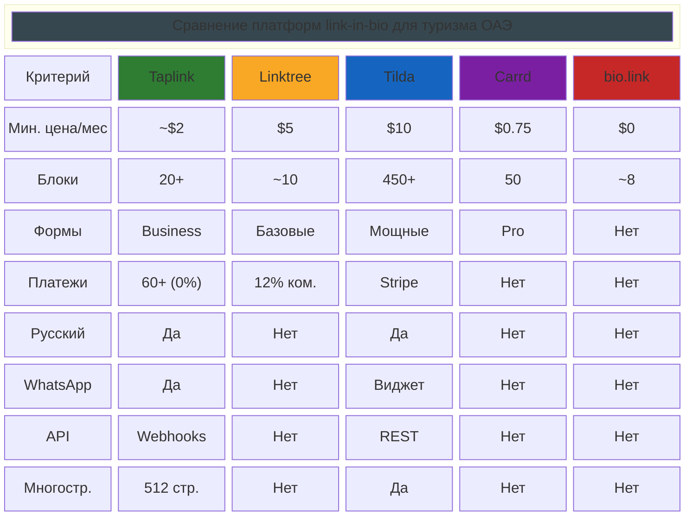
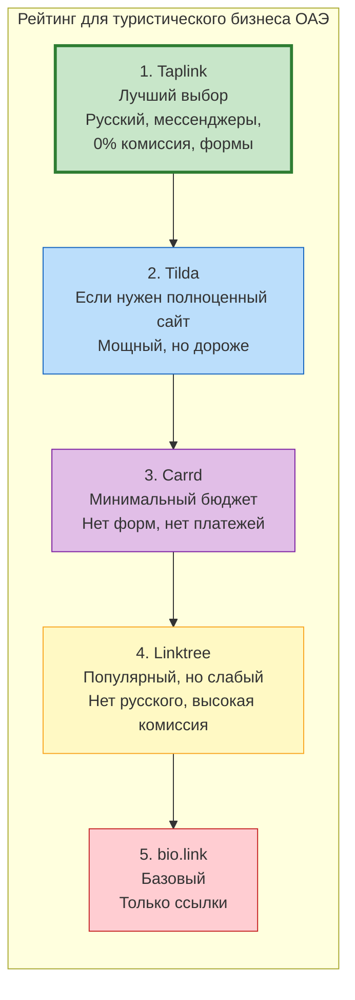

# Сравнение платформ: Taplink vs конкуренты

Матрица сравнения link-in-bio платформ по ключевым параметрам для туристического бизнеса в ОАЭ.

## Детальная таблица сравнения

## Рейтинг для туризма ОАЭ

## Легенда

| Место | Платформа | Почему |
|:-----:|-----------|--------|
| 1 | **Taplink** | Русский язык, WhatsApp/Telegram кнопки, 60+ платежных провайдеров с 0% комиссией, формы бронирования, низкая цена |
| 2 | **Tilda** | Мощный конструктор с REST API, но дороже и избыточен для link-in-bio |
| 3 | **Carrd** | Очень дешево ($9/год), но нет форм, платежей, мессенджеров |
| 4 | **Linktree** | Популярен в мире, но нет русского, высокая комиссия, нет мессенджеров |
| 5 | **bio.link** | Бесплатный, но крайне ограничен |
