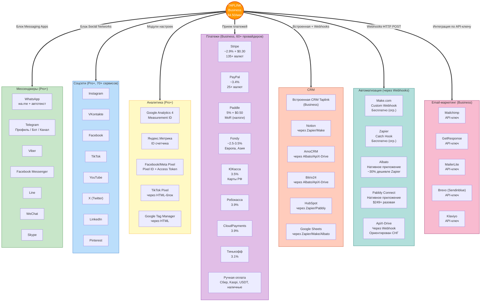
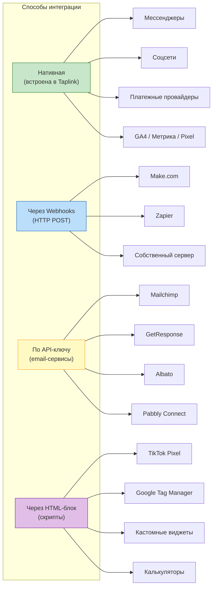

# Карта интеграций Taplink

Визуальная карта всех интеграций Taplink по категориям: мессенджеры, соцсети, аналитика, платежи, CRM, автоматизация, email-маркетинг.

## Типы интеграций

## Легенда

| Цвет | Категория | Тариф |
|------|-----------|-------|
| Зеленый | Мессенджеры | Pro+ |
| Синий | Соцсети | Pro+ |
| Желтый | Аналитика | Pro+ (модули), Business (глобальный HTML) |
| Фиолетовый | Платежи | Business |
| Оранжевый | CRM | Business (встроенная + webhooks) |
| Бирюзовый | Автоматизация | Business (webhooks) |
| Розовый | Email-маркетинг | Business (API-ключ) |
