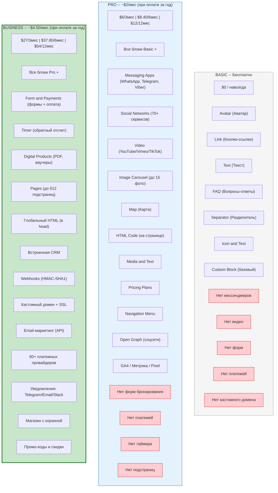
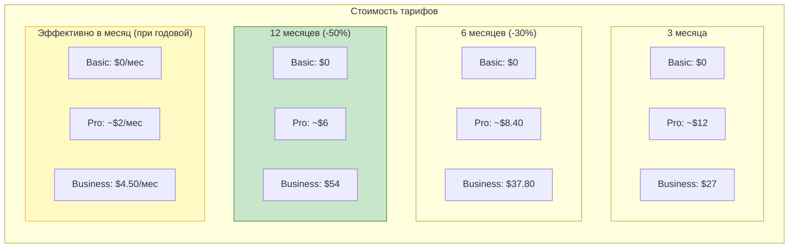
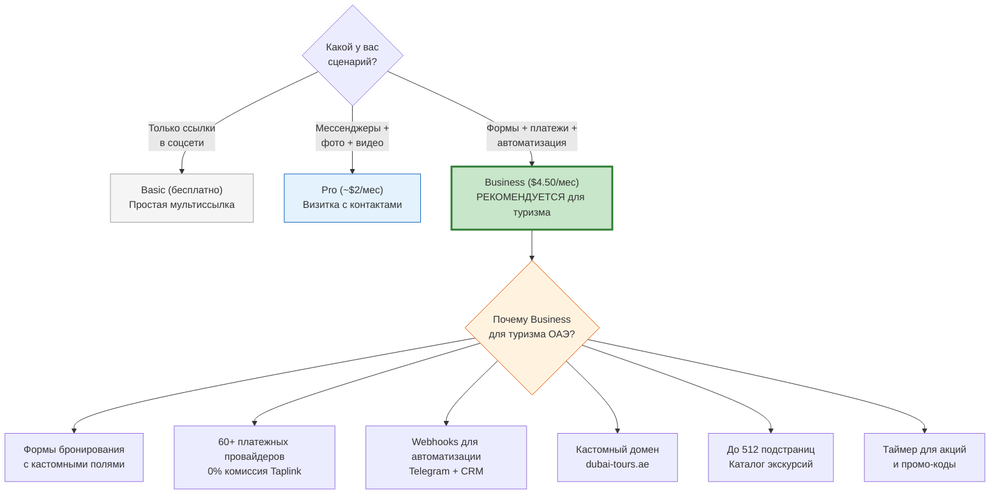

# Сравнение тарифов Taplink: Basic vs Pro vs Business

Детальное сравнение трех тарифных планов Taplink с рекомендациями для туристического бизнеса в ОАЭ.

## Стоимость по периодам

## Рекомендация по сценарию

## Легенда

| Цвет | Значение |
|------|----------|
| Серый | Basic -- бесплатный, минимальный |
| Синий | Pro -- средний, подходит для визитки |
| Зеленый (жирная рамка) | Business -- рекомендуется для туризма ОАЭ |
| Красный | Функция отсутствует на данном тарифе |
| Желтый | Рекомендуемый вариант оплаты (годовой) |
