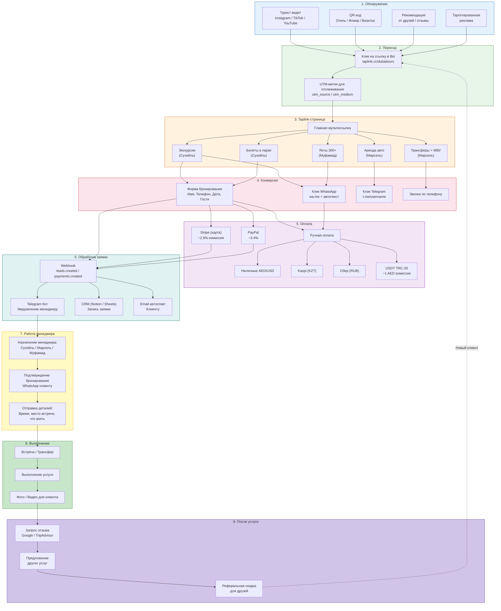
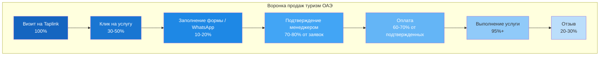
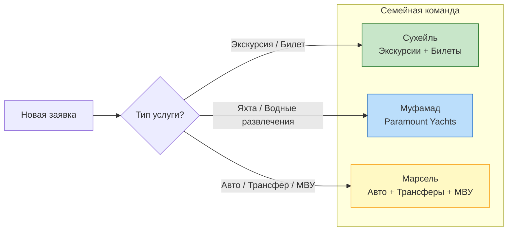

# Бизнес-процесс туризма ОАЭ через Taplink

Полный путь клиента от первого контакта в Instagram до выполнения услуги и получения отзыва. Оптимизировано для туристического бизнеса семьи Сухейля.

## Воронка конверсии

## Распределение по менеджерам

## Легенда

| Этап | Ключевое действие | Инструмент |
|------|-------------------|------------|
| Обнаружение | Турист находит бизнес | Instagram, TikTok, QR-код |
| Переход | Клик на ссылку | Bio link + UTM |
| Taplink | Просмотр услуг | Мультиссылка, подстраницы |
| Конверсия | Заявка или сообщение | Форма, WhatsApp, Telegram |
| Оплата | Платеж | Stripe, ручная, крипто |
| Обработка | Автоматизация | Webhook, Telegram бот, CRM |
| Менеджер | Подтверждение | WhatsApp переписка |
| Выполнение | Услуга | Офлайн |
| После | Отзыв и повторные продажи | Google Reviews, рефералы |
