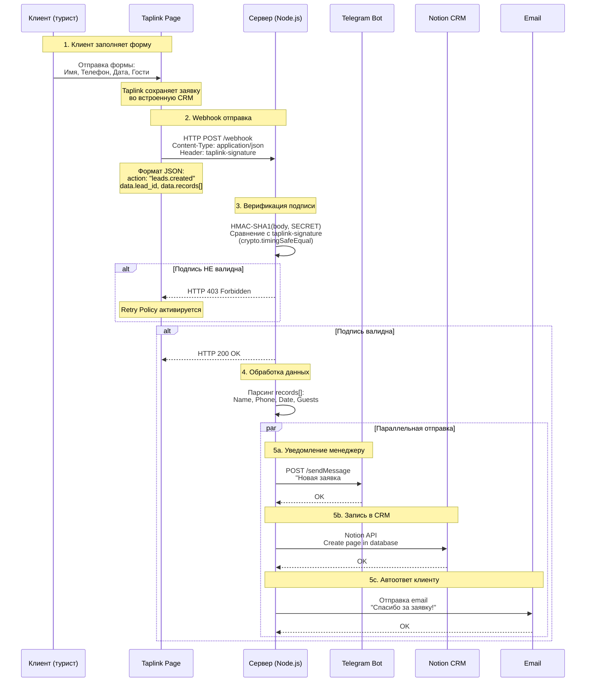
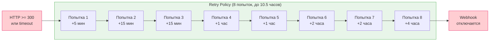
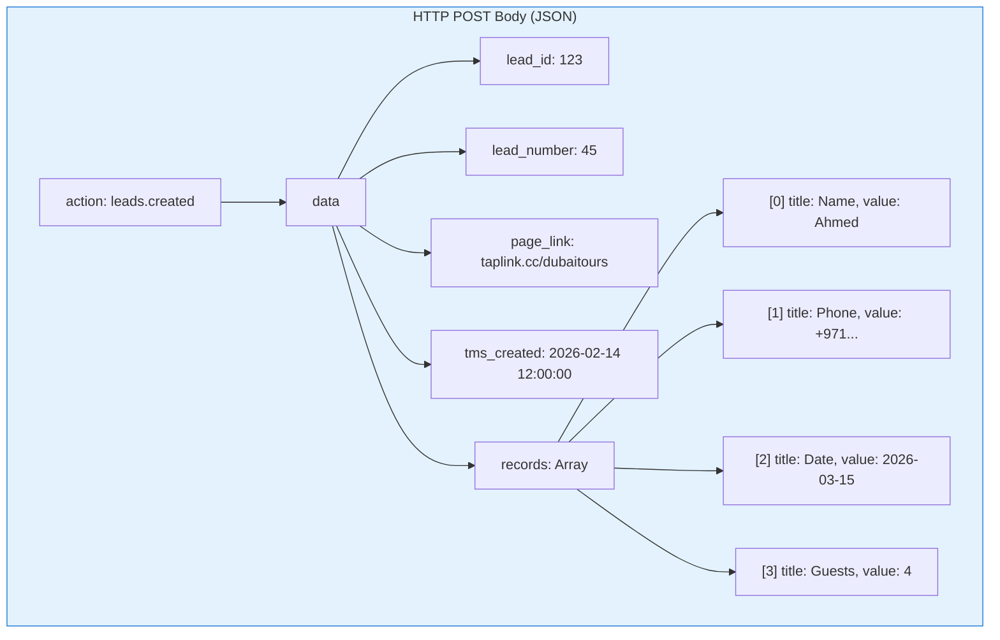

# Процесс обработки вебхука Taplink

Детальная схема прохождения данных от момента отправки формы клиентом до получения уведомления менеджером, включая верификацию подписи и retry policy.

## Retry Policy Taplink

Если сервер ответил кодом, отличным от 100-299, Taplink повторяет отправку.

## Формат данных Webhook

## Легенда

| Элемент | Описание |
|---------|----------|
| taplink-signature | HMAC-SHA1 подпись в заголовке запроса |
| SECRET | Секретный ключ, заданный в настройках Taplink |
| crypto.timingSafeEqual | Безопасное сравнение строк (защита от timing attack) |
| HTTP 100-299 | Коды успешного ответа для Taplink |
| Retry Policy | 8 попыток за 10.5 часов, затем webhook отключается |
